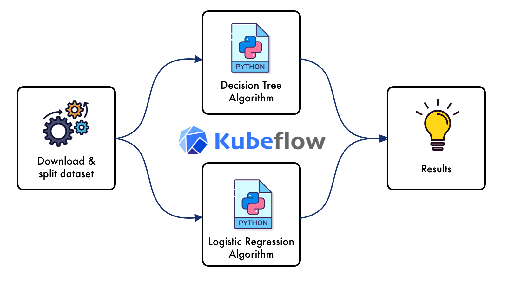

<!-- PROJECT SHIELDS -->
<!--
*** I'm using markdown "reference style" links for readability.
*** Reference links are enclosed in brackets [ ] instead of parentheses ( ).
*** See the bottom of this document for the declaration of the reference variables
*** for contributors-url, forks-url, etc. This is an optional, concise syntax you may use.
*** https://www.markdownguide.org/basic-syntax/#reference-style-links
-->
[![Medium][medium-shield]][medium-url]
[![Twitter][twitter-shield]][twitter-url]
[![Linkedin][linkedin-shield]][linkedin-url]

# Kubeflow Pipelines: How to Build your First Kubeflow Pipeline from Scratch
This repository aims to develop a step-by-step tutorial on how to build a Kubeflow Pipeline from scratch in your local machine.

If you want to know in detail about the detailed explanation of how to develop your first kubeflow pipeline, I recommend you take a look at the article: <a href="Kubeflow Pipelines: How to Build your First Kubeflow Pipeline from Scratch"> *Kubeflow Pipelines: How to Build your First Kubeflow Pipeline from Scratch*</a>

<!-- TABLE OF CONTENTS -->
## Table of Contents

* [Files](#files)
* [How to use](#how-to-use)
* [Contributing](#contributing)
* [Contact](#contact)
* [License](#license)

<!-- files -->
## 1. Files
* **decision_tree**: Contains the files to build the decision_tree component as well as the Dockerfile used to generate the component image.
* **logistic_regression**: Contains the files to build the logistic_regression component as well as the Dockerfile used to generate the component image.
* **download_data**: Contains the files to build the download_data component as well as the Dockerfile used to generate the component image.
* **pipeline.py**: Contains the definition of the pipeline, which when executed generates the ``FirstPipeline.yaml`` file.

<!-- how-to-use -->
## 2. How to use
* It is recommended to have previously installed ``kfp`` as well as configured kubeflow on top of kubernets or a minimal version such as ``minikube``.
* All the images are accesible in Docker Hub: https://hub.docker.com/repository/docker/fernandolpz/only-tests

<!-- contributing -->
## 3. Contributing
Feel free to fork the model and add your own suggestiongs.

1. Fork the Project
2. Create your Feature Branch (`git checkout -b feature/YourGreatFeature`)
3. Commit your Changes (`git commit -m 'Add some YourGreatFeature'`)
4. Push to the Branch (`git push origin feature/YourGreatFeature`)
5. Open a Pull Request

<!-- contact -->
## 5. Contact
If you have any question, feel free to reach me out at:
* <a href="https://twitter.com/Fernando_LpzV">Twitter</a>
* <a href="https://medium.com/@fer.neutron">Medium</a>
* <a href="https://www.linkedin.com/in/fernando-lopezvelasco/">Linkedin</a>
* Email: fer.neutron@gmail.com

<!-- license -->
## 6. License
Distributed under the MIT License. See ``LICENSE.md`` for more information.

<!-- MARKDOWN LINKS & IMAGES -->
<!-- https://www.markdownguide.org/basic-syntax/#reference-style-links -->
[medium-shield]: https://img.shields.io/badge/medium-%2312100E.svg?&style=for-the-badge&logo=medium&logoColor=white
[medium-url]: https://medium.com/@fer.neutron
[twitter-shield]: https://img.shields.io/badge/twitter-%231DA1F2.svg?&style=for-the-badge&logo=twitter&logoColor=white
[twitter-url]: https://twitter.com/Fernando_LpzV
[linkedin-shield]: https://img.shields.io/badge/linkedin-%230077B5.svg?&style=for-the-badge&logo=linkedin&logoColor=white
[linkedin-url]: https://www.linkedin.com/in/fernando-lopezvelasco/
<!-- turn ODC off -->