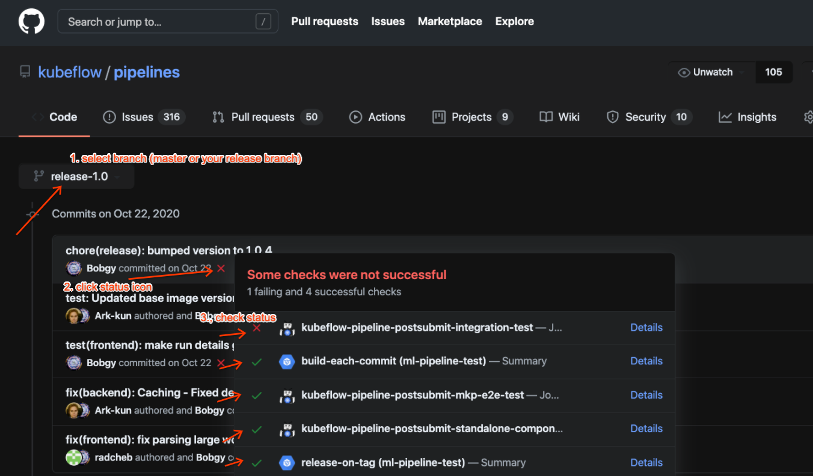
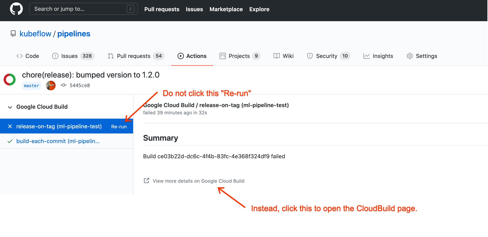
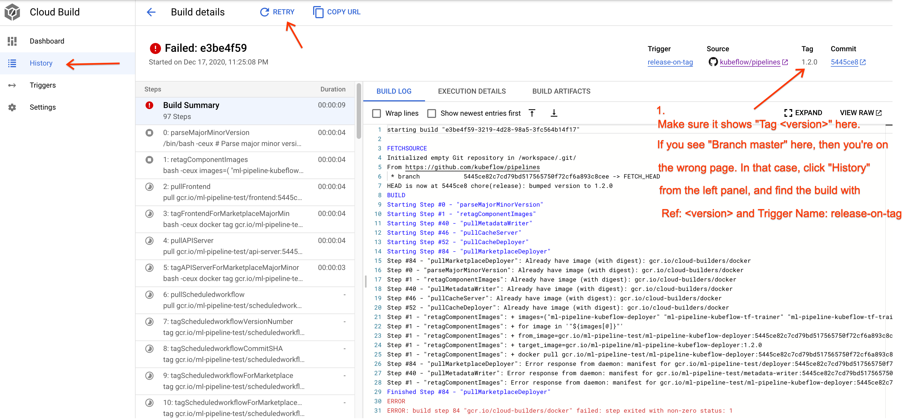

# Kubeflow Pipelines Release Process

<!-- This TOC is auto generated by "markdown all in one" VS Code plugin -->
- [Kubeflow Pipelines Release Process](#kubeflow-pipelines-release-process)
  - [Schedule](#schedule)
  - [Release Tags and Branches](#release-tags-and-branches)
  - [Contributor Instructions](#contributor-instructions)
    - [Cherry picking pull requests to release branch](#cherry-picking-pull-requests-to-release-branch)
      - [Option - (Recommended) cherrypick-approved label](#option---recommended-cherrypick-approved-label)
      - [Option - git cherry-pick](#option---git-cherry-pick)
      - [Option - Kubeflow cherry_pick_pull.sh helper](#option---kubeflow-cherry_pick_pullsh-helper)
  - [Release Manager Instructions](#release-manager-instructions)
    - [Common Prerequisites](#common-prerequisites)
    - [Cutting a release branch](#cutting-a-release-branch)
    - [Before release](#before-release)
    - [Releasing from release branch](#releasing-from-release-branch)
  - [Scripts ./hack/release* implementation details](#scripts-hackrelease-implementation-details)

## Schedule

Kubeflow Pipelines has weekly patch releases and monthly minor releases.
Patch releases only contain bug fixes, while minor releases have new features
additionally.

## Release Tags and Branches

Releases are tagged with tags like `X.Y.Z`, e.g. `1.0.2`. A special format like
`1.0.0-rc.2` is a pre-release. It is the second release candidate before
releasing the final `1.0.0`.

A release branch has the name structure `release-X.Y` where `X.Y` stands for the
minor version. Releases like `X.Y.Z` will all be released from the branch
`release-X.Y`.

For example, `1.0.2` release should be on `release-1.0` branch.

## Contributor Instructions

The following section targets contributors. No need to read further if you only
want to use Kubeflow Pipelines.

### Cherry picking pull requests to release branch

After the `release-X.Y` release branch is cut, pull requests (PRs) merged to
master will be only get released in the next minor release `X.(Y+1).0`.

If you want your PR released earlier in a patch release `X.Y.(Z+1)`:
* The PR must already get merged to master branch.
* The PR should be a bug fix.
* The PR should be cherry picked to corresponding release branch `release-X.Y`.

Choose one of the following options for cherry picking your PR to release branch.

#### Option - (Recommended) cherrypick-approved label
Contributors should ask OWNERS who approved the PR to add a `cherrypick-approved`
label if they want the PR cherry picked to release branch.

Release manager will periodically or before release, search all merged PRs with
`cherrypick-approved` and cherry pick them into current release branch.

#### Option - git cherry-pick
* Find the commit you want to cherry pick on master as $COMMIT_SHA.
* Find the active release branch name $BRANCH, e.g. release-1.0
*
    ```bash
    git checkout $BRANCH
    git checkout -b <cherry-pick-pr-branch-name>
    git cherry-pick $COMMIT_SHA
    ```
* Resolve merge conflicts if any
* `git push origin HEAD`
* Create a PR and remember to update PR's destination branch to `release-$MINOR_VERSION`
* Ask the same OWNERS that would normally need to approve this PR

#### Option - Kubeflow cherry_pick_pull.sh helper
Kubeflow has a cherry pick helper script: https://github.com/kubeflow/kubeflow/blob/master/hack/cherry-picks.md

It automates the process using `hub` CLI tool and bash, so it takes some one off efforts to set up for the first time.

After that, this is convenient to do a lot of cherry picks, because for each PR you'd only need to specify
release branch and PR number.

Known caveats:
* It may produce PR title that is duplicative, you can edit the title after cherry picking.

## Release Manager Instructions

The following sections target release managers. You don't need to read further
if you only want to use or contribute to this repo.

### Common Prerequisites

* OS: Linux (MacOS not supported yet due to different behavior of sed)
* Permissions needed
    * Can create a branch in github.com/kubeflow/pipelines.
    * (Before [#4840](https://github.com/kubeflow/pipelines/issues/4840) is resolved) one would need the admin access to kubeflow/pipelines repo.
    * Can trigger cloudbuild jobs in ml-pipeline-test GCP project.
* Tools that should be in your `$PATH`
    * jq 1.6 https://stedolan.github.io/jq/download/
    * yq https://github.com/mikefarah/yq/releases/tag/3.3.0
    * jdk 8
    * node 12
    * bazel 0.24.0 https://github.com/bazelbuild/bazel/releases/tag/0.24.0
    * python 3 (on linux, one would need the `python` to be `python3` by default instead of `python2`)
* Preparations
    1. Clone github.com/kubeflow/pipelines repo into `$KFP_REPO`.
    2. `cd $KFP_REPO`

### Cutting a release branch (Optional)

1. Choose a good commit on master branch with commit hash as `$COMMIT_SHA`.
1. Choose the next release branch's `$MINOR_VERSION` in format `x.y`, e.g. `1.0`, `1.1`...
1. Make a release branch of format `release-$MINOR_VERSION`, e.g. `release-1.0`, `release-1.1`. Branch from the commit and push to kubeflow pipelines upstream repo.
    ```bash
    git checkout $COMMIT_SHA
    git checkout -b release-$MINOR_VERSION
    git push upstream HEAD
    ```

### Before release

Do the following things before a release:
1. **(Do this step only when releasing from a NON-master release branch)**
    
    cherry pick all merged PRs with `cherrypick-approved` label:
    * Search all merged PRs with `cherrypick-approved`
        label, but no `cherrypicked` label using
        [this link](https://github.com/kubeflow/pipelines/pulls?q=is%3Apr+label%3Acherrypick-approved+-label%3Acherrypicked+is%3Aclosed+sort%3Aupdated-asc)
    * Use the git cherry-pick option to pick these PR commits into the release
    branch one by one in a batch and add `cherrypicked` label to these PRs.

        NOTE: if there are merge conflicts for a PR, ask the PR author or area OWNER
        to create a cherry pick PR by themselves following other two options.
    * `git push upstream release-$VERSION` directly to the release branch.

    There's an automated script that can help you do the above:
    ```
    # Prepare your env
    cd ~/kubeflow/pipelines
    git fetch upstream
    git checkout release-1.0
    git pull
    git checkout -b <your-cherry-pick-branch-name>

    # The following command shows usage info
    ./hack/cherry-pick.sh

    # The following command cherry picks PRs #123 #456 #789 for you.
    # It runs git cherry-pick for each merged commit, then adds `cherrypicked`
    # label on the PR.
    #
    # If there's a merge conflict in the middle, it will stop there waiting for
    # you to resolve. You need to add the `cherrypicked` label by yourself in
    # this case. After the issue resolved, you can rerun the same command and
    # PRs already cherrypicked (with the label `cherrypicked`) will be skipped.
    ./hack/cherry-pick.sh 123 456 789

    # After cherry pickings are done, they are still in your local repo. Push
    # them to your remote branch to create a PR.
    git push origin HEAD
    ```

    You can get the list of PRs waiting to be cherrypicked by:
    1. Open [cherrypick-approved PRs that haven't been cherrypicked sorted by updated order](https://github.com/kubeflow/pipelines/pulls?q=is%3Apr+label%3Acherrypick-approved+-label%3Acherrypicked+is%3Amerged+sort%3Aupdated-asc+).
    1. Open browser console (usually by pressing F12).
    1. Paste the following command into the console.
        ```javascript
            console.log(Array.from(document.querySelectorAll('[id^="issue_"][id*="_link"]')).map(el => /issue_(.*)_link/.exec(el.id)[1]).join(' '))
        ```

1. Verify cloudbuild and postsubmit tests are passing: visit https://github.com/kubeflow/pipelines/commits/master for master branch.



If not, contact the KFP team to determine if the failure(s) would block the release.

### Releasing from release branch

Note, when releasing from master, all the below mentions of "release branch" means master branch.

1. Choose the release's complete `$VERSION` following semantic versioning, e.g.
    * `1.0.0-rc.1`
    * `1.0.0-rc.2`
    * `1.0.0`
    * `1.0.1`
    * `1.1.0`
    * ...
    Contact @Bobgy if you are not sure what next version should be.

1. Verify all the required tools are installed properly:
    ```bash
    ./hack/check-release-needed-tools.sh
    ```

1. Update all version refs in release branch by
    ```bash
    ./hack/release.sh $VERSION $BRANCH
    ```
    It will prompt you whether to push it to release branch. Press `y` and hit `Enter`.

    Note, the script will clone kubeflow/pipelines repo into a temporary location on your computer, make those changes and attempt to push to upstream, so that it won't interfere with your current git repo.

1. View related cloudbuild jobs' statuses by clicking the latest commit's status icon
in the release branch. The page will look like https://github.com/kubeflow/pipelines/runs/775788343.
Refer to the above screenshot to find the page.

1. Wait and make sure the `build-each-commit` cloudbuild job that builds all images
in gcr.io/ml-pipeline-test succeeded. If it fails, please click "View more details
on Google Cloud Build" and then "Retry".
    
    NOTE: you can find your latest release commit in https://github.com/kubeflow/pipelines/commits/master and select your release branch.
    

1. Select the `release-on-tag` cloudbuild job that copies built images and artifacts to
public image registry and gcs bucket. This job should have already failed because
artifacts haven't been built. Now, please click "View more details on Google Cloud Build"
and then "Retry", because after waiting for previous step, artifacts are now ready.

    NOTE: (To be verified) Do not click the "Re-run" button from GitHub Actions status page.
    It will create a build with "Branch: $BRANCH" instead of "TAG: $VERSION".
    Open "View more details on Google Cloud Build", and rerun from there.

    

    

    TODO: we should have an automation KFP cluster, and the waiting and submiting
    `release-on-tag` cloudbuild task should happen automatically.
    
    NOTE: postsubmit tests will most likely fail for the release commit, this is expected, postsubmit
    tests start right after the commit is in GitHub repo, but some artifacts they depend on are still
    being built by the processes in these two steps.
1. Search "PyPI" in Google internal release doc for getting password of kubeflow-pipelines user.
1. Release `kfp-server-api` python packages to PyPI.
    ```bash
    git checkout $BRANCH
    git pull upstream
    cd backend/api/python_http_client
    rm -r dist
    python3 setup.py --quiet sdist
    python3 -m twine upload --username kubeflow-pipelines dist/*
    ```
1. Release `kfp` python packages to PyPI.
    ```bash
    pip3 install twine --user
    gsutil cp gs://ml-pipeline/release/$VERSION/kfp.tar.gz kfp-$VERSION.tar.gz
    python3 -m twine upload --username kubeflow-pipelines kfp-$VERSION.tar.gz
    ```

    !!! The file name must contain the version. See https://github.com/kubeflow/pipelines/issues/1292

1. Create a GitHub release using `$VERSION` git tag and title `Version $VERSION`,
fill in the description. Detailed steps:
   
   1. [Draft a new release](https://github.com/kubeflow/pipelines/releases/new).
   1. Typing in version tag field to search and select the "$VERSION" tag published in release instructions above.
   Its format is like `X.Y.Z` or `X.Y.Z-rc.N`.

   1. Use this template for public releases and replace the `$VERSION` with real values.
       <pre>
       To deploy Kubeflow Pipelines in an existing cluster, follow the instruction in [here](https://www.kubeflow.org/docs/pipelines/standalone-deployment-gcp/) or via UI [here](https://console.cloud.google.com/ai-platform/pipelines)

       Install python SDK (python 3.6 above) by running:
       ```
       python3 -m pip install kfp kfp-server-api --upgrade
       ```

       See the [Change Log](https://github.com/kubeflow/pipelines/blob/$VERSION/CHANGELOG.md)
       </pre>

       Use this template for prereleases (release candidates) and **PLEASE CHECK** the
       ***This is a prerelease*** checkbox in the GitHub release UI.
       <pre>
       To deploy Kubeflow Pipelines in an existing cluster, follow the instruction in [here](https://www.kubeflow.org/docs/pipelines/standalone-deployment-gcp/).

       Install python SDK (python 3.6 above) by running:
       ```
       python3 -m pip install kfp kfp-server-api --pre --upgrade
       ```

       See the [Change Log](https://github.com/kubeflow/pipelines/blob/$VERSION/CHANGELOG.md)
       </pre>

1. **(Do this step only when releasing from a NON-master release branch)**
Update master branch to the same version and include latest changelog:
    ```bash
    git checkout master
    git pull
    git checkout -b <your-branch-name>
    # This avoids line break at end of line.
    echo -n $VERSION > VERSION
    # This takes a while.
    ./hack/release-imp.sh
    git checkout $VERSION -- CHANGELOG.md
    git add -A
    git commit -m "chore(release): bump version to $VERSION on master branch"
    ```

1. If current release is not a prerelease, create a PR to update version in kubeflow documentation website: 
https://github.com/kubeflow/website/blob/master/layouts/shortcodes/pipelines/latest-version.html

   Note, there **MUST NOT** be a line ending in the file. Editing on GitHub always add a line ending
   for you so you cannot create a PR on GitHub UI.
   Instead, you can checkout the repo locally and
   ```
   echo -n 1.0.0 > layouts/shortcodes/pipelines/latest-version.html
   ```
   and create a PR to update the version, e.g. https://github.com/kubeflow/website/pull/1942.

## Scripts ./hack/release* implementation details

The script `./hack/release-imp.sh` does the following:
1. Generate `./CHANGELOG.md` using commit history.
1. Regenerate open api specs based on proto files.
1. Regenerate `kfp-server-api` python package.
1. Update all version refs in this repo to `./VERSION` by calling each of the
`./**/hack/release.sh` scripts. The individual scripts are responsible for updating
version refs to their own folder.

The script `./hack/release.sh` is a wrapper on top of `./hack/release-imp.sh`, it
1. Clones github.com/kubeflow/pipelines repo to a temporary path.
1. Checkout `release-$MINOR` branch.
1. Runs `./hack/release-imp.sh`.
1. Runs git commit and tag.
1. After confirming with user input, pushes to upstream branch.
