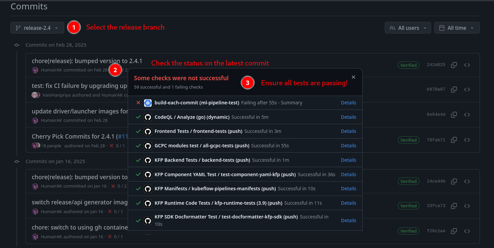
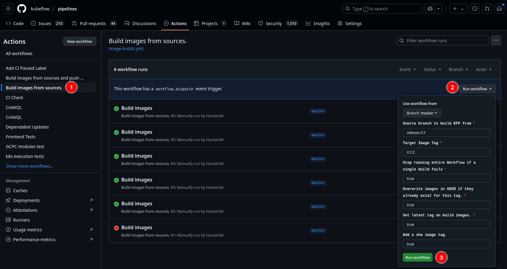

# Kubeflow Pipelines Release Process

- [Kubeflow Pipelines Release Process](#kubeflow-pipelines-release-process)
  - [Schedule](#schedule)
  - [Release Tags and Branches](#release-tags-and-branches)
  - [Contributor Instructions](#contributor-instructions)
    - [Cherry-picking pull requests to release branch](#cherry-picking-pull-requests-to-release-branch)
      - [Option - (Recommended) cherrypick-approved label](#option---recommended-cherrypick-approved-label)
      - [Option - git cherry-pick](#option---git-cherry-pick)
  - [Release Manager Instructions](#release-manager-instructions)
    - [Common Prerequisites](#common-prerequisites)
    - [Cutting a release branch (Optional)](#cutting-a-release-branch)
    - [Before release](#before-release)
    - [Releasing from release branch](#releasing-from-release-branch)
    - [Release KFP Python Packages](#releasing-kfp-python-packages)
    - [Create GitHub Release](#create-github-release)
    - [Sync Master Branch with Release](#sync-master-branch-with-latest-release)
  - [Release Process Development](#release-process-development)

## Schedule

Kubeflow Pipelines has quarterly minor releases. Patch releases occur on a 
need basis and don't currently operate on a schedule.

Patch releases only contain bug fixes, while minor releases have new features
additionally.

## Release Tags and Branches

Releases are tagged with tags like `X.Y.Z`, e.g. `1.0.2`. A special format like
`1.0.0-rc.2` is a pre-release. It is the second release candidate before
releasing the final `1.0.0`.

A release branch has the name structure `release-X.Y` where `X.Y` stands for the
minor version. Releases like `X.Y.Z` will all be released from the branch
`release-X.Y`.

For example, `1.0.2` release should be on `release-1.0` branch.

## Contributor Instructions

The following section targets contributors. No need to read further if you only
want to use Kubeflow Pipelines.

### Cherry picking pull requests to release branch

After the `release-X.Y` release branch is cut, pull requests (PRs) merged to
master will be only get released in the next minor release `X.(Y+1).0`.

If you want your PR released earlier in a patch release `X.Y.(Z+1)`:

- The PR must already get merged to master branch.
- The PR should be a bug fix.
- The PR should be cherry picked to corresponding release branch `release-X.Y`.

To cherry pick a PR:

- Find the commit you want to cherry pick on master as $COMMIT_SHA.
- Find the active release branch name $BRANCH, e.g. release-1.0
- Cherry pick a commit:

    ```bash
    git checkout $BRANCH
    git checkout -b <cherry-pick-pr-branch-name>
    git cherry-pick $COMMIT_SHA
    ```

- Resolve merge conflicts if any
- `git push origin HEAD`
- Create a PR and remember to update PR's destination branch to `release-$MINOR_VERSION`
- Ask the same OWNERS that would normally need to approve this PR

## Release Manager Instructions

The following sections target release managers. You don't need to read further
if you only want to use or contribute to this repo.

### Common Prerequisites

- OS: Linux or MacOS
- Permissions needed
  - Admin access to kubeflow/pipelines repo.
- Tools that should be in your `$PATH`
  - docker
  - python3
- Preparations
    1. Clone github.com/kubeflow/pipelines repo into `$KFP_REPO`.
    2. `cd $KFP_REPO`

### Cutting a release branch

KFP releases are required to be cut from a release branch. This includes all python packages.
Release branches must be scoped to a minor version. The following components should always have all future patch versions tagged and released from their respective minor branch. For example, you would cut a release for SDK 2.14.1 from the release-2.14 branch, the same with KFP backend 2.14.4, kfp-kubernetes 2.14.2, and so on.

1. Choose a good commit on master branch with commit hash as `$COMMIT_SHA`.
1. Choose the next release branch's `$MINOR_VERSION` in format `x.y`, e.g. `1.0`, `1.1`...
1. Make a release branch of format `release-$MINOR_VERSION`, e.g. `release-1.0`, `release-1.1`. Branch from the commit and push to kubeflow pipelines upstream repo.

```bash
git checkout $COMMIT_SHA
BRANCH=release-$MINOR_VERSION
git checkout -b $BRANCH
git push upstream HEAD
```

> [!Note]
> The creation of this release branch triggers image builds via the [Build Tools Workflow]. 
> These images are required by the release script used in the next sections.

### Before release

Do the following things before a release:
1. Cherry-picking
    Cherry pick all PRs that should be released in the next minor release from the master branch. Make a PR and get an approval from the area owners.

2. ```
    git cherry-pick <commit-id>
    ```

1. Verify release branch CI is passing: visit <https://github.com/kubeflow/pipelines/commits/master> for master branch.



If not, contact the KFP team to determine if the failure(s) would block the release.

### Releasing from release branch

1. Choose the release's complete `$VERSION` following semantic versioning, e.g.
- `1.0.0-rc.1`
- `1.0.0-rc.2`
- `1.0.0`
- `1.0.1`
- `1.1.0`
- ...
Set the version by using `VERSION=<version-value>`. Contact @chensun or @HumairAK if you are not sure what next version should be.

1. Update all version refs in release branch by

> [!Note]
> Ensure that the [Build Tools Workflow] for the release branch has completed successfully before proceeding.
> You can also verify this by checking the release tools images [Release Image] and [Api Generate Image] have the `$BRANCH` tag.

```bash
# Replace this with your fork remote, this is where you'll make a PR to the release branch. 
export FORK_REMOTE=git@github.com:myuser/pipelines.git
cd ./test/release && TAG=$VERSION BRANCH=$BRANCH FORK_REMOTE= make release
```

This script updates the version values for various manifests, and generated code.
Once finished, it will prompt you whether to push it to your fork.
You can inspect the changes by navigating to the temporary directory it creates. 
Once you are comfortable with the changes, press `y` and hit `Enter`.
If you choose no, you can always push manually later.

In addition, verify that the public version ConfigMap reflects the new control-plane version used for this release:

- In `manifests/kustomize/base/pipeline/kustomization.yaml`, set the `kubeflow_pipelines_version` literal under the `configMapGenerator` for the `kubeflow-pipelines-public` ConfigMap to the release tag with a `v` prefix (for example, `kubeflow_pipelines_version=v2.0.0-rc.1`).

> [!Note]
> the script will clone kubeflow/pipelines repo into a temporary location on your computer, 
> make those changes and attempt to push to your fork, so that it won't interfere with your current git repo.

> [!Note]
> If you see error "docker.sock: connect: permission error", you need to [allow managing docker as a non-root user].

1. Build the release images by using the [Build images from sources].

The target tag should be `$VERSION`. 




[allow managing docker as a non-root user]: https://docs.docker.com/engine/install/linux-postinstall/#manage-docker-as-a-non-root-user
[Build images from sources]: https://github.com/kubeflow/pipelines/actions/workflows/image-builds-release.yml
[Build Tools Workflow]: https://github.com/kubeflow/pipelines/actions/workflows/build-tools-images.yml
[Release Image]: https://github.com/kubeflow/pipelines/pkgs/container/kfp-api-generator
[Api Generate Image]: https://github.com/kubeflow/pipelines/pkgs/container/kfp-api-generator

### Releasing KFP Python Packages

All Python packages must be released with wheel and source packages. 
When doing a minor release, you *must* make a release for all Python packages as well, even if there are no new changes there. 

This includes: 
* kfp-pipeline-spec
* kfp
* kfp-kubernetes
* kfp-server-api

> [!Note]
> When making a release, if something goes wrong, always yank the release in pypi, **do not delete** the package and try to re-upload it with the same version, pypi won't let you do this even though it lets you delete the package. In such an event, yank the release and do a new release with a new patch version.

When performing these releases, you should adhere to the order presented below.

> [!Note]
> All python packages should be released with aligned patch versions. For example if you intend to release a new 
> patch version x.y.z for `kfp-pipeline-spec`, you must also release a new patch version x.y.z for `kfp`, `kfp-server-api`, and `kfp-kubernetes`.

#### Update `kfp` requirements

If this version of `kfp` depends on new api changes to: 

* `kfp-pipeline-spec`
* `kfp-server-api`

Then update the lower-bound values for the aforementioned packages in `sdk/python/requirements.in` file. 

You can run the following to update the associated `requirements.txt`

```bash
cd sdk/python
./pre-release-requirements-update.sh
```

Once done you should see a diff in `requirements.txt`. Confirm the changes.

Update the SDK version in `version.py` and `readthedocs` `versions.json`, example PR [here](https://github.com/kubeflow/pipelines/pull/11715/files).

Also update the `kfp-kubernetes==` pin in `sdk/python/pyproject.toml` to match the new version.

Also update the `kfp-pipeline-spec==` and `kfp-server-api==` pins in `sdk/python/pyproject.toml` and the `kfp==` pin in `kubernetes_platform/python/pyproject.toml` to match the new version.

#### Update `kfp-kubernetes` requirements

If this version of `kfp-kubernetes` depends on new api changes to: 

* `kfp-pipeline-spec`
* `kfp`

Then update the lower-bound values in the aforementioned packages in `kubernetes_platform/python/requirements.in` file. 

You can run the following to update the associated `requirements.txt`

```bash
cd kubernetes_platform/python
./pre-release-requirements-update.sh
```
Update the KFP Kubernetes SDK version in `__init__.py` and `readthedocs` `versions.json`, example PR [here](https://github.com/kubeflow/pipelines/pull/11380).

#### Make the Pull Request to the release branch

Once you have updated the versions make a pull request targeted towards the `release-x.y` branch. Ensure the CI passes.

#### Release the packages 

Once the release pull request has been merged, create a GitHub release with the tag `sdk-x.y.z`, where `x.y.z` map to 
the version being released. Once the tag is created, we can now initiate the GitHub workflow to publish the packages to Pypi. 

Navigate to the [Publishing Workflow]: 
* Select "Run Workflow" 
* Select Branch: `release-x.y`
* Enter the tag `sdk-x.y.z` 
* Select `all`
* Click `Run Workflow`

This will build and publish all python packages.

[Publishing Workflow]: https://github.com/kubeflow/pipelines/actions/workflows/publish-packages.yml

#### Create kfp-kubernetes readthedocs branch 

There is a separate kfp-kubernetes docs website. This requires a separate branch to be created and pushed,
do this by running the following: 

```bash
# Cut release-the-docs branch 
export KFP_KUBERNETES_VERSION= # Set this to the version being released x.y.z
cd kubernetes_platform/python
./create_release_branch.sh
```
    
Follow the output push instructions to **commit and push the read the docs release branch to KFP**.

> [!Note]
> Note that kfp-kubernetes package has a separate readthedocs site and requires that a new branch be pushed for readthedocs to be able to host multiple pages from the same repo. 
> Every new patch version for this package requires us to create a new release branch purely for readthedocs purposes. However always cut this branch from the `release-X.Y` branch.

#### Update `kfp` Readthedocs

* Create a GitHub release for KFP SDK release. [Here's an example](https://github.com/kubeflow/pipelines/releases/tag/sdk-2.14.1) reference for a template.
  * When creating a release create a new tag `sdk-x.y.z`
* Navigate to the readthedocs website [here](https://app.readthedocs.org/projects/kubeflow-pipelines/), login if needed
* You should see a new build under "Versions" section for this new tag, ensure it succeeds.
* Click "Settings"
* Set the default version to `sdk-x.y.z` (the version we just built and released)
* Set the default branch to be the release branch `release-x.y.z`

#### Update `kfp-kubernetes` Readthedocs

Once the branch is updated, you need to add this version to readthedocs. Follow these steps: 

* Navigate to the package section on the readthedocs website [here](https://app.readthedocs.org/projects/kfp-kubernetes/). 
* Click "Add version"
* Enter the branch `kfp-kubernetes-x.y.z` where x.y.z is the version you released, if you pushed it and it's not showing up, press the "Resync Versions" button and try again 
* Add this version, navigate back to the "Versions" section, and you should see a build, make sure it succeeds before moving onto the next section.
* Go to Settings
* Set this version as the default version. 
* Click Save
* Click "View Docs" to navigate to the docs page and ensure the new version shows up as the default.

Push the changes to the `release-X.Y` branch. 

### Create GitHub Release

1. Create a GitHub release using `$VERSION` git tag and title `Version $VERSION`,
fill in the description. Detailed steps:

1. [Draft a new release](https://github.com/kubeflow/pipelines/releases/new).
1. Typing in version tag field to search and select the "$VERSION" tag published in release instructions above.
Its format is like `X.Y.Z` or `X.Y.Z-rc.N`.

1. Use this template for public releases and replace the `$VERSION` with real values.

<pre>
To deploy Kubeflow Pipelines in an existing cluster, follow the instruction in [here](https://www.kubeflow.org/docs/components/pipelines/operator-guides/installation/)

Install Python SDK (Python 3.9 above) by running:

```bash
python3 -m pip install kfp kfp-server-api --upgrade
```

See the [Change Log](https://github.com/kubeflow/pipelines/blob/$VERSION/CHANGELOG.md)
</pre>

Use this template for prereleases (release candidates) and **PLEASE CHECK** the
***This is a prerelease*** checkbox in the GitHub release UI.

<pre>
To deploy Kubeflow Pipelines in an existing cluster, follow the instruction in [here](https://www.kubeflow.org/docs/components/pipelines/operator-guides/installation/).

Install kfp-server-api package (Python 3.9 above) by running:

```bash
python3 -m pip install kfp-server-api==$VERSION --upgrade
```

Refer to:
* [Upgrade Notes with notices and breaking changes](https://www.kubeflow.org/docs/components/pipelines/installation/upgrade/)
* [Change Log](https://github.com/kubeflow/pipelines/blob/$VERSION/CHANGELOG.md)

NOTE, kfp Python SDK is **NOT** included and released separately.
</pre>
    
### Sync Master Branch with latest release

1. Update master branch to the same version and include latest changelog:

```bash
git checkout master
git pull
git checkout -b <your-branch-name>
# This avoids line break at end of line.
echo -n $VERSION > VERSION
# This takes a while.
pushd test/release
make release-in-place
popd
git checkout $VERSION -- CHANGELOG.md
git add -A
git commit -m "chore(release): bump version to $VERSION on master branch"
```

1. If current release is not a prerelease, create a PR to update version in kubeflow documentation website:
<https://github.com/kubeflow/website/blob/master/layouts/shortcodes/pipelines/latest-version.html>

Note, there **MUST NOT** be a line ending in the file. Editing on GitHub always add a line ending
for you so you cannot create a PR on GitHub UI.
Instead, you can checkout the repo locally and

```bash
echo -n 1.0.0 > layouts/shortcodes/pipelines/latest-version.html
```

and create a PR to update the version, e.g. <https://github.com/kubeflow/website/pull/1942>.

## Release Process Development

Please refer to [./test/release](./test/release).

## Versioning Policy in KFP 

Starting from version **2.14**, all major and minor versions (X.Y) of the Kubeflow Pipelines (KFP) components are aligned. The following components are included in this alignment:

* **KFP Backend / UI**
* **KFP Python SDK**
* **KFP Python Kubernetes Platform SDK**
* **KFP Python Pipeline Specification**
* **KFP Server API**

The following patches also require that all patch releases be aligned:
* **KFP Python SDK**
* **KFP Python Kubernetes Platform SDK**
* **KFP Python Pipeline Specification**
* **KFP Server API**

### Versioning and Compatibility Policy

* **API Compatibility:**
All KFP components sharing the same major and minor version (X.Y) are guaranteed to be API-compatible.

* **Backward Compatibility:**
The KFP project aims to maintain backward compatibility within a given **major version** for all Python SDK packages, though there may be exceptions at times.

Specifically:

* Newer versions of the KFP Python SDK within the same major release (e.g., 2.x) should continue to function with older versions of the KFP backend.
* However, newly introduced features in a later SDK minor version may require a matching or newer backend version to function correctly. For example:
  * A feature introduced in `kfp==2.15` is not guaranteed to be supported by a `2.14` backend. In such cases, upgrading the backend to version `2.15` or later is necessary.

* **Patch Releases:**
  Patch versions (X.Y.Z) may include bug fixes, maintenance updates, and minor feature enhancements. These changes must not break API compatibility or violate the support guarantees outlined above.
