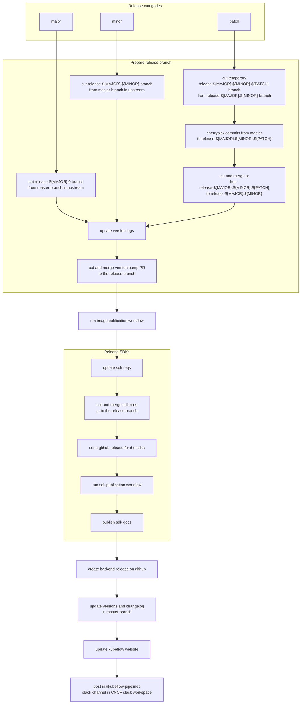
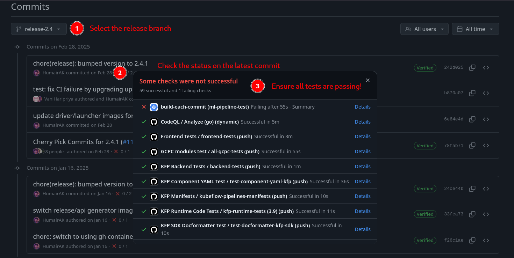

# Kubeflow Pipelines Release Process

- [Kubeflow Pipelines Release Process](#kubeflow-pipelines-release-process)
  - [Summary](#summary)
  - [Context](#context)
    - [Release categories](#release-categories)
      - [Semver](#semver)
      - [What gets released](#what-gets-released)
      - [Categories](#categories)
    - [Tags vs branches](#tags-vs-branches)
    - [High level sequence](#high-level-sequence)
  - [Procedure](#procedure)
    - [Prerequisites](#prerequisites)
    - [Prepare the release branch](#prepare-the-release-branch)
      - [Cut a cherry-pick branch](#cut-a-cherry-pick-branch)
      - [Cherry pick](#cherry-pick)
      - [Push to the fork](#push-to-the-fork)
      - [Open and merge the cherry-pick PR](#open-and-merge-the-cherry-pick-pr)
    - [Update version tags](#update-version-tags)
    - [Cut and merge a PR to the release branch](#cut-and-merge-a-pr-to-the-release-branch)
    - [Run the image publication workflow](#run-the-image-publication-workflow)
    - [Update SDK Versions](#update-sdk-versions)
      - [Context](#context-1)
      - [Update SDK requirements](#update-sdk-requirements)
      - [Update `kfp` requirements](#update-kfp-requirements)
      - [Update `kfp-kubernetes` requirements](#update-kfp-kubernetes-requirements)
      - [Cut and merge an SDK version bump PR to the release branch](#cut-and-merge-an-sdk-version-bump-pr-to-the-release-branch)
    - [Cut a GitHub release for the SDKs](#cut-a-github-release-for-the-sdks)
    - [Run SDK publication workflow](#run-sdk-publication-workflow)
    - [Update the SDK documentation](#update-the-sdk-documentation)
      - [Update `kfp` RTD docs](#update-kfp-rtd-docs)
      - [Create `kfp-kubernetes` readthedocs branch](#create-kfp-kubernetes-readthedocs-branch)
      - [Update `kfp-kubernetes` RTD docs](#update-kfp-kubernetes-rtd-docs)
    - [Cut a GitHub release for the backend](#cut-a-github-release-for-the-backend)
    - [Sync `master` branch with latest release](#sync-master-branch-with-latest-release)
  - [Reference](#reference)
    - [Versioning Policy in KFP](#versioning-policy-in-kfp)
    - [Versioning and Compatibility Policy](#versioning-and-compatibility-policy)

## Summary

The goal of this document is to provide step-by-step instructions for how to release Kubeflow Pipelines. This document aims to clarify the process and serve as a comprehensive resource for release engineers. Eventually, we'd like for this process to be fully automated and executable within a workflow.

## Context

### Release categories

There are multiple different release categories that vary in complexity.


#### Semver

You have to understand [semver](https://semver.org/) in order to be able to differentiate between the different release categories. In a nutshell:

Given a version number `MAJOR.MINOR.PATCH`, increment the:

- MAJOR version when you make incompatible API changes.
- MINOR version when you add functionality in a backward compatible manner.
- PATCH version when you make backward compatible bug fixes.

#### What gets released

Broadly speaking, there are four distinct release artifacts:

- The backend, primarily in the form of images.
- The SDK(s).
- The SDK documentation.
- The manifests used to deploy KFP.

#### Categories

There are four different release categories based on semver. They are:

* MAJOR
* MINOR
* PATCH
  * Note, patch releases can release the backend, the SDK, or both.
* RELEASE CANDIDATE
  * Can be one of MAJOR, MINOR, or PATCH.

### Tags vs branches

The relationship between release tags and release branches varies based on release category. There are various points throughout this process where you have to enter either a tag name, release branch name, or both. It's imperative that you understand the difference between the two and the schema. The following table delineates the schema and provides examples.

Release Category | Tag | Example Tag | Release Branch Name | Example Release Branch Name
--- | --- | --- | --- | ---
MAJOR | `${MAJOR}.0.0` | `3.0.0` | `release-${MAJOR}.0` | `release-3.0` 
MINOR | `${MAJOR}.${MINOR}.0` | `3.2.0` | `release-${MAJOR}.${MINOR}` | `release-3.2`
PATCH | `${MAJOR}.${MINOR}.${PATCH}` | `3.4.1` | `release-${MAJOR}.${MINOR}` | `release-3.4`
RELEASE CANDIDATE | `MAJOR.MINOR.PATCH-rc.${RC_NUMBER}` | `3.1.2-rc.1` | `release-${MAJOR}.${MINOR}` | `release-3.1`


### High level sequence

There are many individual steps in this process. Some of them are automated, others are not. We hope that more will be automated soon. This top down overview may contextualize the individual steps in a way that helps release managers get their bearings as they move through the process. The rest of this document will go into much more detail for each individual step.

Please note, this flowchart does not include release candidates because they can be any one of the other three release categories.


```mermaid
%%{init: {'themeVariables': {'fontSize': '10px'}}}%%

flowchart TD


subgraph releaseCategory["Release categories"]
  major
  minor
  patch
end

subgraph prepareReleaseBranch["Prepare release branch"]
  cutmajor
  cutminor
  cutpatch
  cherrypick
  prcherrypicks
  updateversions
  prversions
end

subgraph releaseSDKs["Release SDKs"]
  updatesdkversions
  prupdatesdkversions
  sdkghrelease
  publishsdks
  publishdocs
end

%% entrypoints
major --> cutmajor["cut release-${MAJOR}.0 branch<br>from master branch in upstream"]
minor --> cutminor["cut release-${MAJOR}.${MINOR} branch<br>from master branch in upstream"]
patch --> cutpatch["cut temporary<br>release-${MAJOR}.${MINOR}.${PATCH} branch<br>from release-${MAJOR}.${MINOR} branch"]

%% cherry-pick patches
cutpatch --> cherrypick["cherrypick commits from master<br>to release-${MAJOR}.${MINOR}.${PATCH}"]
cherrypick --> prcherrypicks["cut and merge pr<br>from release-${MAJOR}.${MINOR}.${PATCH}<br>to release-${MAJOR}.${MINOR}"]

%% converge on version updates
cutmajor --> updateversions["update version tags"]
cutminor --> updateversions
prcherrypicks --> updateversions
updateversions --> prversions["cut and merge version bump PR<br>to the release branch"]
prversions --> publishimages["run image publication workflow"]
publishimages --> updatesdkversions["update sdk reqs"]

%% sdk release
updatesdkversions --> prupdatesdkversions["cut and merge sdk reqs<br>pr to the release branch"]
prupdatesdkversions --> sdkghrelease["cut a github release for the sdks"]
sdkghrelease --> publishsdks["run sdk publication workflow"]
publishsdks --> publishdocs["publish sdk docs"]
publishdocs --> ghbackendrelease["create backend release on github"]
ghbackendrelease --> updatemaster["update versions and changelog<br>in master branch"]
updatemaster --> updatekfwebsite["update kubeflow website"]
updatekfwebsite --> postinslack["post in #kubeflow-pipelines<br>slack channel in CNCF slack workspace"]
```

## Procedure

### Prerequisites

- Linux or OSX operating system.
- Admin access to the kubeflow/pipelines repo.
- Local dependencies:
  - docker
  - python
- Preparation:
  - Clone github.com/kubeflow/pipelines locally.

### Prepare the release branch

Everything until now was just preamble. Now we're going to pivot to the actual release procedure. We're going to use collapsible sections to improve clarity where the logic forks depending on release category.

<details>
<summary><b>Major</b></summary>

Cut a branch from the `master` branch named `release-${MAJOR}.0`.

```bash
git checkout master
git pull
git checkout -b release-${MAJOR}.0
```

</details>

<details>
<summary><b>Minor</b></summary>

Cut a branch from the `master` branch named `release-${MAJOR}.${MINOR}`.

```bash
git checkout master
git pull
git checkout -b release-${MAJOR}.${MINOR}
```

</details>

<details>
<summary><b>Patch</b></summary>

Patch releases are different. Instead of cutting a new release branch from the `master` branch, you need to cut a branch from the last major / minor release branch, cherry-pick commits from `master` into it, then PR into the last major / minor release branch.

For example, if you want to release version `3.1.1`, you would cut a new branch from `release-3.1`, cherry-pick commits from `master` into it, then PR the changes into `release-3.1`. 

#### Cut a cherry-pick branch

Don't cherry-pick directly into the last release branch. You need to be able to PR and review the changes and make sure that they pass CI. Instead, cut a new branch from the last release branch and cherry pick into that.

```bash
git checkout release-${MAJOR}.${MINOR} # preexisting release branch
git pull
git checkout -b release-${MAJOR}.${MINOR}.${PATCH}
```

#### Cherry pick

Identify which commits you want to cherry-pick from the `master` branch into the patch release branch.

Cherry-picked commits need to meet the semver PATCH criteria. They should be backwards compatible and not contain any new user-facing features. 

You need the commit SHAs to pass to the `git cherry-pick` command. You can look at the commit history on the `master` branch to identify the SHAs. Alternatively, if you're referencing PRs in the GitHub Web GUI, here's a helpful function to find the corresponding SHAs:

```bash
prsha(){GH_PAGER=cat gh --repo kubeflow/pipelines pr view "$1" --json mergeCommit --jq '.mergeCommit.oid'; }
```

To use it, just call `prsha` and pass in a PR URL, for example:

```bash
> prsha https://github.com/kubeflow/pipelines/pull/13344                                                       
67a73cf809f7c76fee33c749f302f2bceedd8fab
```

Once you have the SHA, go ahead and cherry-pick:

```bash
git cherry-pick <SHA>
```

Address any conflicts that surface.

#### Push to the fork

When you finish cherry-picking, push the branch to your fork of `kubeflow/pipelines`. Make sure not to push to the origin.

#### Open and merge the cherry-pick PR

Open a PR from your fork to `origin/release-${MAJOR}.${MINOR}`. 

Ensure CI passes. Navigate to https://github.com/kubeflow/pipelines/commits/master, select the release branch from the branch dropdown, and check the CI status.



If CI is not passing, contact the KFP team to determine if the failure(s) should block the release.

Ask other maintainers / release managers for reviews. Once the PR is merged, move on to the next step.

</details>

### Update version tags

Version tags are distributed throughout the codebase. They need to be updated.

Set `VERSION` based on semver.

```bash
export VERSION=${MAJOR}.${MINOR}.${PATCH}
```

Set `FORK_REMOTE` to point to your fork.

```bash
export FORK_REMOTE=git@github.com:${YOUR_GITHUB_USERNAME}/pipelines.git
```

Set `BRANCH` to the `release-${MAJOR}.${MINOR}` branch, e.g. `release-2.16`.

```bash
export BRANCH=release-${MAJOR}.${MINOR}
```

The next step assumes the existence of an `upstream` remote that points to `https://github.com/kubeflow/pipelines.git`. If you don't have an `upstream` remote, run the following to create it:

```bash
git remote add upstream https://github.com/kubeflow/pipelines.git
```

<!-- I use `origin` for the `kubeflow/pipelines` remote personally. We may want to make this configurable. -->

Execute the version tag update step.

```bash
kfpr update-version-tags \
  --release-type patch \
  --version "$VERSION" \
  --fork-remote "$FORK_REMOTE" \
  --mark-done
```

This step updates the version tags in numerous files.

> [!Note]
> If you see error "docker.sock: connect: permission error", you need to [allow managing docker as a non-root user](https://docs.docker.com/engine/install/linux-postinstall/#manage-docker-as-a-non-root-user).

### Cut and merge a PR to the release branch

The last step updated your version tags and pushed the changes to your fork. Now you need to create a PR from your fork to the release branch. Ensure CI passes. Once the PR is merged, you can proceed.

### Run the image publication workflow

Build the release images by running the `Build And Push For Release` workflow.

The following command should automate the process. 

> [!NOTE]
> I haven't had a chance to validate the new GitHub CLI commands in this doc. Whoever cuts the next release should validate them.

```bash
BRANCH="release-${MAJOR}.${MINOR}"
TAG="${MAJOR}.${MINOR}.${PATCH}"

gh workflow run image-builds-release.yml \
  --ref "$BRANCH" \
  -f src_branch="$BRANCH" \
  -f target_tag="$TAG" \
  -f overwrite_imgs=false \
  -f set_latest=true \
  -f add_sha_tag=true \
  -f dry_run=false
```

Run the following command to watch progress:

```bash
RUN_ID="$(gh run list --workflow image-builds-release.yml --branch "$BRANCH" --limit 1 --json databaseId --jq '.[0].databaseId')"
gh run watch "$RUN_ID"
```

Alternatively, you can do kick off the workflow manually:

Navigate [here](https://github.com/kubeflow/pipelines/actions/workflows/image-builds-release.yml).

Click `Run workflow`.

Complete the resulting form as follows:

Input Field | Value
--- | ---
Use workflow from | The release branch
Source branch to build KFP from | The release branch
Target Image Tag | ${MAJOR}.${MINOR}.${PATCH}
Overwrite images in GHCR if they already exist for this tag. | False unless you're running again
Set latest tag on build images | true
Add a sha image tag | true
Dry run mode | false

Click the green `Run workflow` button at the bottom of the form. Make sure the workflows complete.

The images are now officially published.

### Update SDK Versions

Let's move on to the SDK. Please note, if you're only releasing backend changes in a PATCH release, you can skip the SDK release sections.

#### Context

KFP ships with four distinct python packages that are interdependent. We plan to consolidate them into one in the near future. 

The four packages are:

- kfp-pipeline-spec
- kfp
- kfp-kubernetes
- kfp-server-api

When conducting a major or a minor backend release, you must release all four packages, even if they don't include any changes. This to reduce confusion for end users by ensuring version alignment.

#### Update SDK requirements

Both the `kfp` and `kfp-kubernetes` packages depend on the `kfp-pipeline-spec` and `kfp-server-api` packages. If a release includes changes to either `kfp-pipeline-spec` or `kfp-server-api`, it's imperative that `kfp` and `kfp-kubernetes` update their lower-bound values for these dependencies. 

#### Update `kfp` requirements

If the release includes changes to `kfp-pipeline-spec` and / or `kfp-server-api`, bump them in [sdk/python/requirements.in](sdk/python/requirements.in), then run the following commands to propagate the update to the corresponding `requirements.txt` files:

```bash
cd sdk/python
pip-compile --no-emit-find-links --no-header --no-emit-index-url requirements.in \
  --find-links=../../sdk/python/dist \
  --find-links=../../backend/api/v2beta1/python_http_client/dist \
  --find-links=../../api/v2alpha1/python/dist
```

Update the SDK version in [version.py](sdk/python/kfp/version.py).

Update the SDK version in the readthedocs [versions.json](docs/sdk/versions.json). [Here's](https://github.com/kubeflow/pipelines/pull/11715/files) an example PR.

#### Update `kfp-kubernetes` requirements

If the release includes changes to `kfp-pipeline-spec` and / or `kfp-server-api`, bump them in [kubernetes_platform/python/requirements.in](kubernetes_platform/python/requirements.in), then run the following commands to propagate the update to the corresponding `requirements.txt` files:

```bash
cd kubernetes_platform/python
pip-compile --no-emit-find-links --no-header --no-emit-index-url requirements.in \
  --find-links=../../../api/v2alpha1/python/dist \
  --find-links=../../../backend/api/v2beta1/python_http_client/dist
```

Update the KFP Kubernetes SDK version in [\_\_init\_\_.py](kubernetes_platform/python/kfp/kubernetes/__init__.py).

Update the `readthedocs` [conf.py](kubernetes_platform/python/docs/conf.py). [Here's](https://github.com/kubeflow/pipelines/pull/11380) an example PR.

Commit these changes. Push them to your fork.

#### Cut and merge an SDK version bump PR to the release branch

Cut a PR from your fork to the `kubeflow/pipelines` release branch `release-${MAJOR}.${MINOR}`. Ensure that CI passes. Receive approval and merge.

### Cut a GitHub release for the SDKs

After the PR has been merged, create a new GitHub release for the SDKs (not the backend).

You can automate release creation with GH CLI:

```bash
SDK_TAG="sdk-${MAJOR}.${MINOR}.${PATCH}"
BRANCH="release-${MAJOR}.${MINOR}"

gh release create "$SDK_TAG" \
  --repo kubeflow/pipelines \
  --target "$BRANCH" \
  --title "KFP SDK v${MAJOR}.${MINOR}.${PATCH}" \
  --notes "$(cat <<'EOF'
Release of:

- KFP SDK
- KFP Kubernetes
- KFP Server API
- KFP Pipeline Spec

To install the KFP SDK:

```
pip install kfp-pipeline-spec==${MAJOR}.${MINOR}.${PATCH}
pip install kfp-server-api==${MAJOR}.${MINOR}.${PATCH}
pip install kfp==${MAJOR}.${MINOR}.${PATCH}
pip install kfp-kubernetes==${MAJOR}.${MINOR}.${PATCH}
```

For changelog, see [release notes](https://github.com/kubeflow/pipelines/blob/sdk-${MAJOR}.${MINOR}.${PATCH}/sdk/RELEASE.md).
EOF
)"
```

Alternatively, you can cut the release manually in the GitHub UI. [Here's](https://github.com/kubeflow/pipelines/releases/tag/sdk-2.16.1) an example release for reference.

Navigate [here](https://github.com/kubeflow/pipelines/releases/new) to begin cutting the release.

Complete the form as follows:

Input Field | Value
--- | ---
Select tag | `sdk-${MAJOR}.${MINOR}.${PATCH}`
Target | `release-${MAJOR}.${MINOR}`
Title | `KFP SDK v${MAJOR}.${MINOR}.${PATCH}`
Body | ** See below.

** Body:

~~~
Release of:

- KFP SDK
- KFP Kubernetes
- KFP Server API
- KFP Pipeline Spec

To install the KFP SDK:

```
pip install kfp-pipeline-spec==${MAJOR}.${MINOR}.${PATCH}
pip install kfp-server-api==${MAJOR}.${MINOR}.${PATCH}
pip install kfp==${MAJOR}.${MINOR}.${PATCH}
pip install kfp-kubernetes==${MAJOR}.${MINOR}.${PATCH}
```

For changelog, see [release notes](https://github.com/kubeflow/pipelines/blob/sdk-${MAJOR}.${MINOR}.${PATCH}/sdk/RELEASE.md).
~~~

Make sure to update ${MAJOR}.${MINOR}.${PATCH} in the body.

### Run SDK publication workflow

Next, run the python package publication workflow.

```bash
BRANCH="release-${MAJOR}.${MINOR}"
SDK_TAG="sdk-${MAJOR}.${MINOR}.${PATCH}"

gh workflow run publish-packages.yml \
  --ref "$BRANCH" \
  -f tag="$SDK_TAG" \
  -f packages=all \
  -f dry_run=false
```

Run the following command to watch progress:

```bash
RUN_ID="$(gh run list --workflow publish-packages.yml --branch "$BRANCH" --limit 1 --json databaseId --jq '.[0].databaseId')"
gh run watch "$RUN_ID"
```

Alternatively, you can trigger the workflow manually in the GitHub UI.

Navigate to the [Publishing Workflow](https://github.com/kubeflow/pipelines/actions/workflows/publish-packages.yml). 

Click `Run Workflow`. Complete the form as follows:

Input Field | Value
--- | ---
Use workflow from | `release-${MAJOR}.${MINOR}`
Tag associated with the release | `sdk-${MAJOR}.${MINOR}.${PATCH}`
Which package to publish | `all`
Dry run | uncheck

Click the green `Run workflow` button.

This will build and publish all four python packages.

> [!Note]
> When releasing the SDKs, if something goes wrong, always yank the release in pypi, **do not delete** the package and try to re-upload it with the same version, pypi won't let you do this even though it lets you delete the package. In such an event, yank the release and do a new release with a new patch version.

### Update the SDK documentation

The KFP documentation is hosted on [RTD](https://www.readthedocs.com/) in two discrete places:

Package | User-facing URL | RTD Admin URL
--- | --- | ---
kfp | https://kubeflow-pipelines.readthedocs.io | https://app.readthedocs.org/projects/kubeflow-pipelines/
kfp-kubernetes | https://kfp-kubernetes.readthedocs.io/ | https://app.readthedocs.org/projects/kfp-kubernetes

You have to release documentation updates for each package independently, at least until the packages are consolidated.

#### Update `kfp` RTD docs

This goes without saying, but make sure that the SDK packages are published and the GitHub release is created as described in previous steps before moving on to this step.

Navigate to the [kfp RTD website](https://app.readthedocs.org/projects/kubeflow-pipelines/). Login if necessary.

You should see a new build under the `Versions` section for the `kfp` package version you just released. Validate that the build succeeds.

Click on `Settings`.

Set `Default version` to `sdk-${MAJOR}.${MINOR}.${PATCH}` (the version that was just built and published).

Set `Default branch` to be the release branch: `release-${MAJOR}.${MINOR}`.

Click `View Docs` and confirm that the new package version is the default.

#### Create `kfp-kubernetes` readthedocs branch 

The kfp-kubernetes docs must be served from a discrete branch.

Run the following step to cut and push the branch:

```bash
export KFP_KUBERNETES_VERSION=${MAJOR}.${MINOR}.${PATCH}
kfpr create-kfp-kubernetes-docs-branch \
  --release-type patch \
  --version "$KFP_KUBERNETES_VERSION" \
  --fork-remote upstream \
  --mark-done
```
    
Follow the prompt to commit and push the kfp-kubernetes RTD release branch to the `kubeflow/pipelines` remote.

> [!Note]
> Every new patch version for this package requires a new release branch purely for RTD purposes. Always cut this branch from the `release-${MAJOR}.${MINOR}` branch.

#### Update `kfp-kubernetes` RTD docs

Navigate to the [kfp-kubernetes RTD website](https://app.readthedocs.org/projects/kfp-kubernetes/). Login if necessary.

Click `Add version`.

Click the `Search versions` text entry field.

Enter `kfp-kubernetes-${MAJOR}.${MINOR}.${PATCH}`. If the branch you just pushed is not showing up, click `Resync versions` and try again.

Click on the `Versions` tab. You should see the corresponding build. Validate that it succeeds before moving on to the next section.

Click on `Settings`.

Set `Default version` to `kfp-kubernetes-${MAJOR}.${MINOR}.${PATCH}` (the version that was just built and published).

Click `View Docs` and confirm that the new package version is the default.

### Cut a GitHub release for the backend

Ok. We've published new images, cut a GitHub release for the SDKs, published new SDK packages, and updated the SDK documentation. Now it's time to cut a GitHub release for the backend.

Fill out the variables and `What's Changed` fields before executing the following command.

```bash
TAG="${MAJOR}.${MINOR}.${PATCH}"
BRANCH="release-${MAJOR}.${MINOR}"
LAST_RELEASE="<last release version>"

gh release create "$TAG" \
  --repo kubeflow/pipelines \
  --target "$BRANCH" \
  --title "Version ${MAJOR}.${MINOR}.${PATCH}" \
  --notes "$(cat <<EOF
## What's Changed
* <pr1>
* <pr2>
* etc.


**Full Changelog**: https://github.com/kubeflow/pipelines/compare/${LAST_RELEASE}...${MAJOR}.${MINOR}.${PATCH}
EOF
)"
```

Alternatively, you can author the release manually in the GitHub UI:

Navigate [here](https://github.com/kubeflow/pipelines/releases/new) to begin authoring a new GitHub release.

Complete the form as follows:

Input Field | Value
--- | ---
Select tag | `${MAJOR}.${MINOR}.${PATCH}`; if it doesn't exist, click `Create new tag`
Target | `release-${MAJOR}.${MINOR}`
Title | `Version ${MAJOR}.${MINOR}.${PATCH}`
Body | ** See below

** Body:

```
## What's Changed
* <pr1>
* <pr2>
* etc.


**Full Changelog**: https://github.com/kubeflow/pipelines/compare/<last release version>...${MAJOR}.${MINOR}.${PATCH}
```

[Here's](https://github.com/kubeflow/pipelines/releases/tag/2.14.4) a past backend release for reference.

    
### Sync `master` branch with latest release

The final step is to sync the version bumps back to the master branch. Thankfully, there's some automation for that. Run the following:

```bash
export VERSION=${MAJOR}.${MINOR}.${PATCH} # Update this before running this command
kfpr sync-master --release-type patch --version "$VERSION" --fork-remote "$FORK_REMOTE" --mark-done
```

If the current release is not a pre-release, create a PR to update the version in the kubeflow documentation website:

https://github.com/kubeflow/website/blob/master/layouts/shortcodes/pipelines/latest-version.html

Note, there **MUST NOT** be a line ending in the file. Editing on GitHub always add a line ending so you cannot create a PR on GitHub UI.

Instead, you must checkout the repo locally and run the following command:

```bash
echo -n $VERSION > layouts/shortcodes/pipelines/latest-version.html
```

...then cut a PR to update the version. [Here's](https://github.com/kubeflow/website/pull/4372) a reference PR.

Make sure the PR title adheres to the following schema: `pipelines: release kfp ${MAJOR}.${MINOR}.${PATCH}`.

## Reference

### Versioning Policy in KFP 

Starting from version **2.14**, all major and minor versions (X.Y) of the Kubeflow Pipelines (KFP) components are aligned. The following components are included in this alignment:

* **KFP Backend / UI**
* **KFP Python SDK**
* **KFP Python Kubernetes Platform SDK**
* **KFP Python Pipeline Specification**
* **KFP Server API**

The following patches also require that all patch releases be aligned:
* **KFP Python SDK**
* **KFP Python Kubernetes Platform SDK**
* **KFP Python Pipeline Specification**
* **KFP Server API**

### Versioning and Compatibility Policy

* **API Compatibility:**
All KFP components sharing the same major and minor version (X.Y) are guaranteed to be API-compatible.

* **Backward Compatibility:**
The KFP project aims to maintain backward compatibility within a given **major version** for all Python SDK packages, though there may be exceptions at times.

Specifically:

* Newer versions of the KFP Python SDK within the same major release (e.g., 2.x) should continue to function with older versions of the KFP backend.
* However, newly introduced features in a later SDK minor version may require a matching or newer backend version to function correctly. For example:
  * A feature introduced in `kfp==2.15` is not guaranteed to be supported by a `2.14` backend. In such cases, upgrading the backend to version `2.15` or later is necessary.

* **Patch Releases:**
  Patch versions (X.Y.Z) may include bug fixes, maintenance updates, and minor feature enhancements. These changes must not break API compatibility or violate the support guarantees outlined above.
