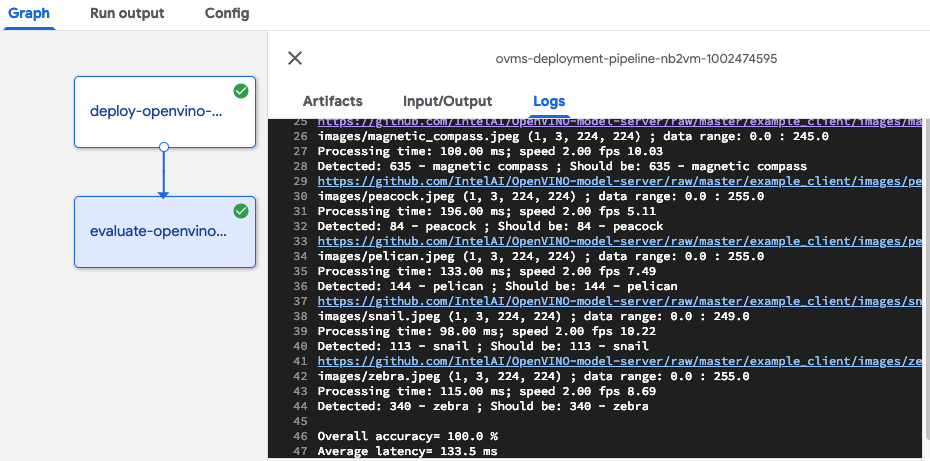

# OpenVINO Model Server deployment pipeline

This is an example of a pipeline implementation based on [OpenVINO Model Server deployer](../../../components/openvino/ovms-deployer) component.

It includes 2 tasks:
- deployment of OpenVINO Model Server in Kubernetes 
- evaluation of the model server instance and its served model

 

## Parameters

- model_export_path - shared storage location( google storage, persistent storage or NFS) pointing to the folder with numerical subfolders storing OpenVINO models. 
For example path 'gs://intelai_public_models/resnet_50_i8' includes subfolder '1' which stores model files .bin and .xml in Intermediate Representation format.
Refer to [OVMS documentation](https://github.com/IntelAI/OpenVINO-model-server/blob/master/docs/docker_container.md#preparing-the-models)
- server_name - Kubernetes service name to be deployed. The model name in the grpc endpoint has the same name.
- log_level - DEBUG/INFO/ERROR - sets the logging level in OVMS pods
- batch_size - which batch size should be loaded in the served model: 'auto' or numerical values
- model_version_policy - parameter defining which version should be served in OVMS. Examples: '{"latest": { "num_versions":2 }}') / 
{"specific": { "versions":[1, 3] }} / {"all": {}}
- replicas - number of pods which should be deployed to serve the model. More replicas is increasing the scalability and number of client requests which can be handled in parallel.
- evaluation-images-list - path or URL to the file with a list of evaluation images. The file should include in every line a path or URL to an image and the classification label number separated by space.
- image-path-prefix - prefix which should be added to every image in the list above. To be used when the image path is relative.
- model-input-name - name of the gRPC input key including data for inference processing. It matches input tensor. 
- model-output-name - name of the output key in gRPC response
- model-input-size - the resolution of the images processed in the model. Evaluation script is rescaling the images to match the model input size.

## Exemplary parameter values

Included default values ensure smooth execution without any extra requirements. They can be changed to execute using custom
models and datasets. 

- The deployed serving component is [OpenVINO Model Server](https://github.com/IntelAI/OpenVINO-model-server) which is using a public docker image.
- the default OpenVINO Model in IR format is representing ResNet v1.50 network topology. 
It is based on pre-trained model from Caffe framework, optimized with OpenVINO model optimizer and quantized to INT8 precision.
You can learn more about model optimization for production deployments on [intel.ai blog post](https://www.intel.ai/introducing-int8-quantization-for-fast-cpu-inference-using-openvino/#gs.2kxdii)
- included [samples of images](https://raw.githubusercontent.com/IntelAI/OpenVINO-model-server/master/example_client/input_images.txt)
 can be used to run simple test and can be easily swapped with other datasets like ImageNet. 

