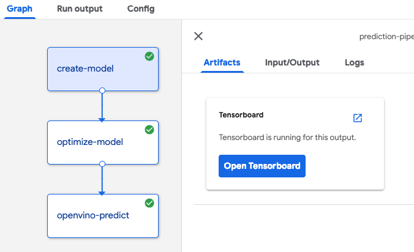
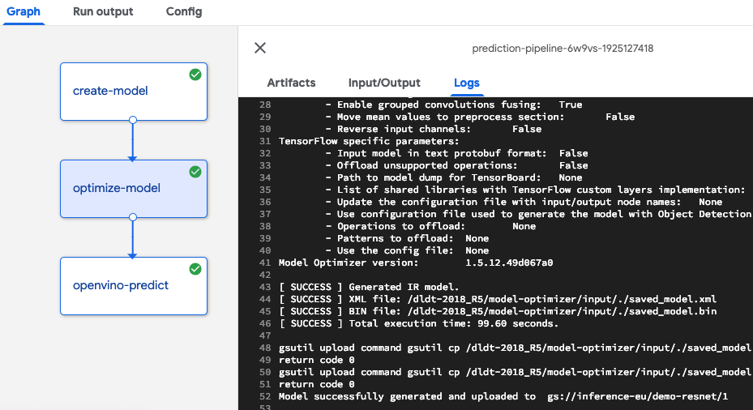
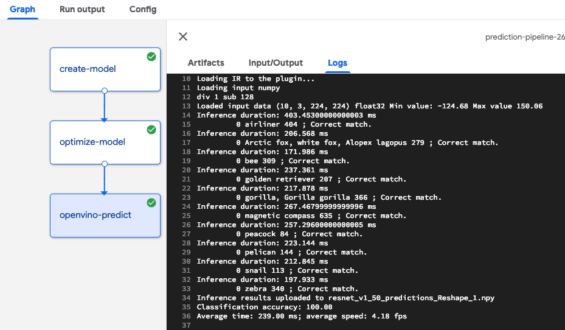

# OpenVINO workflow demo with TensorFlow slim models optimization and evaluation


This pipeline integrates three components:

- [TensorFlow slim models generator](../../../components/openvino/tf-slim) - it creates slim models which are considered as exemplary to 
demonstrate OpenVINO model optimization and execution
- [OpenVINO model optimizer](../../../components/openvino/model_convert) - it converts the model 
from TensorFlow or other frameworks into Intermediate Representation format. 
It is one time operation. The result can be used in the inference execution using Inference Engine.
- [Inference Engine prediction](../../../components/openvino/predict) - it is running the inference evaluation based on 
input and label data in numpy files

The pipeline can be used to assess the results of model optimization in terms of inference execution time and 
classification accuracy. 

During the pipeline execution there are generated several artifacts.
 
In the path set by `tf-export-dir` parameter:
- Graph definition in protobuffer format
- Frozen graph created based on imported checkpoint

In the path set by `generated-model-dir` parameter:
- TensorFlow model in a frozen saved_model format. It can be consumed by TensorFlow based inference scripts or TensorFlow 
serving. This format can't be used for additional training because all variables are changed to constants.
- Intermediate Representation of the optimized model created based on the exported TF saved model. It can be used to run 
inference operation 
using OpenVINO Inference Engine or to be imported by OpenVINO Model Server
- TensorFlow even file which can be used to visualize the graph in tensorboard

`generated-model-dir` value should be pointed to a shared location like google storage, persistent storage or NFS 
so it could be passed between components. 




## Parameters

- model_name = slim model name which match the allowed topologies from 
[slim repo](https://github.com/tensorflow/models/blob/master/research/slim/nets/nets_factory.py)
- num_classes = how many classes is defined in the model. For slim models it could be `1000` or `1001` depending on the model
- checkpoint_url = URL to the compressed checkpoint for the [pre-trained models](https://github.com/tensorflow/models/tree/master/research/slim#pre-trained-models)
-batch_size - batch size for the generated IR model
- export_dir - location for storing auxiliary model formats
- generated_model_dir - location for storing pipeline results - google storage path. If set to a numerical subfolder 
 it could be used by TensorFlow Serving or OpenVINO Model Server 
- mo_options -  a list of options to be passed to model optimizer, it assumes the source model in saved_model folder
 will be downloaed to the 'current directory' so use `--saved_model_dir .` to point to the model generated in first step.
 Refer to [mo.py --help](../../../components/openvino/model_convert) for details.
- input_numpy_file - gs path to the numpy file including evaluation dataset in the `NCHW` format.
- label_numpy_file - gs path to the numpy file with labels for evaluation images. They will be used to access model accuracy.

## Examples of the parameters

```bash
model-name - resnet_v1_50<br />
model-name - 1000
checkpoint-url - http://download.tensorflow.org/models/resnet_v1_50_2016_08_28.tar.gz
batch-size - 1
tf-export-dir = /tmp/export
generated-model-dir = gs://your-bucket/folder
mo_options - saved_model_dir .
input_numpy_file - gs://intelai_public_models/images/imgs.npy
label-numpy-file - gs://intelai_public_models/images/lbs.npy
```


