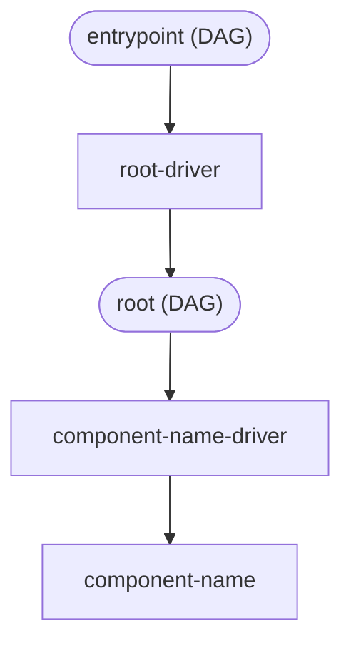
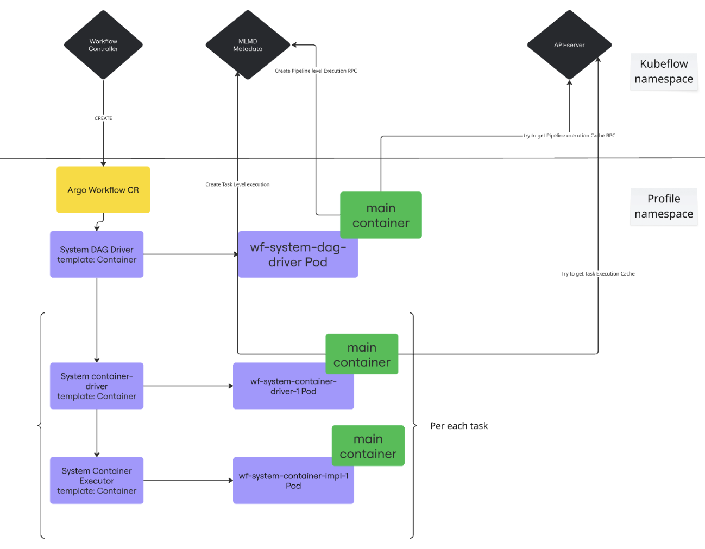

# Pipeline Anatomy

This document clarifies the anatomy of a single-component pipeline. Complexity sometimes discourage scrutiny. My hope is that improved clarity will pave the way for consolidation and simplification. 

## Flowchart



## Table

| Argo Workflows (AWF) Task Name | AWF Task Type | AWF Template Name         | Driver Type | Pod | Responsibilities                                                                                                                                                                                                                                                                         |
| ------------------------------ | ------------- | ------------------------- | ----------- | --- | ---------------------------------------------------------------------------------------------------------------------------------------------------------------------------------------------------------------------------------------------------------------------------------------- |
| entrypoint                     | dag           | entrypoint                | N/A         |     | In Argo Workflows, the entrypoint DAG defines the primary template to be executed when a workflow is initiated. It acts as the starting point or "main" function of your workflow.<br><br> The entrypoint has two sequential tasks:<ol><li>root-driver<li>driver                         |
| root-driver                    | container     | system-dag-driver         | ROOT_DAG    | ✅   | <ol><li>Validates provided options<li>Determines where artifacts will be stored<li>Creates the execution record in MLMD</ol>                                                                                                                                                             |
| root                           | dag           | root                      | N/A         |     | The root DAG has two sequential tasks:<ol><li>\<component-name\>-driver<li>\<component-name\></ol>                                                                                                                                                                                       |
| \<component-name\>-driver      | container     | system-container-driver   | CONTAINER   | ✅   | <ol><li>Resolves inputs from upstream tasks<li>Evaluates conditions<li>Prepares output destinations<li>Makes caching decisions<li>Creates execution record in MLMD<li>Dynamically configures subsequent execution pod (including K8s-specific config) at runtime using podSpecPatch</ol> |
| \<component-name\>             | container     | system-container-executor | N/A         | ✅   | <ol><li>Downloads input artifacts<li>Executes end-user code<li>Uploads output artifacts<li>Records output metadata and execution status to MLMD<li>Publishes logs</ol>                                                                                                                   |

## Reference Pipeline

```python
from kfp import dsl
from kfp import compiler


@dsl.component()
def hello_world():
    print("hello world")


@dsl.pipeline()
def pipeline_hello_world():
    task = hello_world()
```

## Pipeline Execution Flow on Argo Workflows Backend


## Table

| Pipeline Execution Component Name | Responsibilities                                                                                                                                                      |
|-----------------------------------|-----------------------------------------------------------------------------------------------------------------------------------------------------------------------|
| Workflow Controller               | Workflow Controller is the central component in the Argo Workflows backend. It monitors and executes Argo Workflow Custom Resources (CRs)                             |
| MLMD Metadata*                    | MLMD Metadata is a storage system for tracking experiments                                                                                                            |
| Argo Workflow CR                  | Argo Workflow CR is the representation of a pipeline at the Argo Workflows level. It contains information about all tasks and their dependencies within the pipeline. |
| API-server                        | API Server — from the pipeline execution perspective, it provides access to the previously executed pipeline cache (if it exists).                                    |

The MLMD implementation is [planned](https://github.com/kubeflow/pipelines/pull/12147) to be replaced in the future.