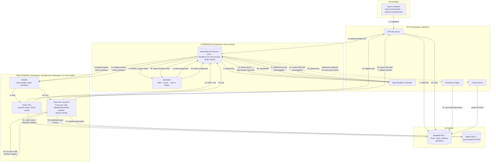

# Full Architecture — Single-Task Argo Workflow, End to End

```mermaid
flowchart TD
    subgraph FRONTEND["FRONTEND"]
        FE["User's container<br/>(user environment) —<br/>submits via SDK/client"]
    end

    subgraph KFP["KFP (namespace: kubeflow)"]
        API["KFP API Server"]
        CACHE["Cache Server"]
        PA["Persistence Agent"]
        ARGO["Argo Workflow Controller"]
    end

    subgraph K8S["KUBERNETES (namespace: kube-system)"]
        K8SAPI[("Kubernetes API Server + etcd —<br/>Workflow CR, Pod records, Node records")]
        SCHED["Scheduler<br/>(filter + score → pick a Node)"]
    end

    subgraph STORAGE["STORAGE"]
        DB[("Metadata DB —<br/>Runs, Tasks, Artifacts (pointers)")]
        OBJ[("Object Store —<br/>actual artifact BYTES")]
    end

    subgraph TASK_RUNNING["TASK RUNNING (namespace: example-user-namespace, on some Node)"]
        KUBELET["kubelet<br/>(pulls image, starts container)"]
        DRV["Driver Pod<br/>(resolve inputs, check cache)"]
        LAU["Task Pod: Launcher<br/>(runs user code,<br/>uploads/downloads artifacts,<br/>reports results)"]
    end

    FE -->|"1: CreateRun"| API
    API -->|"2: write Run"| DB
    API -->|"3: submit Workflow CR"| K8SAPI
    K8SAPI -->|"4: watched by"| ARGO

    ARGO -->|"5: create Driver Pod<br/>(unassigned)"| K8SAPI
    K8SAPI -->|"6: notices, assigns Node"| SCHED
    SCHED -->|"7: writes assignment"| K8SAPI
    K8SAPI -->|"8: kubelet notices,<br/>starts container"| KUBELET
    KUBELET -->|"9: runs"| DRV

    DRV -->|"10: register task"| API
    DRV -->|"11: check cache /<br/>read prior artifacts"| DB
    DRV -->|"12: done - exit"| K8SAPI

    K8SAPI -->|"13: Driver done —<br/>Argo creates Task Pod"| ARGO
    ARGO -->|"14: create Task Pod<br/>(unassigned)"| K8SAPI
    K8SAPI -->|"15: same Scheduler flow"| SCHED
    SCHED -->|"16: writes assignment"| K8SAPI
    K8SAPI -->|"17: kubelet notices,<br/>starts container"| KUBELET
    KUBELET -->|"18: runs"| LAU

    LAU -->|"19: download inputs<br/>(if any)"| OBJ
    LAU -->|"20: run user code,<br/>produce outputs"| LAU
    LAU -->|"21: upload output bytes"| OBJ
    LAU -->|"22: report task state<br/>+ artifact records"| API
    API -->|"23: write"| DB
    LAU -->|"24: exit"| K8SAPI

    K8SAPI -.->|"25: watched by"| ARGO
    K8SAPI -.->|"26: watched by"| PA
    PA -->|"27: sync Run/Task status"| DB

    K8SAPI -.->|"admission webhook,<br/>on every pod creation"| CACHE
    CACHE -->|"cache-hit check"| DB
```

*(photo cuts off at the closing fence — any prose after the diagram wasn't captured)*
