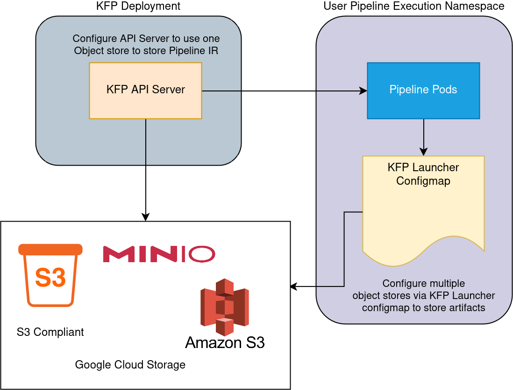

# Object Store Configuration

> **Note**: As of [KFP 2.15](https://github.com/kubeflow/pipelines/releases/tag/2.15.0), the default object store deployment has been changed to SeaweedFS, replacing the previous deployment of MinIO. It is important to note that MinIO remains fully supported (as is any S3-compliant object store within KFP); only the default deployment configuration has been updated. Older MinIO manifests are still available [here](https://github.com/kubeflow/pipelines/blob/release-2.15/manifests/kustomize/env/platform-agnostic-minio/kustomization.yaml). These legacy manifests may be subject to removal in future releases.

In Kubeflow Pipelines (KFP), there are two components that utilize Object store:

* KFP API Server
* KFP Launcher (aka KFP executor)

The default object store that is shipped as part of the Kubeflow Community Distribution is SeaweedFS. However, you can configure a different object store provider with your KFP deployment.

The following diagram provides an simplified overview of how object storage is utilized and configured:



## Prerequisites

* Admin level access to KFP Kubernetes namespace
* Object Store credentials for a supported provider (see below)

> **Note**: in this doc "**KFP Namespace**" refers to the namespace where KFP is deployed. If KFP is deployed as part of the Kubeflow Community Distribution deployment, this is the `kubeflow` namespace.

## KFP API Server

The KFP API Server uses the object store to store the Pipeline Intermediate Representation (IR).

The list below describe the type of Object Store configurations supported today for API Server. Static credentials here
refers to long term credentials provided by Object Store providers. 

For [AWS Static Credentials] and other S3 compliant object storage, this consists of an Access Key ID and Secret Access Key ID embedded into the run time environment or, passed as secure parameters to some API. In Google Cloud Storage, this refers to a JSON containing the [GCS APP Credentials].

### API Server Supported providers

| Provider                                     | Supported |
|----------------------------------------------|-----------|
| SeaweedFS with Static Credentials            | Yes       |
| SeaweedFS Gateway to AWS/GCP/Azure/Minio S3  | Yes       |
| AWS S3 with Static Credentials               | Yes       |
| AWS S3 with IRSA                             | Yes       |
| S3-Compliant Storage with Static Credentials | Yes       |
| Google Cloud Storage with Static Credentials | No        |
| Google Cloud Storage with App Credentials    | No        |

### API Server Object Store Configuration

To configure the object store used by the KFP API Server, the configuration depends on whether you are using static credentials, or AWS S3 with IAM roles for service accounts (IRSA).

**Static credentials**

To configure an AWS S3 bucket with static credentials you will need to add the following environment variables to your KFP API Server deployment:

```yaml
apiVersion: apps/v1
kind: Deployment
metadata:
  name: ml-pipeline
  namespace: kubeflow
spec:
  ...
  template:
    ...
    spec:
      containers:
      - name: ml-pipeline-api-server
        serviceAccountName: "ml-pipeline"
        env:
          ...
          - name: OBJECTSTORECONFIG_HOST
            value: "your-bucket" # e.g. s3.amazonaws.com
          - name: OBJECTSTORECONFIG_PORT
            value: "port" # e.g. 443   
          - name: OBJECTSTORECONFIG_REGION
            value: "region" # e.g. us-east-1
            # true if object store is on a secure connection 
          - name: OBJECTSTORECONFIG_SECURE
            value: "true"        
            # These env vars reference the values from a Kubernetes secret
            # this requires deploying the secret ahead of time, and filling out the
            # following values accordingly.
          - name: OBJECTSTORECONFIG_ACCESSKEY
            valueFrom:
              secretKeyRef:
                key: "some-key-1"
                name: "secret-name"
          - name: OBJECTSTORECONFIG_SECRETACCESSKEY
            valueFrom:
              secretKeyRef:
                key: "some-key-2"
                name: "secret-name"
```

**AWS IRSA (IAM Roles for Service Accounts)**

To utilize AWS IRSA for KFP API Server, you will need to omit any Static credential configuration from your deployment, namely `OBJECTSTORECONFIG_ACCESSKEY` and `OBJECTSTORECONFIG_SECRETACCESSKEY` , as these take precedence. If they are left in, API Server will ignore any IRSA configuration.

Next, ensure the appropriate IAM roles associated with the Kubernetes Service Account `ml-pipeline` in the KFP namespace. This is highly dependent on your platform provider, for example for EKS see the [IRSA docs].

## KFP Launcher

The KFP launcher uses the object store to store KFP Input and Output Artifacts.

The list below describe the type of Object Store configurations supported today for API Server.

Refer to the API Server configuration section [here](#api-server-supported-providers) for more information on what Static Credentials are.

### KFP Launcher Supported providers

| Provider                                     | Supported |
|----------------------------------------------|-----------|
| SeaweedFS with Static Credentials            | Yes       |
| SeaweedFS Gateway to AWS/GCP/Azure/Minio S3  | Yes       |
| AWS S3 with Static Credentials               | Yes       |
| AWS S3 with IRSA                             | Yes       |
| S3-Compliant Storage with Static Credentials | Yes       |
| Google Cloud Storage with Static Credentials | Yes       |
| Google Cloud Storage with App Credentials    | Yes       |
| OCI Object Storage with Customer Secret Key  | Yes       |
| OCI Object Storage with IAM Principals       | No        |

### KFP Launcher Object Store Configuration

To configure the object store utilized by the KFP Launcher, you will need to edit the `kfp-launcher` Kubernetes ConfigMap.

In a default KFP deployment, this typically looks like: 

```yaml
apiVersion: v1
kind: ConfigMap
metadata:
  name: kfp-launcher
  namespace: user-namespace
data:
  defaultPipelineRoot: ""
```

> **Note**: **If this configmap is not provided, you will need to deploy this in the Kubernetes Namespace where the Pipelines will be 
executed**. This is not necessarily the same namespace as where Kubeflow Pipeline itself is deployed.

The `defaultPipelineRoot` is a path within the Object store bucket where Artifact Input/Outputs in a given pipeline are 
stored. Note that this field can also be configured via the KFP SDK, see [SDK PipelineRoot Docs]. It can also be configured via the 
KFP UI when creating a Run.

By default `defaultPipelineRoot` is `minio://mlpipeline/v2/artifacts` and artifacts are stored in the default SeaweedFS deployment.
The first value in the path `mlpipeline` refers to the bucket name. 

If you want artifacts to be stored in a different path in the bucket that is not `/v2/artifacts`, you can simply change the `defaultPipelineRoot`.
For example to store artifacts in `/some/other/path` within the default SeaweedFS install, use the following KFP Launcher configmap: 

```yaml
apiVersion: v1
kind: ConfigMap
metadata:
  name: kfp-launcher
  namespace: user-namespace
data:
  defaultPipelineRoot: "minio://mlpipeline/some/other/path"
```

> **Note**: that when utilizing the **KFP Launcher configmap it needs to be deployed in the same namespace where the Pipelines 
will be created**. In a standalone KFP deployment this is the KFP namespace. In a Kubeflow Community Distribution deployment, this will 
be the user Kubeflow Profile namespace.

#### Configure other Providers

To utilize a different object store provider entirely, you will need to add a new field `providers` to the KFP launcher configmap.
How to configure this field depends on your object store provider. See below for details.

Note that the provider is determined by the PipelineRoot value. If `PipelineRoot=s3://mlpipeline` then this is matched
with the `s3` provider. If `PipelineRoot=gs://mlpipeline` then this is matched with the `gs` provider (GCS), if
`PipelineRoot=oci://mlpipeline@mynamespace` then this is matched with the `oci` provider (OCI Object Storage) and so on.

#### S3 and S3-compatible Provider

To configure an AWS S3 bucket with static credentials, update your KFP Launcher configmap to the following:

```yaml
apiVersion: v1
data:
  defaultPipelineRoot: s3://mlpipeline
  providers: |-
    s3:
      default:
        endpoint: s3.amazonaws.com
        disableSSL: false
        region: us-east-2
        forcePathStyle: true
        credentials:
          fromEnv: false
          secretRef:
            secretName: your-k8s-secret
            accessKeyKey: some-key-1
            secretKeyKey: some-key-2
kind: ConfigMap
metadata:
  name: kfp-launcher
  namespace: user-namespace
```

The `s3` provider field is valid for any s3 compliant storage. The `default` indicates that this configuration is used 
by default if no matching `overrides` are provided (read about [overrides]).

#### S3 IRSA and Environment based Credentials

If you are using AWS IRSA, or you have embedded your bucket credentials in the task environment (e.g. via [SDK Secret Env]), 
then you can set `fromEnv: true` and omit `secretRef`. This would look something like: 

```yaml
apiVersion: v1
data:
  defaultPipelineRoot: s3://mlpipeline
  providers: |-
    s3:
      default:
        endpoint: s3.amazonaws.com
        disableSSL: false
        region: us-east-2
        forcePathStyle: true
        credentials:
          fromEnv: true
kind: ConfigMap
metadata:
  name: kfp-launcher
  namespace: user-namespace
```

Ensure that the service account being used to run your pipeline is configured with IRSA (see [IRSA docs]).

You can also configure static credentials via AWS Environment variables directly in your pipeline, for example: 

```python
kubernetes.use_secret_as_env(
    your_task,
    secret_name='aws-s3-creds',
    secret_key_to_env={'AWS_SECRET_ACCESS_KEY': 'AWS_SECRET_ACCESS_KEY'})
kubernetes.use_secret_as_env(
    your_task,
    secret_name='aws-s3-creds',
    secret_key_to_env={'AWS_ACCESS_KEY_ID': 'AWS_ACCESS_KEY_ID'})
kubernetes.use_secret_as_env(
    your_task,
    secret_name='aws-s3-creds',
    secret_key_to_env={'AWS_REGION': 'AWS_REGION'})
...
```

#### Google Cloud Storage (GCS) provider

To configure a GCS provider with static credentials you need to only provide the reference to the App Credentials file via a Kubernetes Secret: 

```yaml
apiVersion: v1
data:
  defaultPipelineRoot: gs://mlpipeline
  providers: |-
    gs:
      default:
        credentials:
          fromEnv: false
          secretRef:
            secretName: your-k8s-secret
            tokenKey: some-key-1
kind: ConfigMap
metadata:
  name: kfp-launcher
  namespace: user-namespace
```

You can also configure static credentials via GCS Environment variables directly in your pipeline, for example:

```python
# Specify the default APP Credential path
your_task.set_env_variable(name='GOOGLE_APPLICATION_CREDENTIALS', value='/gcloud/credentials.json')
# Mount the GCS Credentials JSON
kubernetes.use_secret_as_volume(your_task, secret_name='gcs-secret', mount_path='/gcloud')
```

#### GCS Environment based Credentials

If you have embedded GCS credentials in your Pipeline Task environment (e.g. via [SDK Secret Env]), you can set 
`fromEnv: true` and omit the `secretRef`: 

```yaml
apiVersion: v1
data:
  defaultPipelineRoot: gs://mlpipeline
  providers: |-
    gs:
      default:
        credentials:
          fromEnv: true
kind: ConfigMap
metadata:
  name: kfp-launcher
  namespace: user-namespace
```

#### Oracle Cloud Infrastructure (OCI) Object Storage provider

OCI Object Storage buckets are addressed with the same convention as the OCI CLI, `ocifs` and OCI Data Science:

```
oci://<bucket>@<namespace>/<prefix>
```

The `@<namespace>` part is **required**. KFP already uses the bare `oci://<registry>/<repository>[:tag]` form for
[Modelcar container images](../user-guides/components/importer-component.md); the `@<namespace>` in the authority is what
tells the launcher that the URI is a bucket path rather than a container image reference.

The launcher accesses the bucket through the [S3-compatible API] that every OCI Object Storage namespace exposes at
`https://<namespace>.compat.objectstorage.<region>.oraclecloud.com`. Requests are signed with a [Customer Secret Key]
(an S3-style access key / secret key pair created for an OCI IAM user). Because the namespace is part of the pipeline
root, the provider only needs the region and the credentials:

```yaml
apiVersion: v1
data:
  defaultPipelineRoot: oci://mlpipeline@mynamespace/v2/artifacts
  providers: |-
    oci:
      default:
        region: us-ashburn-1
        credentials:
          fromEnv: false
          secretRef:
            secretName: oci-customer-secret-key
            accessKeyKey: accessKey
            secretKeyKey: secretKey
kind: ConfigMap
metadata:
  name: kfp-launcher
  namespace: user-namespace
```

Create the Kubernetes Secret from the Customer Secret Key:

```bash
kubectl -n user-namespace create secret generic oci-customer-secret-key \
  --from-literal=accessKey="<customer secret key access key>" \
  --from-literal=secretKey="<customer secret key secret>"
```

Optional fields on `default` and on each override:

* `endpoint` — replaces the derived `https://<namespace>.compat.objectstorage.<region>.oraclecloud.com` endpoint, for
  example for a private endpoint or a proxy. When the endpoint does not follow the `compat.objectstorage.<region>`
  convention, `region` must be set as well (it is the SigV4 signing region).
* `forcePathStyle` — defaults to `true`; the OCI S3-compatible API is path-style.
* `maxRetries` — defaults to `5`.

Overrides work like the S3 overrides described below and additionally accept an optional `namespace` field to pin an
override to a specific Object Storage namespace:

```yaml
oci:
  default:
    region: us-ashburn-1
    credentials:
      fromEnv: false
      secretRef:
        secretName: oci-customer-secret-key
        accessKeyKey: accessKey
        secretKeyKey: secretKey
  overrides:
    # Matches pipeline root: oci://mlpipeline@mynamespace/team-a
    - bucketName: mlpipeline
      namespace: mynamespace
      keyPrefix: team-a
      region: us-phoenix-1
      credentials:
        fromEnv: false
        secretRef:
          secretName: oci-team-a-key
          accessKeyKey: accessKey
          secretKeyKey: secretKey
```

#### OCI Environment based Credentials

With `credentials.fromEnv: true` (or when no `oci` provider is configured at all) the launcher resolves the Customer
Secret Key through the AWS SDK default credential chain, i.e. from `AWS_ACCESS_KEY_ID` / `AWS_SECRET_ACCESS_KEY`
environment variables injected into the task (for example via [SDK Secret Env]). The region is taken from the provider
config, from a `?region=<region>` query parameter on the pipeline root, or from the `OCI_REGION` environment variable:

```python
kubernetes.use_secret_as_env(
    your_task,
    secret_name='oci-customer-secret-key',
    secret_key_to_env={'accessKey': 'AWS_ACCESS_KEY_ID', 'secretKey': 'AWS_SECRET_ACCESS_KEY'})
your_task.set_env_variable(name='OCI_REGION', value='us-ashburn-1')
```

> **Note**: native OCI IAM authentication (instance principals, resource principals, API-key request signing) is not
> supported by the `oci` provider: the S3-compatible API only accepts Customer Secret Keys. Supporting IAM principals
> requires a dedicated Object Storage driver on top of the OCI Go SDK.

> **Note**: the KFP UI currently recognizes `oci://<bucket>@<namespace>/...` artifact URIs but cannot preview or download
> them yet; it answers such requests with HTTP 501. Use the OCI Console or the OCI CLI (`oci os object get`) instead.

### KFP Launcher Overrides

KFP Launcher overrides allow users to specify different Provider sources for different paths within a given PipelineRoot. 

The following example shows a comprehensive example of how to do this for GCS and S3 compatible providers: 

```yaml
gs:
  default:
    credentials:
      fromEnv: false
      secretRef:
        secretName: gs-secret-1
        tokenKey: gs-tokenKey
  overrides:
    # Matches pipeline root: gs://your-bucket/some/subfolder
    - bucketName: your-bucket
      keyPrefix: some/subfolder
      credentials:
        fromEnv: false
        secretRef:
          secretName: gcs-secret-2
          tokenKey: gs-tokenKey-2
    # Matches pipeline root: gs://your-bucket/some/othersubfolder
    - bucketName: your-bucket
      keyPrefix: some/othersubfolder
      credentials:
        fromEnv: true
s3:
  default:
    endpoint: http://some-s3-compliant-store-endpoint.com
    disableSSL: true
    region: minio
    forcePathStyle: true
    credentials:
      fromEnv: false
      secretRef:
        secretName: your-secret
        accessKeyKey: accesskey
        secretKeyKey: secretkey
  overrides:
    # Matches pipeline root: s3://your-bucket/subfolder
    # aws-s3-creds secret is used for static credentials
    - bucketName: your-bucket
      keyPrefix: subfolder
      endpoint: s3.amazonaws.com
      region: us-east-2
      forcePathStyle: false
      disableSSL: false
      credentials:
        fromEnv: false
        secretRef:
          secretName: aws-s3-creds
          accessKeyKey: AWS_ACCESS_KEY_ID
          secretKeyKey: AWS_SECRET_ACCESS_KEY
    # Matches pipeline root: s3://your-bucket/some/s3/path/a/b
    - bucketName: your-bucket
      keyPrefix: some/s3/path/a/b
      endpoint: s3.amazonaws.com
      region: us-east-2
      credentials:
        fromEnv: true
    # Matches pipeline root: s3://your-bucket/some/s3/path/a/c
    - bucketName: your-bucket
      keyPrefix: some/s3/path/a/c
      endpoint: s3.amazonaws.com
      region: us-east-2
      credentials:
        fromEnv: false
        secretRef:
          secretName: aws-s3-creds
          accessKeyKey: AWS_ACCESS_KEY_ID
          secretKeyKey: AWS_SECRET_ACCESS_KEY
    # Matches pipeline root: s3://your-bucket/some/s3/path/b/a
    - bucketName: your-bucket
      keyPrefix: some/s3/path/b/a
      endpoint: https://s3.amazonaws.com
      region: us-east-2
      credentials:
        fromEnv: false
        secretRef:
          secretName: aws-s3-creds
          accessKeyKey: AWS_ACCESS_KEY_ID
          secretKeyKey: AWS_SECRET_ACCESS_KEY
```

The `keyPrefix` are matched with the path prescribed in the `PipelineRoot`. For example if  `PipelineRoot` is `s3://your-bucket/some/s3/path/b/a` Then the following provider config is used: 

```yaml
- bucketName: your-bucket
  keyPrefix: some/s3/path/b/a
  endpoint: https://s3.amazonaws.com
  region: us-east-2
  credentials:
    fromEnv: false
    secretRef:
      secretName: aws-s3-creds
      accessKeyKey: AWS_ACCESS_KEY_ID
      secretKeyKey: AWS_SECRET_ACCESS_KEY
```

If a field is not provided, then the default configuration is utilized. 

[IRSA docs]: https://docs.aws.amazon.com/emr/latest/EMR-on-EKS-DevelopmentGuide/setting-up-enable-IAM.html
[S3-compatible API]: https://docs.oracle.com/en-us/iaas/Content/Object/Tasks/s3compatibleapi.htm
[Customer Secret Key]: https://docs.oracle.com/en-us/iaas/Content/Identity/Tasks/managingcredentials.htm#Working2
[SDK PipelineRoot Docs]: ../concepts/pipeline-root.md
[overrides]: #kfp-launcher-overrides
[SDK Secret Env]: https://kfp-kubernetes.readthedocs.io/en/kfp-kubernetes-1.2.0/source/kubernetes.html#kfp.kubernetes.use_secret_as_env
[GCS APP Credentials]: https://cloud.google.com/docs/authentication/application-default-credentials
[AWS Static Credentials]: https://docs.aws.amazon.com/IAM/latest/UserGuide/security-creds.html
