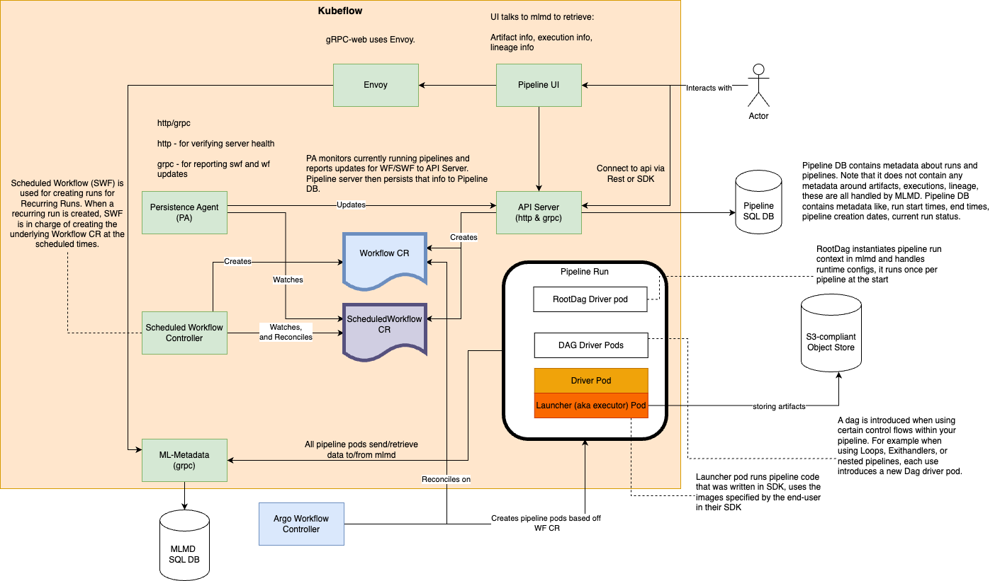

# Kubeflow Pipelines Architecture

Below is a detailed diagram of the Kubeflow Pipelines Architecture.

This section provides a high-level overview of the core components and how they interact within Kubeflow Pipelines.

The above diagram documents the various components in Kubeflow Pipelines and how they interact. This should be a useful starting point for any developers.
