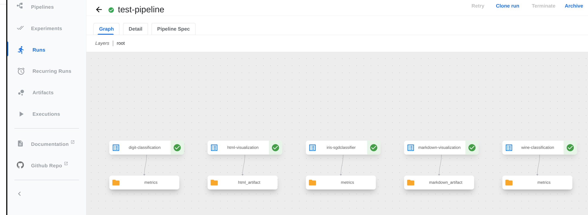
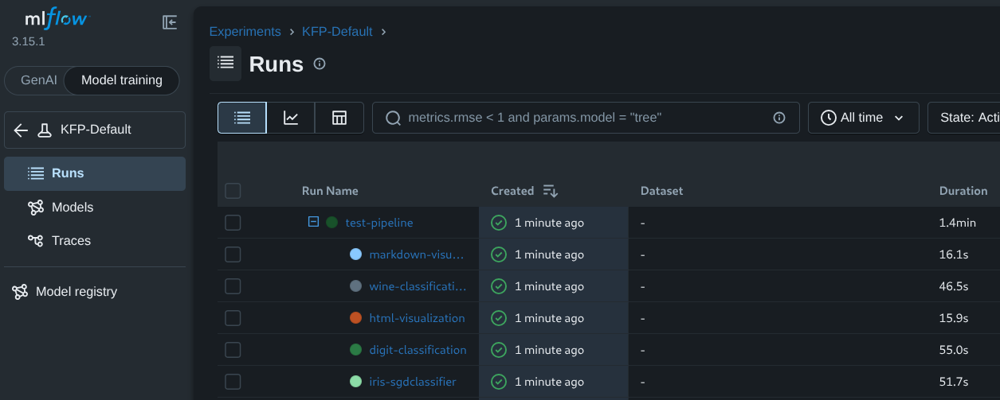
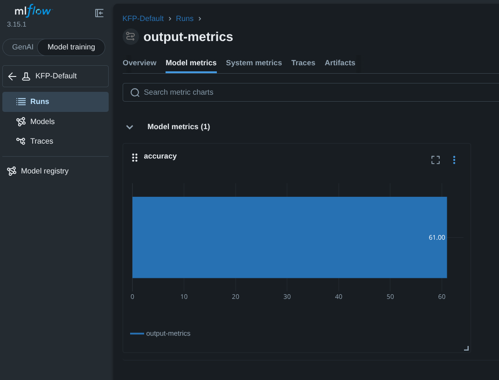

# Overview

## MLflow & Experiment Tracking

[MLflow](https://mlflow.org/) is an open-source platform for managing the end-to-end machine learning lifecycle.
It provides tools for experiment tracking, model versioning, and deployment.
The MLflow UI is a powerful interface for organizing, querying, and visualizing experiments and their corresponding runs, including run parameters and scalar metric artifacts.

## Integration Overview

This integration allows users to register KFP pipeline runs in MLflow, with the following features:
- Track pipeline runs as MLflow runs, organized under MLflow experiments
- Use [MLflow Autolog](https://mlflow.org/docs/latest/ml/tracking/autolog/) in pipeline components to automatically log metrics, parameters, and models
- View pipeline parameters and metrics in the MLflow UI
- Organize related runs under custom experiments
- Maintain a complete audit trail of your ML workflows

This integration bridges the gap between pipeline orchestration and experiment tracking, giving you a unified view of your machine learning workflows.
All tracked data is viewable in the MLflow UI, organized by experiments. You can specify a custom experiment name for each run, or use the default experiment configured by a cluster administrator.

The following pipeline view in the KFP console:

Is displayed in the MLflow console as:

This page provides detailed instructions on how to set up the MLflow plugin for Kubeflow Pipelines at the user level, once it has been deployed and configured at the [admin level](../../../operator-guides/mlflow-plugin.md).

## Features

### MLflow Experiments

MLflow experiments are a logical grouping of related runs. A run will always belong to exactly one experiment. If no experiment is specified, runs are logged to the default experiment (typically `"KFP-Default"` unless configured otherwise [by a cluster administrator](../../../operator-guides/mlflow-plugin.md#mlflow-experiments)).

### MLflow Workspaces

Organize your corresponding MLflow runs further by enabling and utilizing [MLflow workspaces](../../../operator-guides/mlflow-plugin.md#mlflow-workspaces) at either the API server level or namespace-level.

### Using MLflow Autolog with this Integration

MLflow's [Autolog](https://mlflow.org/docs/latest/ml/tracking/autolog/) feature automatically logs metrics, parameters, and artifacts from your machine learning code, without explicit instrumentation, using the simple line `mlflow.autolog()`.
This integration enables you to leverage MLflow Autolog in your Kubeflow Pipelines components, allowing you to track and visualize the performance of your machine learning models in the MLflow UI.
Note that, in order to use Autolog, you must [enable injection](../../../operator-guides/mlflow-plugin.md#plugin-optional-settings) of [MLflow environment variables](#mlflow-environment-variables-in-pipeline-end-user-code) for user containers.

### MLflow Environment Variables in Pipeline End-User Code

MLflow environment variable injection has end-user code applications beyond `autolog()`. The following environment variables are available for injection [(if enabled)](../../../operator-guides/mlflow-plugin.md#plugin-optional-settings):

**General variables:**
- `MLFLOW_RUN_ID`: The MLflow run ID for the current pipeline task (a nested run within the parent pipeline run)
- `MLFLOW_TRACKING_URI`: The MLflow endpoint URL
- `MLFLOW_EXPERIMENT_ID`: The MLflow experiment ID
- `MLFLOW_WORKSPACE`: The MLflow workspace name (if workspaces are enabled)

**Authentication variables:**
- `MLFLOW_TRACKING_AUTH`: Authentication type (`kubernetes` or `kubernetes-namespaced` for Kubernetes auth)
- `MLFLOW_TRACKING_TOKEN`: Bearer token (when using bearer auth)
- `MLFLOW_TRACKING_USERNAME` and `MLFLOW_TRACKING_PASSWORD`: Credentials (when using basic auth)

### Visualize KFP Run Parameters and Metrics in MLflow

This integration automatically logs scalar metric [artifacts](../../data-handling/artifacts.md) (referred to as "metrics" in the MLflow console)
and KFP pipeline run parameters to MLflow. These values are automatically visualized in the MLflow console as displayed below:

### Namespace-Level Overrides in Multiuser Mode

When running in multiuser mode, namespace-level configs are prioritized. Learn more about namespace-level MLflow configuration [here](../../../operator-guides/mlflow-plugin.md#mlflow-plugin-configuration-in-multi-user-mode).

### Run-level MLflow Config Overrides

While most MLflow settings are configured at the API server level, you can override certain values for individual pipeline runs using the `plugins_input.mlflow` field in the KFP API:

- **experiment_name**: Specify a custom experiment name for the run (overrides the default experiment)
- **experiment_id**: Use a specific experiment ID (overrides experiment name at all levels)
- **disabled**: Set to `true` to disable MLflow tracking for this run

Note: These overrides are only available through direct API calls, not through the KFP UI or Python SDK. See [Run a Pipeline](run-a-pipeline.md) for examples.

### Cached Pipeline Runs and MLflow

Pipeline component caching allows users to reuse the results of a previous pipeline run, if the results are available in the cache.
When a pipeline component run is retrieved from the cache, this integration will create a new MLflow run for the cached component,
as it normally would. Cached runs and normally executed runs are represented the same way in MLflow.
