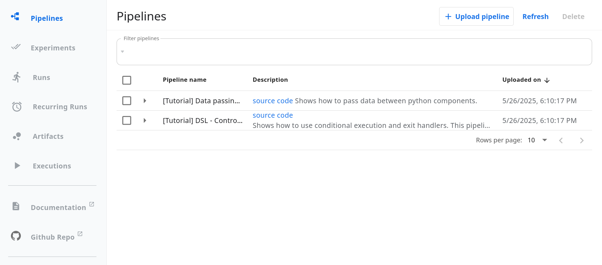

# Kubeflow Pipelines Frontend 

This section of the codebase contains the Kubeflow Pipelines (KFP) Frontend.

## Quick Start Development

This guide will get you started with development on KFP standalone mode. 

### Prerequisites

You will need the following installed in your environment:

* [Docker]
* [Kubectl]
* [Kind] 
* [Kustomize] 
* [Node] version specified in the [.nvmrc]

> [!Note]
> MAC users have reported positive experiences using [Docker + Colima] when using Kind environments. Consider
> using a similar setup if you are on a MAC and encountering issues with Docker VM.

### Deploy KFP

Clone and then deploy KFP: 

```bash
git clone https://github.com/kubeflow/pipelines.git ${WORKING_DIRECTORY}
cd ${WORKING_DIRECTORY}
make -C backend kind-cluster-agnostic
```

The above command will deploy KFP in standalone mode. You can access the KFP UI by port-forwarding the KFP UI Kubernetes Service:

```bash
kubectl -n kubeflow  port-forward svc/ml-pipeline-ui 3000:80
```

Navigate to [http://127.0.0.1:3000] to view the UI. You will see something like the following: 



Try uploading and running a pipeline and confirm it works! You can use one of the already uploaded templates. You can also follow the [KFP docs] for instructions on how to write and submit a pipeline. You can use [http://127.0.0.1:3000] as your `Client(host=...)` value.

### Local Development 

Now that you have had a chance to check out the UI, we will now scale this UI down and run the UI ourselves locally. 

Scale the UI down by running the following: 

```bash
# End the port-forwarding by pressing ctrl+D in your terminal, then run:
kubectl -n kubeflow scale --replicas=0 deployment/ml-pipeline-ui
```

You can confirm that the previous [http://127.0.0.1:3000] link no longer works.

Now navigate to the KFP frontend folder, install and build your NPM dependencies: 

```bash
cd ${WORKING_DIRECTORY}/frontend
npm ci
npm run build
```

Now run the following: 

```bash
npm run start:proxy-and-server
```

You should see the following output

```bash
Server listening at http://localhost:3001
```

Follow this link, and you should be directed to the KFP UI the same as before, except this time you are using the UI running in your local environment!

If you enjoy hot reloading when developing the client side React code, you can subsequently run the following command: 

```bash
npm run start
```

You should see something like the following output:

```bash
You can now view pipelines-frontend in the browser.

  Local:            http://localhost:3000
...
```

Follow this link, it should also take you to the same UI. The difference here is that whenever you change client side (React) code locally, you will automatically get the new changes in your browser without having to restart your server. 

## Contributing

For a more comprehensive guide on contributing, please read [CONTRIBUTING.md].

<!REFERENCES>
[Docker]: https://docs.docker.com/engine/install/
[Kind]: https://kind.sigs.k8s.io/#installation-and-usage
[Kustomize]: https://kustomize.io
[Node]: https://www.npmjs.com/package/node
[.nvmrc]: .nvmrc
[CONTRIBUTING.md]: CONTRIBUTING.md
[http://127.0.0.1:3000]: http://127.0.0.1:3000
[Kubectl]: https://kubernetes.io/docs/tasks/tools/#kubectl
[Docker + Colima]: https://github.com/abiosoft/colima?tab=readme-ov-file#docker
[sample pipeline]: https://raw.githubusercontent.com/kubeflow/pipelines/refs/heads/master/sdk/python/test_data/pipelines/pipeline_with_env.py
[sample pipeline in yaml]: https://raw.githubusercontent.com/kubeflow/pipelines/refs/heads/master/sdk/python/test_data/pipelines/pipeline_with_env.yaml
[KFP docs]: https://www.kubeflow.org/docs/components/pipelines/getting-started/