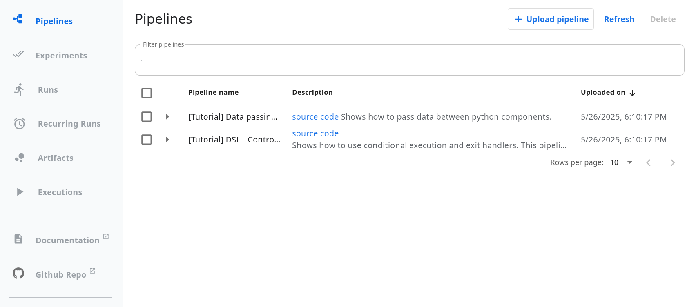

# Kubeflow Pipelines Frontend

This section of the codebase contains the Kubeflow Pipelines (KFP) Frontend.

## Current Stack

- React 19 with TypeScript on Vite 7
- MUI v5 with Emotion
- TanStack Query v5
- React Router v5
- Vitest with Testing Library v16 for UI tests
- Vitest for frontend server tests
- Storybook 10 for component development

## Quick Start Development

This guide will get you started with development on KFP standalone mode.

### Prerequisites

You will need the following installed in your environment:

* [Docker]
* [Kubectl]
* [Kind]
* [Kustomize]
* [Node] version specified in the [.nvmrc]
* npm version specified in [package.json]

> [!Note]
> MAC users have reported positive experiences using [Docker + Colima] when using Kind environments. Consider
> using a similar setup if you are on a MAC and encountering issues with Docker VM.

### Deploy KFP

Clone and then deploy KFP:

```bash
git clone https://github.com/kubeflow/pipelines.git ${WORKING_DIRECTORY}
cd ${WORKING_DIRECTORY}
make -C backend kind-cluster-agnostic
```

The above command will deploy KFP in standalone mode.
It uses sensible defaults (MySQL database) for quick setup. If you need to customize the backend configuration (e.g., use PostgreSQL instead of MySQL), please refer to the [backend README](../backend/README.md) for advanced deployment options using `dev-kind-cluster`.


You can access the KFP UI by port-forwarding the KFP UI Kubernetes Service:

```bash
kubectl -n kubeflow  port-forward svc/ml-pipeline-ui 3000:80
```


Navigate to [http://127.0.0.1:3000] to view the UI. You will see something like the following:



Try uploading and running a pipeline and confirm it works! You can use one of the already uploaded templates. You can also follow the [KFP docs] for instructions on how to write and submit a pipeline. You can use [http://127.0.0.1:3000] as your `Client(host=...)` value.

### Local Development

Now that you have had a chance to check out the UI, we will now scale this UI down and run the UI ourselves locally.

Scale the UI down by running the following:

```bash
# End the port-forwarding by pressing ctrl+D in your terminal, then run:
kubectl -n kubeflow scale --replicas=0 deployment/ml-pipeline-ui
```

You can confirm that the previous [http://127.0.0.1:3000] link no longer works.

Now navigate to the KFP frontend folder, install and build your NPM dependencies:

```bash
cd ${WORKING_DIRECTORY}/frontend
npm install --global "$(node -p 'require("./package.json").packageManager')"
npm ci
npm run build
```

Now run the following:

```bash
npm run start:proxy-and-server
```

You should see the following output

```bash
Server listening at http://localhost:3001
```

Follow this link, and you should be directed to the KFP UI the same as before, except this time you are using the UI running in your local environment!

If you enjoy hot reloading when developing the client side React code, you can subsequently run the following command:

```bash
npm run start
```

You should see output indicating the Vite dev server is running, for example:

```bash
VITE v7.x ready in ...
➜  Local:   http://localhost:3000/
...
```

Follow this link, it should also take you to the same UI. The difference here is that whenever you change client side (React) code locally, you will automatically get the new changes in your browser without having to restart your server.

The local dev bootstrap runs under React Strict Mode. Vitest UI tests are configured to do the same through Testing Library's global `reactStrictMode` setting so direct `render()` calls match dev behavior. Production builds remain outside Strict Mode.

### Mock backend shortcut

For fixture-backed client work that does not need a Kubernetes cluster, run:

```bash
npm run mock:api
npm run start
```

The mock backend serves the primary v2 Pipelines, Experiments, Runs, and Recurring Runs list pages with deterministic fixture data. Use `npm run start:proxy-and-server` against a real KFP deployment when validating MLMD, pod logs, runtime artifacts, auth, or backend behavior beyond those fixtures.

## Visual Regression Testing

When making UI changes, use the smoke test tool to capture screenshots and generate side-by-side comparisons against a base branch. This catches layout regressions, styling issues, and unintended visual changes before they reach review.

### Quick screenshot of your dev server

The fastest workflow — point the tool at your already-running `npm start` server:

```bash
node scripts/ui-smoke-test/smoke-test-runner.js --current-only --use-existing --url http://localhost:3000
```

Screenshots are saved to `.ui-smoke-test/screenshots/pr/`.

### Compare your branch against master

The full workflow — detects changed backend components, ensures a Kind cluster, builds both frontends, captures screenshots from both, and generates a side-by-side comparison with diff percentages:

```bash
node scripts/ui-smoke-test/smoke-test-runner.js --compare master
```

If your PR only touches frontend code, the backend rebuild is auto-skipped since no backend components changed.

### Compare someone else's PR

Fetch and test a PR you don't have checked out locally:

```bash
node scripts/ui-smoke-test/smoke-test-runner.js --compare master --pr 12756
```

Results are saved to `.ui-smoke-test/screenshots/comparison/`. See [scripts/ui-smoke-test/README.md] for the full command reference, troubleshooting, and architecture details.

## Contributing

For a more comprehensive guide on contributing, please read [CONTRIBUTING.md].

<!REFERENCES>
[Docker]: https://docs.docker.com/engine/install/
[Kind]: https://kind.sigs.k8s.io/#installation-and-usage
[Kustomize]: https://kustomize.io
[Node]: https://www.npmjs.com/package/node
[.nvmrc]: .nvmrc
[package.json]: package.json
[CONTRIBUTING.md]: CONTRIBUTING.md
[scripts/ui-smoke-test/README.md]: scripts/ui-smoke-test/README.md
[http://127.0.0.1:3000]: http://127.0.0.1:3000
[Kubectl]: https://kubernetes.io/docs/tasks/tools/#kubectl
[Docker + Colima]: https://github.com/abiosoft/colima?tab=readme-ov-file#docker
[sample pipeline]: https://raw.githubusercontent.com/kubeflow/pipelines/refs/heads/master/sdk/python/test_data/pipelines/pipeline_with_env.py
[sample pipeline in yaml]: https://raw.githubusercontent.com/kubeflow/pipelines/refs/heads/master/sdk/python/test_data/pipelines/pipeline_with_env.yaml
[KFP docs]: https://www.kubeflow.org/docs/components/pipelines/getting-started/

## Artifact ownership migration in 2.18

Multi-user frontend previews and downloads enforce namespace-prefixed object keys by default:
`private-artifacts/<namespace>/...` (or `ARTIFACT_NAMESPACE_KEY_PREFIX/<namespace>/...`).
Matching MLMD metadata alone no longer authorizes an arbitrary custom-root object. This applies
to direct and proxied MinIO, S3, GCS and HTTP(S) retrieval. Standalone mode is unchanged.

Operators with legacy custom roots can temporarily set `ARTIFACT_OWNERSHIP_ENFORCEMENT=audit`
in the `pipeline-install-config` ConfigMap and restart the frontend deployment. The default is
`enforce`; unknown values deny access. Audit is a **2.18 migration option, not a security fix**:
matching metadata can refer to another tenant's object when downstream credentials are shared.
Enable audit only after independently verifying storage and proxy/network isolation, and set a
migration deadline before upgrading to 3.0. The 3.0 policy has no audit exception.

Audit relaxes only an absent namespace prefix after successful MLMD lookup and matching namespace
evidence for every returned artifact. It does not relax user authorization, explicit namespace
mismatches, unsafe paths, missing protobufs, MLMD errors/timeouts or missing context evidence.
For objects absent from MLMD, `mlmd-then-prefix` retains the validated namespace-prefix fallback;
`mlmd-only` still denies them. Neither mode permits unavailable ownership checks to fail open.

Each permitted legacy read emits an `artifact_ownership_audit` warning with namespace, source,
route category and reason. Count these events in your log system to track migration; full object
URIs, query strings and credentials are not included in the audit event. Audit also emits a startup
warning. An event records permission to proceed, not proof that the downstream download succeeded.

Configure new pipeline roots with namespace-prefixed paths, then move/copy authorized existing
objects and update their references. Metadata changes alone do not move storage objects. Switch
back to `enforce` and verify preview/download before upgrading. Do not disable authentication to
restore custom-root access. MLMD outages now deny artifact reads in both modes, including reads of
otherwise correctly prefixed objects; restoring MLMD restores those reads.
