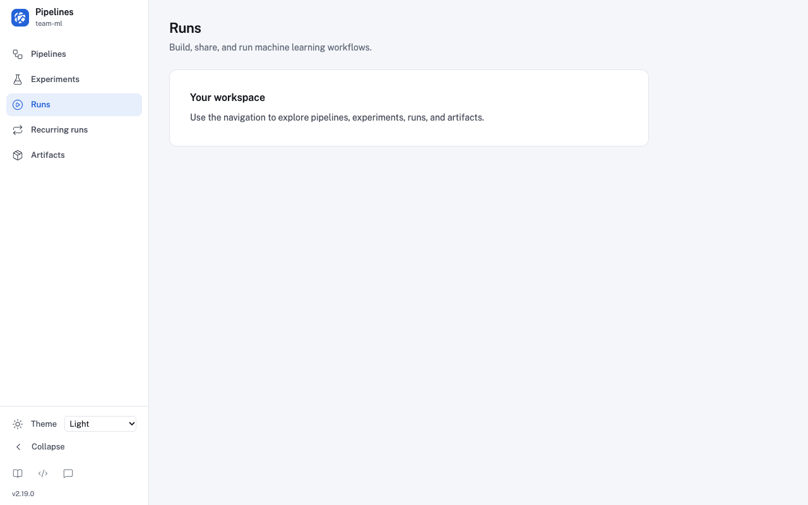
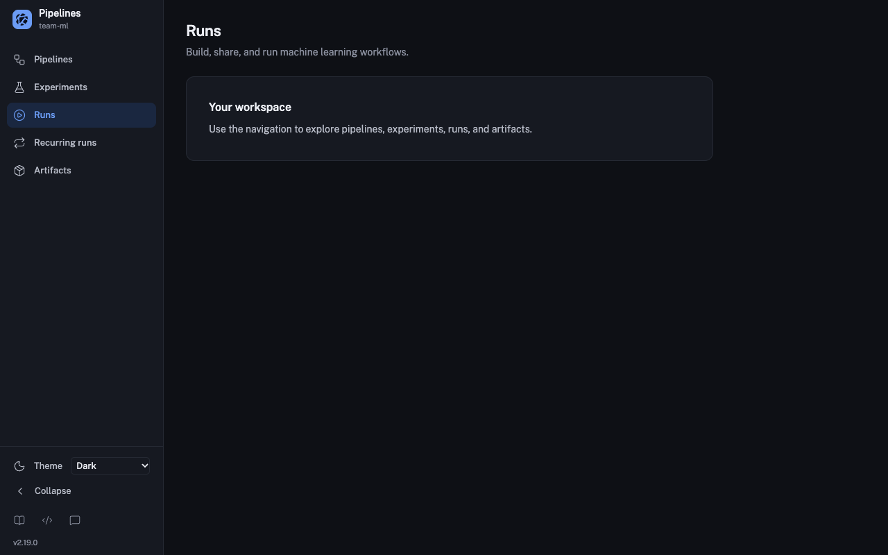
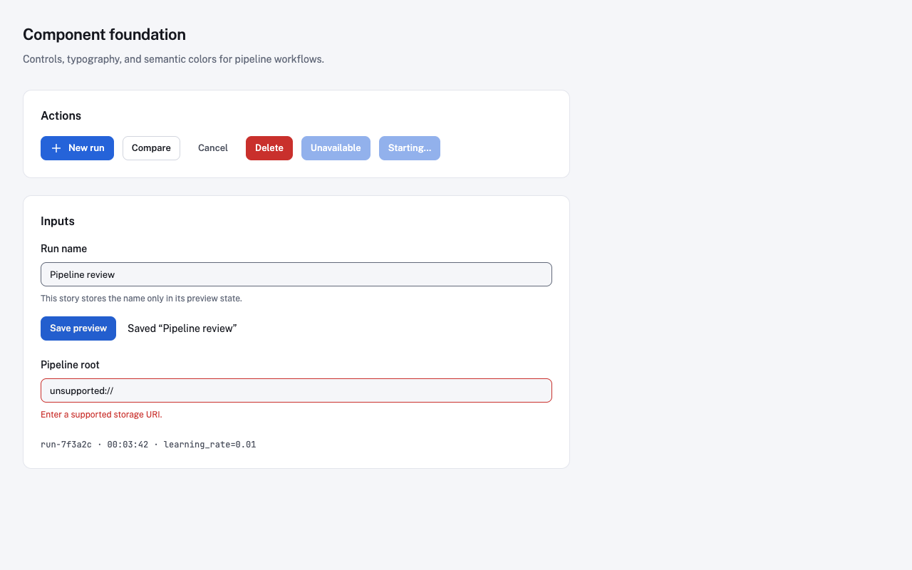
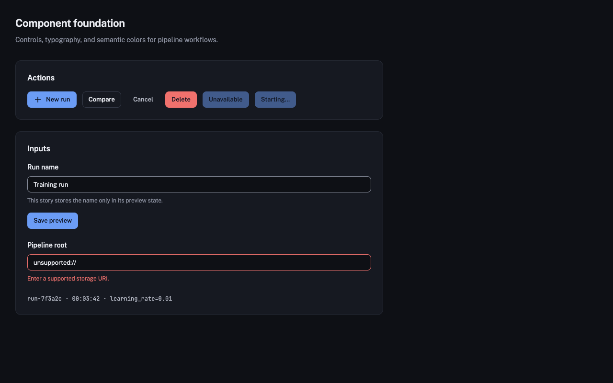

# UI modernization foundation

This development slice supports [issue #14572](https://github.com/kubeflow/pipelines/issues/14572) and [KEP PR #14574](https://github.com/kubeflow/pipelines/pull/14574). It establishes the shared presentation foundation and an interactive shell in Storybook. Production routes still render the existing pages and SideNav. The application-wide Tailwind pipeline does change in this branch; this is a draft migration step toward the coordinated cutover, not an independently qualified release.

## Implemented

- Tailwind 4.3.3 and its CLI, retaining `npm run build:tailwind` and the existing generated CSS import. Existing custom MUI colors/spacing, legacy grow/shrink names, focus rings and relevant preflight defaults are retained. Utilities remain unlayered while MUI/TypeStyle consumers coexist, preserving their previous precedence.
- Local Public Sans 400/500/600 and JetBrains Mono 400/500 Latin font subsets through Fontsource 5.3.0. Vite resolves and hashes the font assets when the foundation is imported; no external font requests are needed. Font licenses ship in [Public Sans OFL](../../public/fonts/public-sans/OFL.txt) and [JetBrains Mono OFL](../../public/fonts/jetbrains-mono/OFL.txt).
- Scoped semantic colors, radii, typography, visible focus and reduced-motion rules; light/dark tokens follow the design handoff with the accessibility corrections below.
- Repository-owned shadcn-style [Button](../../src/components/ui/button.tsx) and [Input](../../src/components/ui/input.tsx), using Base UI 1.8.0 primitives. Links retain link semantics; buttons default to ordinary actions unless explicitly marked `type='submit'`. [components.json](../../components.json) records the Base UI style and existing import aliases.
- [ThemeProvider](../../src/components/modernization/ThemeProvider.tsx): system/light/dark, live system changes, cross-tab updates, and safe missing/invalid/unavailable storage behavior. The separate `kfp.theme` key does not migrate or remove legacy preferences. Theme classes are scoped to `.kfp-theme` during component development; document-root integration belongs to workflow cutover.
- [AppShell](../../src/components/modernization/AppShell.tsx): 236/64 px rail, namespace/build/cluster presentation, controlled navigation and secondary destinations, theme selection, persistent collapse using the existing `navbarCollapsed` key, skip-to-main focus, and a hidden-navigation mode. Below 1024 px it collapses automatically without overwriting the user's wide-screen preference.

The shell accepts route destinations, active state and metadata from its caller. It does not import the production Router, fetch counts, create a namespace selector, or add duplicate backend requests. The eventual adapter must pass existing deployment flags/context, preserve nested route matching, and retain the existing toolbar, error and mutation contracts. Command search, notifications, additional primitives and workflow pages remain subsequent work; no unfinished search control is displayed.

## Review in Storybook

Use the repository-pinned Node/npm versions, install with `npm ci` in `frontend`, then run:

```sh
npm run storybook
```

Open **Modernization → App shell** or **Modernization → Primitives**. Light/dark stories use separate theme preference keys; navigation uses the existing collapse preference. Resize the actual canvas viewport below 1024 px for automatic collapse, then widen it to verify restoration. The hidden-navigation story demonstrates the layout contract, not live Central Dashboard integration. The primitive form changes only preview state and makes no API requests.






These Chrome 154 screenshots show the component previews at 1280×800 on macOS. The main workspace is illustrative shell content, not a migrated Runs page.

## Accessibility adjustments

Small text uses a minimum 4.5:1 contrast ratio against its intended surfaces. The supplied light palette needed these changes; dark text pairs already pass:

| Token                | Handoff   | Foundation |                         Minimum tested ratio |
| -------------------- | --------- | ---------- | -------------------------------------------: |
| Muted foreground     | `#737889` | `#626979`  | 4.88:1 across card/background/muted surfaces |
| Succeeded foreground | `#1f8a4c` | `#18733d`  |          5.20:1 on succeeded soft background |
| Warning foreground   | `#b8700a` | `#975b08`  |            4.96:1 on warning soft background |
| Neutral foreground   | `#8a8f9d` | `#626979`  |            4.74:1 on neutral soft background |

Focus uses a 2 px primary-colored outline with offset. Input boundaries use muted foreground rather than the low-contrast decorative border token. The [token checks](../../src/styles/modernization.test.ts) verify 24 normal-text foreground/background pairs, including destructive button text in both themes. These checks complement keyboard/browser review; they do not certify every future control or complete accessibility conformance.

## Browser and test compatibility

Tailwind 4 requires at least Chrome 111, Safari 16.4 and Firefox 128 according to its [compatibility guide](https://tailwindcss.com/docs/compatibility#browser-support). This applies to the generated stylesheet imported by the existing app as well as to the new components. The repository's current `supports es6-module` browserslist and ES2015 target remain broader; the browser policy/configuration and minimum-version matrix must be agreed and aligned before this branch is merged or released independently. Keeping the shell in Storybook does not isolate that CSS compatibility change.

The test DOM uses jsdom 27.4.0, whose modern CSS parser supports the generated cascade layers. jsdom 24 discarded the Tailwind 4 stylesheet. The selected version supports the pinned Node 24.14 runtime; CSS processing remains enabled. Browser checks remain authoritative for layout, fonts and computed CSS variable values.

Legacy raw unstyled inputs receive Tailwind 4's transparent background; production form controls use MUI styles. Retained compatibility rules are temporary and should be removed only with their final consumers. The existing visual/behavioral [baseline PR](https://github.com/kubeflow/pipelines/pull/14576) remains the comparison reference.

## Verification and remaining work

Run from `frontend`:

```sh
npm run test:ui -- --maxWorkers 2
npm run build
npm run build:storybook
node --test scripts/production-bundle.smoke.mjs
npm run check:react-peers
npm run format:check
```

Verification passed on the repository-pinned runtime: 132 frontend test files / 1,677 tests, including 59 new foundation and CSS-pipeline checks. Production and Storybook builds, UI/server lint, TypeScript, the production-bundle browser smoke, React peer compatibility and formatting checks also passed.

The new focused checks cover theme/media/storage behavior, preference preservation, responsive restoration, active navigation and destinations, hidden navigation, keyboard focus, form submission/disabled actions, input labeling/errors, and token contrast. Browser review verifies local font loading, theme/collapse persistence across reloads, live system-theme changes, narrow/wide restoration, hidden-navigation layout, and primitive form feedback.

Before application integration, implement the route/deployment adapter and migrate the affected page chrome; preserve the existing namespace/auth context. Before release, finish workflow/state parity, keyboard and accessibility review, browser-floor qualification, performance comparison and live UI/backend upgrade/rollback rehearsal. This slice changes no backend schema, API payload or KFP Local behavior and performs no preference migration. Release qualification must identify and rehearse rollback to a compatible prior UI image as required by the KEP.
