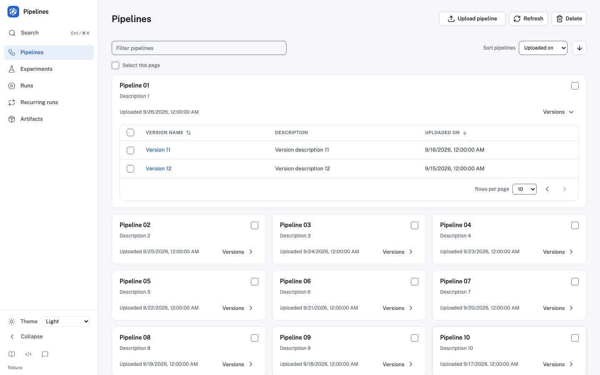
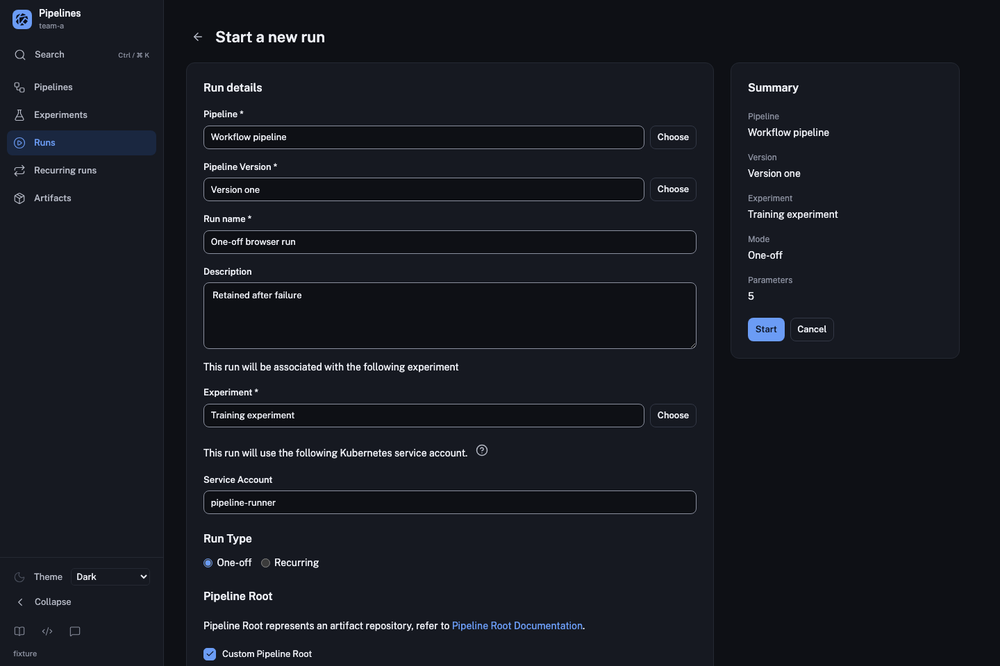
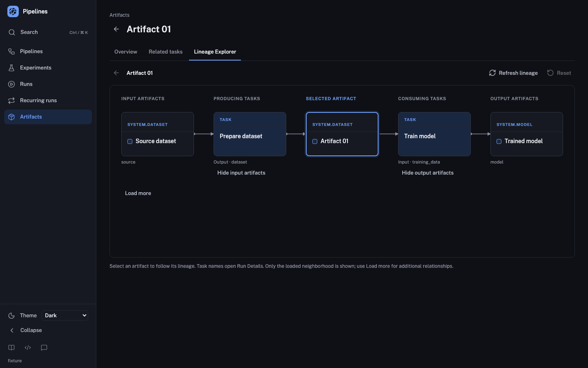
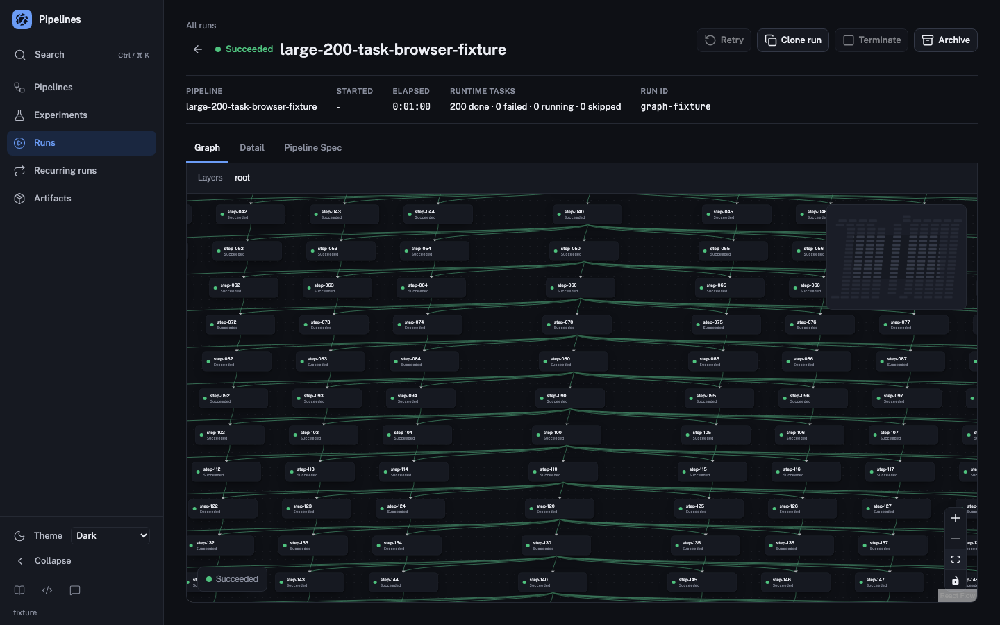

# UI modernization: workflows and qualification

Latest follow-up: [loading-layout stability](layout-stability.md) records the `e79f8d42` fixes, 141-case browser matrix and repeated matched measurements. The source-specific results below remain historical evidence.

**Historical retirement checkpoint:** newer application source, repeated measurements and compatibility checks are recorded in [performance qualification](performance-qualification.md) and [browser/accessibility qualification](browser-accessibility-qualification.md). The results below remain tied to their original source and assets.

This is the current implementation report for [issue #14572](https://github.com/kubeflow/pipelines/issues/14572), [KEP PR #14574](https://github.com/kubeflow/pipelines/pull/14574), and [implementation PR #14584](https://github.com/kubeflow/pipelines/pull/14584). It supersedes the implementation-status statements in the historical [foundation](foundation.md), [Runs](runs.md), and [inspection](inspection.md) checkpoints. Their screenshots and test totals remain evidence for those earlier slices.

Workflow presentation now covers the shell, Runs and inspection, Pipelines and versions, Experiments, recurring runs, creation forms, Artifacts and lineage, comparison and rich viewers, and secondary pages. This remains one coordinated UI cutover. Final source verification, performance results, supported-browser qualification and live deployment/rollback evidence are tracked separately below; implementation coverage does not close those gates.

## Workflow coverage

| Area                           | Presentation and preserved behavior                                                                                                                                                                                                                                                                                                               | Authoritative checks                                                                                                                                                                                                                                                                                                                     |
| ------------------------------ | ------------------------------------------------------------------------------------------------------------------------------------------------------------------------------------------------------------------------------------------------------------------------------------------------------------------------------------------------- | ---------------------------------------------------------------------------------------------------------------------------------------------------------------------------------------------------------------------------------------------------------------------------------------------------------------------------------------- |
| Shell and Runs                 | System/light/dark theme, responsive persisted navigation, deployment-aware destinations, keyboard command search, active/archive routes, independent row navigation and checkbox selection, compare/clone/archive/restore/delete, confirmation and notification behavior. Existing namespace and table preferences remain intact.                 | [Runs/search browser scenarios](../../scripts/ui-modernization-runs.smoke.mjs), [ApplicationShell tests](../../src/components/modernization/ApplicationShell.test.tsx), [Runs tests](../../src/pages/RunList.modern.test.tsx).                                                                                                           |
| Pipelines and versions         | Cards and lazily expanded versions, private/shared scoping, filtering/sorting/token paging, encoded resource links, version switching, YAML view, file and URL imports, validation and recovery.                                                                                                                                                  | [Pipeline browser scenarios](../../scripts/ui-modernization-pipelines.smoke.mjs), [upload/version tests](../../src/pages/NewPipelineVersion.test.tsx), [version detail tests](../../src/pages/PipelineDetailsV2.test.tsx).                                                                                                               |
| Experiments and recurring runs | Active/archive lists, expandable run rows, recent-run samples truthfully labeled as bounded samples, experiment creation/detail, recurring-run enable/disable and management through the existing mutation path. Controls prevent duplicate pending writes and retain retry after failure.                                                        | [Workflow browser scenarios](../../scripts/ui-modernization-workflows.smoke.mjs), [Experiment Details tests](../../src/pages/ExperimentDetails.test.tsx), [recurring switch tests](../../src/components/modernization/RecurringRunSwitch.test.tsx).                                                                                      |
| Run creation                   | One-off and recurring forms, pipeline/version selection, inline experiment creation, latest-version mode, custom root, service account, typed parameters and JSON editor. Periodic/cron schedules preserve date/timezone, catchup and concurrency contracts. Supported `0`, `false` and empty values survive validation and payload construction. | [NewRun tests](../../src/pages/NewRunV2.test.tsx), [inline creation regression](../../src/pages/NewRunSwitcher.test.tsx), [Trigger tests](../../src/components/Trigger.test.tsx), [parameter tests](../../src/components/NewRunParametersV2.test.tsx), [workflow browser scenarios](../../scripts/ui-modernization-workflows.smoke.mjs). |
| Run/task inspection            | Real failed-task navigation to Logs, complete task-list summary with structural records excluded, nested task URLs/history, inspector keyboard behavior, all existing parameters/artifacts/pod/volume content and task state history. Logs retain executor/artifact/driver sources, retries and stale-response protection.                        | [Run Details browser scenarios](../../scripts/ui-modernization-run-details.smoke.mjs), [RuntimeNodeDetails tests](../../src/components/tabs/RuntimeNodeDetailsV2.test.tsx), [Run Details tests](../../src/pages/RunDetailsV2.test.tsx).                                                                                                  |
| Artifacts and lineage          | Combined name/type filtering, paging, encoded task/artifact destinations, bounded lineage neighborhoods, history, preview consent, provider-aware download and recovery.                                                                                                                                                                          | [Artifact browser scenarios](../../scripts/ui-modernization-artifacts.smoke.mjs), [artifact detail tests](../../src/pages/ArtifactDetails.test.tsx), [lineage tests](../../src/components/NativeArtifactLineage.test.tsx).                                                                                                               |
| Comparison and viewers         | Selected-run order, missing/empty/zero distinctions, artifact provenance, ROC off-page selection and search, fullscreen focus restoration, paged/sortable tables, Markdown, isolated HTML and TensorBoard lifecycle/proxy readiness.                                                                                                              | [Comparison browser scenarios](../../scripts/ui-modernization-comparison.smoke.mjs), [rich-viewer browser scenarios](../../scripts/ui-modernization-artifacts.smoke.mjs), [comparison tests](../../src/components/viewers/RuntimeArtifactComparison.test.tsx), [TensorBoard tests](../../src/components/viewers/Tensorboard.test.tsx).   |
| Secondary pages and errors     | Tutorial lookup and fallback, correct internal/external link behavior, feature-flag drafts that persist only on Save, Reset/reload semantics, accessible 404 recovery and self-contained native error diagnostics.                                                                                                                                | [Secondary-route browser scenario](../../scripts/ui-modernization-workflows.smoke.mjs), [feature tests](../../src/pages/FrontendFeatures.test.tsx), [404 tests](../../src/pages/404.test.tsx), [ErrorBoundary tests](../../src/atoms/ErrorBoundary.test.tsx).                                                                            |

Shared [inspection tabs](../../src/components/modernization/InspectionTabs.tsx), [fields](../../src/components/modernization/InspectionFields.tsx), [resource tables](../../src/components/modernization/ResourceTable.tsx), [text fields](../../src/components/ui/text-field.tsx), dialogs, buttons, checkboxes and switches provide the presentation contracts. Existing data clients, backend endpoints and page-owned actions remain the source of behavior. The handoff's unavailable aggregate counts and invented operational metadata are not presented as measured data.

## Graph, editor and runtime contracts

Runtime/static graph nodes, controls and canvas now consume light/dark tokens. The white graph in the earlier [inspection screenshot](inspection.md#browser-review) is historical, not the current theme boundary. The React Flow renderer, task-to-node mapping, nested DAG/loop identities and query-driven selection remain in place.

The deterministic [large-graph harness](../../scripts/ui-modernization-graph.smoke.mjs) has 200 executable tasks, 201 rendered nodes and 363 directed edges. It verifies the exact node and edge identities from all task pages, explicit 200×56 leaf/artifact node bounds, and stable world geometry across selection, zoom, pan, fit, theme changes and reload. The second fixture preserves nested loop iterations and hierarchical deep links. This establishes fixture integrity and interaction stability; it is not a claim that every historical pixel coordinate is unchanged or that the new stack is faster.

[LogViewer](../../src/components/LogViewer.tsx) retains its fixed 15px virtualized rows, horizontal scrolling, bounded overscan and follow-tail behavior. Runtime CSS preserves the scroll-container contracts. [Editor](../../src/components/Editor.tsx) retains its editor implementation and explicitly emits YAML/JSON worker URLs through Vite, including prefixed deployments. Product behavior and worker delivery are tested separately from cosmetic snapshots.

## Regression fixes required by the migration

- The [table controller](../../src/components/CustomTable.tsx) keeps filter/sort/page requests coherent, resets a changed filter to the first cursor, and prevents superseded reads from replacing newer rows, errors or pagination. Read recovery clears stale error UI while retaining valid data and selection where the existing contract allows it. See [controller tests](../../src/components/CustomTable.test.tsx).
- Creation selectors retain current pipeline/version/experiment scope, reject stale asynchronous results and preserve latest-version mode across inline experiment creation. One-off and recurring payloads keep their distinct version-reference rules; pending actions do not issue duplicate mutations. See [NewRun](../../src/pages/NewRunV2.test.tsx), [NewRunSwitcher](../../src/pages/NewRunSwitcher.test.tsx), and [workflow browser coverage](../../scripts/ui-modernization-workflows.smoke.mjs).
- Shared tabs commit a pointer gesture once when focus precedes click, preserving route-controlled active/archive/private/shared navigation; keyboard focus activation remains available. See [inspection component tests](../../src/components/modernization/Inspection.test.tsx) and the pipeline/artifact browser scenarios.
- Resource links preserve encoded IDs, copied task query URLs and browser history. URL pipeline imports and version detail reads retain the complete identity through creation and navigation. YAML/JSON workers are bundled as real assets instead of relying on unresolved runtime worker paths. See [pipeline browser coverage](../../scripts/ui-modernization-pipelines.smoke.mjs) and [Editor tests](../../src/components/Editor.test.tsx).
- Controlled React Flow nodes retain actual measured dimensions through selection, inspector closure and runtime-node refreshes. Measurements are scoped by layer and node identity/type; equal measurements do not trigger updates, and selection/deletion/position events retain their existing owners. This fixes an intermittent graph that remained hidden after its inspector closed despite nonzero DOM dimensions. [Canvas tests](../../src/pages/v2/DagCanvas.test.tsx) and strict node/edge browser assertions cover the regression.
- The outer [ErrorBoundary](../../src/atoms/ErrorBoundary.tsx) uses native alert/details/summary diagnostics with fallback colors, so it can render outside a working theme provider. Navigation clears captured errors without remounting healthy child state. Its tests cover disclosure/focus, retained diagnostics and recovery; native Enter/Space activation was also checked in Chromium.

## Browser evidence and current execution status

The production harnesses load emitted assets with deterministic local responses. They bound requests, fail unexpected endpoints and exercise real UI controls; mutation assertions validate payloads and exactly-once behavior. Fixture namespace/iframe tests verify client contracts, not live authentication or authorization.

| Harness                                                                                        | Cases per engine | Chromium  | Firefox   | WebKit    |
| ---------------------------------------------------------------------------------------------- | ---------------: | --------- | --------- | --------- |
| [Startup](../../scripts/production-bundle.smoke.mjs)                                           |                1 | Pass      | Pass      | Pass      |
| [Runs and command search](../../scripts/ui-modernization-runs.smoke.mjs)                       |                6 | Pass      | Pass      | Pass      |
| [Run Details](../../scripts/ui-modernization-run-details.smoke.mjs)                            |                9 | Pass      | Pass      | Pass      |
| [Pipelines](../../scripts/ui-modernization-pipelines.smoke.mjs)                                |                8 | Pass      | Pass      | Pass      |
| [Experiments, recurring runs and creation](../../scripts/ui-modernization-workflows.smoke.mjs) |                7 | Pass      | Pass      | Pass      |
| [Artifacts and rich viewers](../../scripts/ui-modernization-artifacts.smoke.mjs)               |                8 | Pass      | Pass      | Pass      |
| [Comparison](../../scripts/ui-modernization-comparison.smoke.mjs)                              |                3 | Pass      | Pass      | Pass      |
| [Graph](../../scripts/ui-modernization-graph.smoke.mjs)                                        |                2 | Pass      | Pass      | Pass      |
| **Total**                                                                                      |           **44** | **44/44** | **44/44** | **44/44** |

The [132-case matrix](workflows/browser-matrix.json) records source commits, exact asset SHA-256 hashes, viewport coverage and the current Playwright engines: Chromium 145.0.7632.6, Firefox 146.0.1 and WebKit 26.0, using Playwright 1.58.0 and Node 24.14.0. The graph scenarios validate visible nodes and nonempty visible edges after repeated inspector open/close and history navigation. Secondary-route coverage includes tutorial lookup/fallback, keyboard navigation, draft/Save/Reset/reload behavior, dark presentation and narrow 404 recovery.

Native multipart uploads reach a bounded same-origin loopback collector that validates the actual filename, MIME type and exact selected bytes before mutating the fixture. Native Blob workers are allowed only within the fixture origin/request bound; imported HTTP assets and unexpected endpoints remain checked. These transport details avoid treating Playwright WebKit interception limitations as application behavior.

[`test:bundle`](../../package.json) includes all eight harnesses serially after building; `KFP_BROWSER` selects another installed engine. Screenshots below were captured from the same qualified production assets in Chromium and reviewed for layout; they are not historical images or minimum-browser evidence.

| Pipelines and expanded versions                                                      | Run creation, dark theme                                              |
| ------------------------------------------------------------------------------------ | --------------------------------------------------------------------- |
|  |  |

| Artifact lineage, dark theme                                                | Large graph, zoomed/panned dark view                                 |
| --------------------------------------------------------------------------- | -------------------------------------------------------------------- |
|  |  |

## Runs status-filter compatibility dependency

The existing name/archive filters remain available. A new status selector is deferred until list filtering matches the statuses displayed for historical runs. The backend maps the `state` predicate to the raw database `State` column, while `Run.ToV2()` normalizes that value and can fall back to historical `Conditions`. An older run can therefore display Running but be omitted by a raw `state = RUNNING` query. The historical `status` field is not a substitute: it collapses Paused into Pending and Canceled into Failed.

The backend already has an effective-state predicate for lifecycle operations, but generic list filtering needs separate compatibility coverage before this UI can expose the new filter. See [model conversion and filter mapping](../../../backend/src/apiserver/model/run.go), [list filtering](../../../backend/src/apiserver/storage/run_store.go), and the [wire states](../../../backend/api/v2beta1/run.proto). This remains an open dependency in #14572; the modernization does not rewrite historical data or change backend semantics. Global status counts and the proposed 48-hour failure summary remain omitted under the KEP's bounded-data rule. The current list requests `skip_count=true`; a page length is not a total.

## Browser floor and accessibility

The maintainer-approved [browser support policy](../browser-support.md) covers the latest two stable Chrome/Edge/Firefox majors, current Chrome/Edge Extended Stable, supported Firefox ESR overlap, and current/previous annual Safari and iOS/iPadOS releases with latest patches. Policy acceptance is complete. The [supported-browser checkpoint](supported-browser-qualification.md) records full Chrome 154 and Edge 154/153 production runs plus scoped Firefox stable/ESR smoke. Remaining supported-browser, device and OS qualification stays open.

The [production Browserslist](../../package.json) and [Vite targets](../../vite.config.mts) retain conservative compiler settings. Their Chrome/Edge 111, Firefox 128 and Safari/iOS 16.4 targets no longer define product support or required qualification. Historical engine runs and the actual Firefox 128 smoke retain their recorded provenance; they do not qualify the newly declared channels. Record exact browser/OS versions and final asset identities for the new release matrix.

Keyboard tests cover focus visibility, semantic table selection, tabs, modeless/modal inspection, rich help links, switch operation, dialog trapping/return and draft form behavior. Token tests check normal-text contrast pairs in both themes. These checks support the design review; final accessibility review and representative assistive-technology checks remain open.

## Backend, deployment and KFP Local considerations

This migration does not change backend schemas, API payload formats, runtime-task ownership, polling sources, artifact storage, or Python `kfp.local` execution/output artifacts. No KFP Local migration, local-run recompilation or artifact conversion is required. UI preferences use the existing keys plus `kfp.theme`; no destructive preference migration is introduced.

The frontend image includes both the browser application and its Express server. A static bundle smoke alone cannot qualify deployment compatibility. Preserve root and `/pipeline/` asset entry, hash URLs, runtime deployment flags, namespace context, probes, service ports, security context, signing-key lifecycle and UI rollout strategy. Qualify standalone and embedded/multi-user authorization, shared pipelines and supported pipeline stores in their real deployment modes.

The [baseline deployment contract](https://github.com/kubeflow/pipelines/blob/339670f5e/frontend/docs/ui-modernization/deployment-baseline.md) requires immutable previous/candidate UI identities against the same unchanged compatible backend, followed by an actual return to the previous UI. The planned rehearsal builds the previous UI and Express server from baseline source `02cbc725ac9ddcd950f4400d8355dd78bfcd6c57`; a release tag alone is not assumed compatible with the current task APIs. Rollback must preserve backend data, browser preferences and the shared TensorBoard signing key, then repeat representative list/create/task/log/artifact/viewer checks. This live rehearsal remains pending.

## Legacy presentation retirement

The unused legacy `CustomTable` and `RunList` presentation branches are removed. Every production table caller supplies an explicit modern renderer; `CustomTable.renderTable` is required. The controller retains the same filter, sort, page-token, storage, selection and stale-request handling, and RunList retains the existing requests and enrichment. The retired `CustomTableRow`, `StatusV2`, CSS helpers and unused input/separator components are deleted, together with their renderer-specific tests and snapshots. MUI, Emotion and typestyle dependencies are removed.

Controller tests now exercise the active ResourceTable controls, and RunList tests exercise the active RunsTable presentation. The retirement-focused checks pass 242 tests across 15 suites. The lower full-suite total reflects removal of tests for the deleted presentation paths; it does not remove request, mutation, selection, paging or recovery assertions from the retained components.

## Verification checkpoint

Application and harness source `2e52a3fa634fa0805511a37c982f8d13f690b868` includes legacy retirement, the graph measurement fix, current master dependencies, and the WebKit run-type fieldset fix. With Node 24.14.0 / npm 11.17.0, the full CI constituent checks pass: formatting, UI/server lint, application/mock TypeScript, React peer checks, 131 UI files / **1,721 tests**, and 29 server files / **1,052 tests**, both with coverage. Repository commit hooks, production build and Storybook build pass. All 132 browser cases were rerun on the retirement build and passed in the three recorded engines.

The qualified entry JavaScript is `index-CsUTqcBF.js` (SHA-256 `408fa52d300a3bf2c76ea7d77f99037b5dff38d8701a2811a9bf949430d21e26`); CSS is `index-8lXTuxuW.css` (SHA-256 `f3dfd462464d4418f97f9d8719880c943ed52e17e2152168b3c16c51c79323c1`). The published matrix and four screenshots correspond to these emitted assets.

UI coverage is 51.84% lines (6,099/11,765), 46.01% branches (4,720/10,258), 59.75% functions (1,682/2,815), and 52.28% statements (6,305/12,059). Corresponding baseline percentages are 50.96%, 43.50%, 58.14%, and 51.28%. Inclusion/exclusion rules are unchanged. Behavioral coverage and removal of obsolete presentation components change the denominator; coverage percentages alone do not establish workflow parity. Server coverage is 81.32% lines, 78.72% branches, 73.90% functions and 81.03% statements.

The [performance comparison](performance-comparison.md) records repeated measurements on the retired application assets. Initial JS/CSS gzip is 4.0% below baseline; Runs/Run Details LCP remains 6.4%/14.5% slower, filtering readiness 4.6% slower, and layout shifts remain higher. The report links the pre-retirement checkpoint and retains individual trials and limits. Hosted checks are recorded against their source commits below.

## Final qualification checklist

- [x] Retire the unused legacy table/run-list presentation branches and their MUI/Emotion/typestyle dependencies; rerun source checks, builds and the complete browser matrix.
- [x] Record the application source commit and fresh production/Storybook build identities.
- [x] Run full formatting, lint, application/mock type checks, React peer checks, and UI/server coverage on that source; record exact totals.
- [x] Run all 44 production browser scenarios in three engines on the recorded emitted assets; retain the browser/version matrix and reviewed screenshots.
- [x] Adopt the [browser support policy](../browser-support.md), including enterprise channels and annual Safari releases.
- [ ] Complete actual supported-browser/OS/device qualification and accessibility review against the new policy.
- [x] Repeat nine native-fixture loads, three filtering trials and three run/task navigation trials on the retirement build against the [performance baseline](https://github.com/kubeflow/pipelines/blob/339670f5e/frontend/docs/ui-modernization/performance-baseline.md); retain the pre-retirement results and report measured regressions and scope limits.
- [ ] Resolve or explicitly accept measured regressions with agreed budgets, and extend repeated measurements to representative large-graph and populated-comparison workloads.
- [ ] Reconfirm hosted real-cluster frontend integration results for the final source and record any independent backend failures separately.
- [ ] Rehearse previous UI → candidate UI → previous UI against the same backend with immutable image identities and retained state; qualify the additional real deployment modes above.

Use the repository-pinned Node/npm versions and run from `frontend`:

```sh
npm run test:ci
npm run test:bundle
npm run build:storybook
```

For browser engines already installed in the test environment, rerun the emitted bundle without another source build:

```sh
KFP_BROWSER=firefox node --test --test-concurrency=1 scripts/production-bundle.smoke.mjs scripts/ui-modernization-*.smoke.mjs
KFP_BROWSER=webkit node --test --test-concurrency=1 scripts/production-bundle.smoke.mjs scripts/ui-modernization-*.smoke.mjs
```

These commands do not establish minimum-version support on their own. Hosted checks, agreed performance budgets, supported-browser/accessibility qualification and live deployment/rollback evidence remain release gates.

### Hosted and harness follow-up

All four [real-cluster frontend integration lanes](https://github.com/kubeflow/pipelines/actions/runs/36437408457) pass at retirement source `2e52a3fa6` (Kubernetes 1.33/1.36, TLS on/off). The same source passes hosted UI/server coverage; its production artifact test exposed a readiness race: a visible TensorBoard Start control precedes the initial lookup response. Harness-only follow-up `409aa8a7a` awaits that response and usable control, and holds the response to verify disabled/loading behavior. All 24 affected checks pass across the three engines, with unchanged application asset hashes and exact request-count/namespace assertions. [Hosted frontend qualification](https://github.com/kubeflow/pipelines/actions/runs/36439321567) passes at that follow-up: 1,721 UI tests, 1,052 server tests, full frontend checks and 44/44 Chromium production scenarios.
