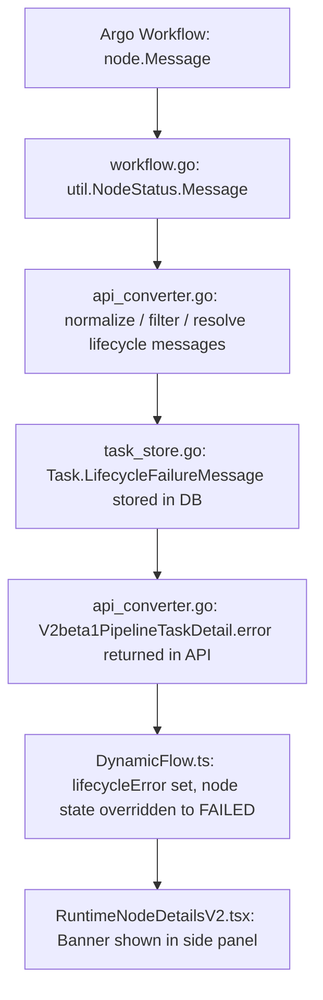

# KEP-12843: Pod Lifecycle Failure Support and Visualization

- [Summary](#summary)
- [Motivation](#motivation)
  - [Goals](#goals)
  - [Non-Goals](#non-goals)
- [Proposal](#proposal)
  - [User Stories](#user-stories)
  - [Risks and Mitigations](#risks-and-mitigations)
- [Design Details](#design-details)
  - [Where the Failure Message Lives in Argo](#where-the-failure-message-lives-in-argo)
  - [Backend Changes](#backend-changes)
  - [Frontend Changes](#frontend-changes)
  - [Structured Message Classification](#structured-message-classification)
  - [Reporting Latency](#reporting-latency)
  - [End-to-End Data Flow](#end-to-end-data-flow)
- [Test Plan](#test-plan)
- [Migration Strategy](#migration-strategy)
- [Frontend Considerations](#frontend-considerations)
- [KFP Local Considerations](#kfp-local-considerations)
- [Future Work](#future-work)
- [Implementation History](#implementation-history)
- [Drawbacks](#drawbacks)
- [Alternatives](#alternatives)

## Summary

A KFP pipeline task can fail in two ways. The first is a user-script failure, where the Python code inside the container raises an exception. The second is a pod lifecycle failure, where the Kubernetes pod backing the task never reaches a healthy running state, or is killed by the system. Common examples of the second category are `ImagePullBackOff`, `Unschedulable`, `OOMKilled`, `CrashLoopBackOff`, and `NodeLost`.

KFP handles the first case well today. The second case is currently invisible in the UI. The task node stays in a running state forever, no error is shown, and the user has no way to find out what happened without using `kubectl`. This proposal threads the pod lifecycle failure message that Argo Workflows already records all the way through the API server and into the run details page, so the task node turns red and the failure reason is shown in the side panel, just like a user-script failure is shown today.

## Motivation

This work started as a GSoC 2026 project idea opened by [@alyssacgoins](https://github.com/alyssacgoins) in [#12843](https://github.com/kubeflow/pipelines/issues/12843). [@khushiiagrawal](https://github.com/khushiiagrawal) wrote a GSoC proposal for it and did an initial draft of the implementation. The project was not selected for GSoC this year, but after discussing with the maintainer we agreed that it is still worth landing in KFP, so the work is continuing outside of GSoC and being submitted through the regular KEP process.

When a pod lifecycle failure happens, Argo Workflows records a human-readable message on the failed node, for example `Back-off pulling image "ghcr.io/example/does-not-exist:v1"`. KFP does not store or expose this message anywhere. The persistence agent reads the Argo workflow, converts node statuses into the internal `util.NodeStatus` struct, and drops the message field. The `Task` row in the database has no column for it, and the v2beta1 `GetRun` API never returns it.

On the UI side, the run details page renders the pipeline graph from MLMD execution records. The driver pod writes the MLMD execution row in `RUNNING` state before the user container starts. If the user container then fails to start at all, the MLMD record stays at `RUNNING` forever, and the graph node renders green and spins indefinitely.

KFP positions itself as a Kubernetes abstraction for data scientists and ML engineers. Many of its users are not Kubernetes operators. When the UI shows a task that never finishes and never fails, with no message, the only path forward is to ask someone else to run `kubectl get pods`. That breaks the abstraction the product is built on.

### Goals

1. Capture the Argo node failure message and persist it on the KFP `Task` row.
2. Expose the message through the existing `task_details[].error` field of the v2beta1 `GetRun` response. No new API surface.
3. In the UI, when a lifecycle failure is present on a task, override the node visual state to Failed (red), even if MLMD still reports `RUNNING`, and show the failure reason in a banner inside the node detail side panel.
4. Avoid false positives. Argo emits transient messages like `PodInitializing` during normal pod startup. Healthy runs must not show a failure banner.

### Non-Goals

1. Configurable per-class timeouts (for example, fail after one hour of `ImagePullBackOff`). Timeouts require tracking how long a pod has been in a given failure state, which needs either a new timestamp column on the `Task` model or a separate sweep mechanism in the persistence agent. That is a distinct feature that can be built on top of the `LifecycleFailureMessage` foundation this proposal lays. Bundling it here would significantly increase scope and risk without changing the core visibility fix.
2. Any changes to the SDK, the pipeline spec, or the compiler.
3. Any changes to how user-script failures are captured. Those already work.
4. Surfacing pod logs in the UI. Out of scope.

## Proposal

The Argo node message already contains exactly the information the user needs. The fix is to stop dropping it. Persist it on the `Task` model, return it in the existing error field of the run response, and have the frontend render it. The work is split across six backend files and four frontend files. There are no proto changes, no new API endpoints, and no breaking changes to existing responses.

### User Stories

#### Story 1: Bad image

I push a pipeline that references a misspelled container image. The run starts, and the affected task pod hits `ImagePullBackOff`. Within a few seconds the task node in the UI turns red. I click on it and the side panel shows `Pod lifecycle failure: Back-off pulling image "..."`. I fix the image name and re-run.

#### Story 2: Out of memory

A task pod runs out of memory and gets `OOMKilled` by the kernel. The task node turns red. The side panel says `Pod lifecycle failure: OOMKilled`. I bump the memory request on that component and re-run.

#### Story 3: Healthy pipeline

I submit a healthy pipeline. Every task transitions through normal pod startup states (`PodInitializing`, `ContainerCreating`) before running. None of the task nodes ever shows a lifecycle failure banner. The run completes green.

### Risks and Mitigations

| Risk | Mitigation |
|---|---|
| Argo emits `PodInitializing` and `ContainerCreating` on healthy pods, which would create a false-positive banner on every run | Filter these known transient strings in `normalizeLifecycleFailureMessage` before persisting |
| Argo also emits messages on `Succeeded`, `Skipped`, and `Omitted` nodes (cache hits, conditional skips) | Suppress messages whose node state is non-failure in `nodeLifecycleFailureMessage` |
| The Argo node graph could in theory contain a cycle | Cycle-safe traversal in `resolveNodeLifecycleMessages` using a recursion-stack guard |
| A pod that recovers on retry could leave a stale failure message on the row | `patchTask` always overwrites the field with the latest filtered value from Argo, with no preservation logic |
| The Argo message lives on a child executor pod node, not the parent task node the UI renders | `resolveNodeLifecycleMessages` walks the tree and bubbles the child message up to the parent task node |

## Design Details

### Where the Failure Message Lives in Argo

For a run with a bad image, the relevant slice of `workflow.status.nodes` looks roughly like this:

```
parent task node (rendered by the UI)
    phase: Pending
    message: ""
    children: [executor pod node]

executor pod node (one per task pod)
    phase: Pending
    message: 'Back-off pulling image "ghcr.io/example/does-not-exist:v1"'
    children: []
```

Two things matter here. First, the message lives on the child executor node, but the UI renders the parent task node, so the message has to be propagated up. Second, the parent's phase is also `Pending`, not `Failed`, until Argo gives up. That is why MLMD also reports the task as still running and why the UI cannot rely on phase alone.

### Backend Changes

The backend change set touches six files.

#### `backend/src/common/util/execution_status.go`

Add a `Message string` field to the internal `NodeStatus` struct. Without this field, the message is dropped during the Argo to KFP conversion.

```go
type NodeStatus struct {
    ID         string
    Name       string
    DisplayName string
    State      string
    StartTime  int64
    CreateTime int64
    FinishTime int64
    Children   []string
    Message    string
}
```

#### `backend/src/common/util/workflow.go`

In `NodeStatuses()`, populate the new field from `node.Message` when iterating over the Argo workflow nodes. This is the only place the message enters the KFP code path.

#### `backend/src/apiserver/model/task.go`

Add a nullable `LifecycleFailureMessage LargeText` column to the `Task` model. It is stored as a dedicated field rather than embedded inside the existing payload column so that it can be queried, indexed, and updated independently.

```go
type Task struct {
    // ... existing fields ...

    LifecycleFailureMessage LargeText `gorm:"column:LifecycleFailureMessage; type:longtext;"`
}
```

The new field is kept on its own line, separated from `ParentTaskId` by a blank line, so that `gofmt` does not pull the surrounding fields into a single aligned block and trigger `golangci-lint --new` on the pre-existing `ParentTaskId` name.

#### `backend/src/apiserver/server/api_converter.go`

Three small helpers, then one place that uses them.

1. `normalizeLifecycleFailureMessage(message string) string`. Returns an empty string for transient startup messages (`PodInitializing`, `ContainerCreating`). Otherwise returns the input unchanged.
2. `nodeLifecycleFailureMessage(node util.NodeStatus) string`. Calls `normalizeLifecycleFailureMessage`, then additionally returns empty for nodes whose state is `Succeeded`, `Skipped`, or `Omitted`.
3. `resolveNodeLifecycleMessages(nodes map[string]util.NodeStatus) map[string]string`. Walks the node graph starting from each task node. For a given node, the resolved message is its own filtered message if non-empty, otherwise the first non-empty resolved message from any of its descendants. Cycle detection uses an `onStack` map keyed on node id, with a deferred delete on return so that shared descendants (the same node reached through two different parents) are not incorrectly treated as cycles.

In `toModelTask`, write the resolved message into `task.LifecycleFailureMessage`.

In `toApiPipelineTaskDetail`, when the field is non-empty, build the response error as a `*rpcstatus.Status` with `Code: codes.Internal` and `Message: "Pod lifecycle failure: <argo message>"`. The status is constructed directly instead of using `util.NewInternalServerError`, because the latter prefixes the message with `InternalServerError:`, which would be misleading. The API server itself did not fail.

#### `backend/src/apiserver/storage/task_store.go`

Add `LifecycleFailureMessage` to `taskColumns`, to `scanRows`, and to the `CreateTask` and `CreateOrUpdateTasks` insert paths.

In `patchTask`, `LifecycleFailureMessage` is intentionally omitted from the preserve-if-empty loop that fills other fields from the existing DB row. This means the fresh value computed from the current workflow sync is always kept as-is — an empty string when the pod has recovered, or the failure message when it has not. No special overwrite logic is added; the field simply does not participate in the preserve-old-when-empty pattern that governs the other fields. Existing `patchTask` behavior for all other fields is unchanged.

### Frontend Changes

The frontend change set touches four files.

#### `frontend/src/components/graph/Constants.ts`

Add an optional field on the execution flow element data:

```ts
export type ExecutionFlowElementData = FlowElementDataBase & {
  state?: Execution.State;
  lifecycleError?: string;
};
```

#### `frontend/src/lib/v2/DynamicFlow.ts`

`updateFlowElementsState` now takes the run's `task_details` array as an extra argument. From it, build a map keyed on the pipeline task display name, valued by the error message string. While iterating execution nodes, if the node's task name has an entry in the map, write the message onto `data.lifecycleError`. If `data.lifecycleError` is non-empty, override `data.state` to `Execution.State.FAILED`. This last step is the critical one: it makes the node render red even though MLMD still reports `RUNNING`.

#### `frontend/src/pages/RunDetailsV2.tsx`

Pass `run.run_details?.task_details` into `updateFlowElementsState` from the `dynamicFlowElements` `useMemo`. No other changes.

#### `frontend/src/components/tabs/RuntimeNodeDetailsV2.tsx`

Read `lifecycleError` from the typed flow element data, replacing the existing `as any` cast with `as ExecutionFlowElementData | undefined` in the same step. When set, render a `Banner` at the top of the side panel with the failure reason. Also render the banner in the Input/Output tab when no MLMD execution record exists, since that is the case where the pod failed before the driver could write any metadata.

### Structured Message Classification

Argo node messages are human-readable strings without a fixed schema. Most useful failure messages map to a small set of known Kubernetes failure categories:

| Category | Example messages |
|---|---|
| Image pull | `Back-off pulling image`, `ErrImagePull`, `ImagePullBackOff` |
| Resource / scheduling | `Unschedulable`, `FailedScheduling`, `Insufficient cpu` |
| Runtime / OOM | `OOMKilled`, `Error`, `CrashLoopBackOff` |
| Admission / policy | `pods "..." is forbidden` (Kyverno, PodSecurityPolicy) |
| Unknown | Anything not matching the above |

Structured classification is intentionally deferred from this proposal. The raw message already gives the user the information needed to diagnose the failure, and the Argo node message works even in cases where the pod was never created at all (for example, resource quota exceeded or an admission controller blocking pod creation). A structured category field can be added later as a separate column on the `Task` model without any breaking changes to the existing `LifecycleFailureMessage` field or the API response. For unknown or newly introduced failure patterns, the structured status would stay `Unknown` while the raw message would still provide the original diagnostic details.

### Reporting Latency

The `resolveNodeLifecycleMessages` function runs inside the persistence agent reporting path, inside `toModelTask`, which is called for each node during `ReportWorkflowResource`. The traversal is a DFS over the Argo node graph with a memoization cache (`resolved` map), so each node is visited at most once. The time complexity is O(n) where n is the number of nodes in the workflow.

For typical KFP pipelines this adds negligible overhead. A pipeline with 100 tasks produces roughly 200-300 Argo nodes (one task node and one executor pod node per task). The traversal is entirely in-memory map lookups with no I/O.

For cron runs, the persistence agent reporting path is more sensitive because the run row may not yet exist in MySQL when the first workflow state update arrives. The lifecycle message processing does not add any new database reads or writes beyond the existing `patchTask` upsert. The graph traversal happens entirely in memory before the database write, so it does not affect the likelihood or window of the existing race condition on the run row.

A before-and-after performance measurement of the persistence agent reporting loop will be included in the implementation PR.

### End-to-End Data Flow



## Test Plan

### Unit Tests

Backend, added in `backend/src/apiserver/server/api_converter_test.go`:

1. `TestNormalizeLifecycleFailureMessage` covers that real failure strings (`Back-off pulling image ...`, `OOMKilled`) pass through unchanged, `PodInitializing` and `ContainerCreating` return empty, and empty input returns empty.
2. `TestNodeLifecycleFailureMessage` covers that a Failed or Pending node with a real message returns the message, and Succeeded, Skipped, and Omitted nodes return empty even when the message is non-empty.
3. `TestResolveNodeLifecycleMessages` covers a direct message on a task node, propagation from a child executor node, parent precedence over a child, an empty result when no descendant has a message, a graph with a cycle, and two task nodes that share a descendant.

Backend, in `backend/src/apiserver/storage/task_store_test.go`: existing CRUD tests cover the new column once it is added to the column list. No new test files are required.

Frontend unit tests, in `frontend/src/lib/v2/DynamicFlow.test.ts`:

- A test covering a task with a non-empty `lifecycleError` confirms the node state is overridden to `Execution.State.FAILED` and `data.lifecycleError` is set.
- A test covering a task with no lifecycle error confirms the node state is unchanged and `data.lifecycleError` is undefined.
- Existing `RunDetailsV2.test.tsx` snapshot and behavior tests continue to pass, confirming the success path is unaffected.

Frontend component tests, in `frontend/src/components/tabs/RuntimeNodeDetailsV2.test.tsx`:

- A test confirms the `Banner` is rendered when `lifecycleError` is set on the flow element data.
- A test confirms no `Banner` is rendered when `lifecycleError` is absent.

### CI Validation

The existing KFP end-to-end test suite in `.github/workflows/e2e-test.yml` runs full pipeline runs against a live cluster and verifies final task states. Once this change lands, one or more of the following will be added to cover the lifecycle failure path in CI:

- A dedicated test pipeline with a deliberately bad container image that verifies the failing task's `error.message` contains the expected pod lifecycle failure string via the v2beta1 `GetRun` API.
- A frontend integration test (in `test/frontend-integration-test/`) that submits the bad-image pipeline, waits for the task node to turn red, and asserts the banner text in the side panel.

These CI additions will be part of the implementation PR rather than this KEP.

### Manual Verification (E2E)

These steps reproduce the behavior end to end on a local Kind cluster.

Setup:

```bash
make -C backend kind-cluster-agnostic
kubectl -n kubeflow port-forward svc/ml-pipeline-ui 8080:80
```

Failure case (`ImagePullBackOff`):

1. Compile and submit a one-component pipeline whose component uses a deliberately bad image, for example `image="ghcr.io/example/does-not-exist:v1"`.
2. Open the run in the UI. Within roughly 30 seconds the task node should turn red.
3. Click the node. The side panel should display `Pod lifecycle failure: Back-off pulling image "ghcr.io/example/does-not-exist:v1"`.
4. Confirm the API matches the UI:

   ```bash
   curl -s "http://localhost:8080/apis/v2beta1/runs/<run-id>" | \
     jq '.run_details.task_details[] | {display_name, error}'
   ```

   The failing task should have an `error.message` containing the same string.

Success case (clean run, regression check):

1. Submit any healthy pipeline, for example one of the samples under `samples/`.
2. Watch the run from start to finish. No task node should ever show a lifecycle failure banner during pod startup transitions.
3. The run finishes green.

Recovery case (retry after failure):

1. Submit a pipeline that fails on the first attempt and is configured with a retry policy.
2. Confirm that on the failed attempt the node shows the lifecycle banner.
3. After Argo retries and the pod succeeds, confirm the banner is cleared and the node turns green. This validates that the field is overwritten and not preserved.

Both the failure case and the success case were verified locally on a Kind cluster while developing this proposal.

## Migration Strategy

The only schema change is one new nullable column on the `tasks` table, `LifecycleFailureMessage` (stored as `longtext` in MySQL via GORM's `LargeText` type). It is added on API server startup by GORM's `AutoMigrate`, which performs additive-only changes. No manual migration script is required and no downtime is needed.

Existing rows have a `null` value, which the API converter treats as "no lifecycle failure". This is indistinguishable from "no failure" by design.

Rollback is straightforward. Reverting the API server image and either dropping the column or leaving it in place unused restores the previous behavior. The column is informational only, so there is no data loss.

## Frontend Considerations

This proposal directly improves what users see in the run details UI. When a pod lifecycle failure occurs, the affected task node turns red immediately — the same visual treatment as a user-script failure — and the side panel shows a banner with the failure reason, for example `Pod lifecycle failure: Back-off pulling image "..."`. This happens even when MLMD still reports the task as `RUNNING`, because the frontend overrides the node state based on the API response rather than relying solely on MLMD execution records. Users get a clear, actionable error message without ever leaving the KFP UI or running `kubectl`.

The other relevant points:

- No regenerated API client is needed. The frontend consumes the existing `V2beta1PipelineTaskDetail.error` field that the API generator already produces.
- The change keeps user-controlled state intact across refetches. The query refresh pattern already in `RunDetailsV2.tsx` is preserved, and only the argument list of `updateFlowElementsState` is extended.
- The state override in `DynamicFlow.ts` is computed during the existing update path. It is not a new effect and does not introduce an effect chain.
- Existing snapshot and behavior tests in `RunDetailsV2.test.tsx` continue to pass. The success path is unchanged because `lifecycleError` is undefined for healthy runs.

## KFP Local Considerations

This feature is backend and frontend only. It does not change the SDK, the compiler, or the IR. KFP local execution (`SubprocessRunner`, `DockerRunner`) does not go through Argo Workflows, the API server, or the database. None of the code paths added by this proposal are reached during local execution, so there is no impact on the local experience.

## Future Work

The following improvements are out of scope for this proposal but are worth keeping in mind for follow-up work.

**Structured message classification.** See the [Structured Message Classification](#structured-message-classification) section for the proposed category taxonomy. Once the raw message is stable, a structured classifier can be added as a new `LifecycleFailureCategory` column without breaking changes to the existing field or API response.

**Transient vs terminal failure distinction.** `OOMKilled` is a terminal failure and it may make sense to immediately transition the task to a `Failed` state in MySQL. `ImagePullBackOff` and `FailedScheduling` are transient and may resolve on retry. A separate `Warning` task state could be introduced for transient conditions, but this requires additional schema changes and UI work.

**Message deduplication.** Kubernetes can alternate between `ErrImagePull` and `ImagePullBackOff` for the same root cause. If this becomes noisy in the persistence agent reporting loop, suppressing semantically equivalent message updates (where the normalized message matches the currently stored value) would reduce unnecessary database writes.

**Task update deduplication.** More broadly, the persistence agent reports task status snapshots on every workflow sync. For tasks whose effective state has not changed since the last report, skipping the upsert would reduce database write load. Lifecycle messages add one more nuance: even when task state is unchanged, the Argo message may change in ways that carry no new information.

## Implementation History

- 2026-02-18: Original feature request opened by [@alyssacgoins](https://github.com/alyssacgoins) as [#12843](https://github.com/kubeflow/pipelines/issues/12843).
- 2026-06-11: Initial implementation drafted by [@khushiiagrawal](https://github.com/khushiiagrawal) as [#13516](https://github.com/kubeflow/pipelines/pull/13516) and verified end to end on a local Kind cluster against both failure and success pipelines.
- 2026-06-12: KEP submitted (this document).

## Drawbacks

1. The displayed message is the raw Argo node message. It is human-readable but not structured, so it cannot be programmatically classified into provisioning, runtime, or node-level failures from the API alone. A structured classification could be added later without breaking this change.
2. One additional nullable column is added to the `tasks` table. For most operators this is a non-issue, but it is worth being explicit about.
3. The UI override of node state to Failed when a lifecycle error is present means the visual source of truth is no longer purely MLMD. This is intentional and necessary, because MLMD cannot represent the case where the pod never started, but it is worth calling out.

## Alternatives

### Alternative 1: Poll Kubernetes pod status from the API server

The API server could query pod status directly through the Kubernetes API instead of going through Argo. Rejected because the Argo node message already contains the information, querying pods directly adds RBAC requirements and another failure mode to the API server, and it bypasses the existing execution engine abstraction. Argo is the authoritative source for execution state, and the persistence agent already syncs from it.

### Alternative 2: Surface the failure only as a banner above the graph

An earlier sketch only added a global banner on the run details page when any task hit a lifecycle failure. Rejected because the user still cannot tell which task failed if the pipeline has many tasks. Per-node state and per-node banners are a better fit for the existing graph-based UX.

### Alternative 3: Reuse `RuntimeStatus` or existing error fields without a new column

The `Task` model already has a `Payload` text column carrying serialized state. Stuffing the lifecycle message into the payload was considered but rejected because the payload is a serialized blob and not a queryable field, filtering or reporting on lifecycle failures across runs would require parsing the blob, and a dedicated column makes the database semantics obvious and the `patchTask` overwrite rule (fresh value wins) easy to express. The cost is one nullable column.

### Alternative 4: Do this entirely in the frontend by polling pods

The frontend could call `kubectl`-equivalent endpoints to inspect pods in parallel with rendering the run. Rejected for the same reasons as Alternative 1, plus the frontend has no Kubernetes credentials in single-user mode and would need a new proxy. It is far more code for no extra value.
