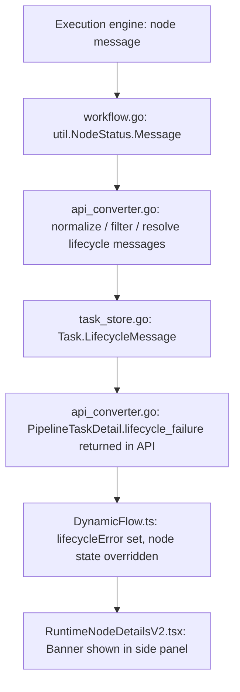

# KEP-12843: Pod Lifecycle Failure Support and Visualization

- [Summary](#summary)
- [Motivation](#motivation)
  - [Goals](#goals)
  - [Non-Goals](#non-goals)
- [Proposal](#proposal)
  - [User Stories](#user-stories)
  - [Risks and Mitigations](#risks-and-mitigations)
- [Design Details](#design-details)
  - [Where the Failure Message Lives](#where-the-failure-message-lives)
  - [Capture Mechanism](#capture-mechanism)
  - [Backend Changes](#backend-changes)
  - [Frontend Changes](#frontend-changes)
  - [Structured Message Classification](#structured-message-classification)
  - [Infra-Error Timeout](#infra-error-timeout)
  - [End-to-End Data Flow](#end-to-end-data-flow)
- [Test Plan](#test-plan)
- [Migration Strategy](#migration-strategy)
- [Frontend Considerations](#frontend-considerations)
- [KFP Local Considerations](#kfp-local-considerations)
- [Future Work](#future-work)
- [Implementation History](#implementation-history)
- [Drawbacks](#drawbacks)
- [Alternatives](#alternatives)

## Summary

A KFP pipeline task can fail in two ways. The first is a user-script failure, where the Python code inside the container raises an exception. The second is a pod lifecycle failure, where the Kubernetes pod backing the task never reaches a healthy running state, or is killed by the system. Common examples of the second category are `ImagePullBackOff`, `Unschedulable`, `OOMKilled`, `CrashLoopBackOff`, and `NodeLost`.

KFP handles the first case well today. The second case is currently invisible in the UI. The task node stays in a running state forever, no error is shown, and the user has no way to find out what happened without using `kubectl`. This proposal threads the pod lifecycle failure message through the execution engine abstraction, the API server, and into the run details page, so the task node reflects the failure and the reason is shown in the side panel, just like a user-script failure is shown today.

## Motivation

When a pod lifecycle failure happens, the execution engine records a human-readable message on the failed node, for example `Back-off pulling image "ghcr.io/example/does-not-exist:v1"`. KFP does not store or expose this message anywhere. The persistence agent reads the workflow, converts node statuses into the internal `util.NodeStatus` struct, and drops the message field. The `Task` row in the database has no column for it, and the v2beta1 `GetRun` API never returns it.

On the UI side, the run details page renders the pipeline graph from the task APIs. If a task pod fails to start, no component updates the task state to reflect the failure, so the graph node stays in a running state indefinitely.

This proposal depends on the MLMD removal effort ([KEP-12147](../12147-mlmd-removal/README.md), [#13986](https://github.com/kubeflow/pipelines/pull/13986)).

KFP positions itself as a Kubernetes abstraction for data scientists and ML engineers. Many of its users are not Kubernetes operators. When the UI shows a task that never finishes and never fails, with no message, the only path forward is to ask someone else to run `kubectl get pods`. That breaks the abstraction the product is built on.

### Goals

1. Capture the pod lifecycle failure message from the execution engine and persist it on the KFP `Task` row. The underlying implementation uses the execution engine's node status, but the KFP API remains engine-agnostic.
2. Expose the lifecycle failure through a dedicated field on `PipelineTaskDetail` in the v2beta1 `GetRun` response, separate from the existing terminal-only `error` field (see [Backend Changes](#backend-changes) for rationale).
3. In the UI, when a lifecycle message is present on a task, show a warning indicator on the node and display the message in a banner inside the node detail side panel. The node only transitions to a failed state when the timeout terminates the run or the engine marks the task as failed.
4. Avoid false positives. The execution engine emits transient messages like `PodInitializing` during normal pod startup. Healthy runs must not show a failure banner.
5. Provide a single configurable infra-error timeout so that pipeline runs stuck in a pod lifecycle failure state (such as `ImagePullBackOff`) do not run forever.

### Non-Goals

1. Per-category configurable timeouts with distinct thresholds per failure class. A single infra-error timeout is in scope; per-class granularity can be built on top of it later.
2. Any changes to the SDK, the pipeline spec, or the compiler.
3. Any changes to how user-script failures are captured. Those already work.
4. Surfacing pod logs in the UI. Out of scope.

## Proposal

The execution engine's node status already contains exactly the information the user needs. The fix is to stop dropping it. Persist it on the `Task` model behind the engine abstraction, return it in a dedicated lifecycle diagnostic field in the run response, and have the frontend render it. There are no proto changes to existing fields, no new API endpoints, and no breaking changes to existing responses.

### User Stories

#### Story 1: Bad image

I push a pipeline that references a misspelled container image. The run starts, and the affected task pod hits `ImagePullBackOff`. Within a few seconds the task node in the UI changes color to indicate a failure. I click on it and the side panel shows the failure reason. I fix the image name and re-run.

#### Story 2: Out of memory

A task pod runs out of memory and gets `OOMKilled` by the kernel. The task node indicates a failure. The side panel shows the reason. I bump the memory request on that component and re-run.

#### Story 3: Stuck run auto-terminates

I push a pipeline with a misspelled image. After the configured infra-error timeout elapses (default: 1 hour), the run is automatically terminated with the failure reason recorded. I do not need to manually cancel the run or discover via `kubectl` that it will never succeed.

### Risks and Mitigations

| Risk | Mitigation |
|---|---|
| False positives on healthy runs from transient engine messages (`PodInitializing`, `ContainerCreating`) | Filter known transient strings before persisting |
| A pod that recovers on retry could leave a stale failure message | Always overwrite the field with the latest value, so it self-clears on recovery |
| The failure message lives on a child node, not the parent task node the UI renders | Propagate the message up to the parent task node |

## Design Details

### Where the Failure Message Lives

For a run with a bad image, the relevant slice of the workflow's node statuses looks roughly like this:

```
parent task node (rendered by the UI)
    phase: Pending
    message: ""
    children: [executor pod node]

executor pod node (one per task pod)
    phase: Pending
    message: 'Back-off pulling image "ghcr.io/example/does-not-exist:v1"'
    children: []
```

Two things matter here. First, the message lives on the child executor node, but the UI renders the parent task node, so the message has to be propagated up. Second, the parent's phase is also `Pending`, not `Failed`, until the engine gives up. That is why the task state still shows as running and why the UI cannot rely on phase alone.

The current execution engine (Argo Workflows) records these messages via its `assessNodeStatus` function, which writes onto `node.Message` on every pod sync. This covers all three failure levels: provisioning (`ImagePullBackOff`, `Unschedulable`), runtime (`OOMKilled`, `CrashLoopBackOff`), and node-level (`NodeLost`, eviction). This behavior is treated as best-effort diagnostic data rather than a stable API contract. KFP normalizes these messages into its own semantics so that the public API does not expose engine-specific message formats.

An alternative approach would be to query Kubernetes pod status or events directly. This was rejected because it would require additional RBAC grants on the persistence agent role, would duplicate work the engine already does, and would miss cases where the pod is never created at all (such as quota or admission blocks), which the engine still records.

### Capture Mechanism

Post-MLMD removal, the Driver and Launcher create and update tasks via the `UpdateTask` API. However, when a pod fails to start, the Launcher never runs, so no in-pod component can report the failure. The persistence agent retains responsibility for detecting these infrastructure-level failures during its existing workflow watch, applying normalization and filtering, and writing the result to the task via `UpdateTask`.

### Backend Changes

#### `backend/src/common/util/execution_status.go`

Add a `Message string` field to the internal `NodeStatus` struct. Without this field, the message is dropped during the engine-to-KFP conversion.

```go
type NodeStatus struct {
    ID         string
    Name       string
    DisplayName string
    State      string
    StartTime  int64
    CreateTime int64
    FinishTime int64
    Children   []string
    Message    string
}
```

#### `backend/src/common/util/workflow.go`

In `NodeStatuses()`, populate the new `Message` field from the engine's node message when iterating over workflow nodes. This is the only place the message enters the KFP code path.

#### `backend/src/apiserver/model/task.go`

Add a nullable `LifecycleMessage` column to the `Task` model using the `LargeText` type, which maps to `LONGTEXT` on MySQL and `TEXT` on other dialects (such as PostgreSQL via pgx). No explicit `type:` GORM tag is used, allowing `LargeText` to handle dialect-specific column types through the existing cross-database abstraction in `model/common.go`.

```go
type Task struct {
    // ... existing fields ...

    LifecycleMessage LargeText `gorm:"column:LifecycleMessage;"`
}
```

It is stored as a dedicated field rather than embedded inside the existing payload column so that it can be queried, indexed, and updated independently.

#### Message processing

Before persisting, the message is normalized (transient startup strings like `PodInitializing` and `ContainerCreating` are dropped), non-failure nodes (`Succeeded`, `Skipped`, `Omitted`) are suppressed, and the message is propagated from child executor nodes up to the parent task node the UI renders. The result is written to the task via `UpdateTask`.

#### API exposure

The lifecycle message is exposed through a **new dedicated field** on `PipelineTaskDetail` rather than through the existing `error` field. The `error` field is documented in `run.proto` as "Only populated when the task is in FAILED or CANCELED state." Lifecycle failures need to surface while the task is still in a non-terminal state (the engine may still be retrying), so reusing `error` would violate the API contract. The new field is populated whenever the lifecycle message is non-empty, regardless of task state, and clears when the pod recovers. This requires a proto addition to `PipelineTaskDetail`.

#### Storage behavior

The `LifecycleMessage` field always reflects the latest value from the engine, clearing on recovery. It does not participate in preserve-if-empty semantics.

### Frontend Changes

The run details graph reads `task_details` from the API response and maps lifecycle messages to nodes using the **task key** (not `display_name`, since the two can diverge). When a lifecycle message is present, the node shows a warning indicator and a banner is rendered in the side panel with the message. The node state is not overridden to failed; it transitions to failed only when the timeout terminates the run or the engine marks the task as terminal. Nodes without a lifecycle message are unaffected.

### Structured Message Classification

Execution engine node messages are human-readable strings without a fixed schema. Most useful failure messages map to a small set of known Kubernetes failure categories:

| Category | Example messages |
|---|---|
| Image pull | `Back-off pulling image`, `ErrImagePull`, `ImagePullBackOff` |
| Resource / scheduling | `Unschedulable`, `FailedScheduling`, `Insufficient cpu` |
| Runtime / OOM | `OOMKilled`, `Error`, `CrashLoopBackOff` |
| Admission / policy | `pods "..." is forbidden` (Kyverno, PodSecurityPolicy) |
| Unknown | Anything not matching the above |

A `LifecycleCategory` column on the `Task` model stores the classified category. The classification is engine-agnostic: the persistence agent normalizes the engine's message into one of the categories above before writing it. For unknown or newly introduced failure patterns, the category defaults to `Unknown` while the raw message in `LifecycleMessage` still provides the original diagnostic details. This structured category enables consistent UI treatment (color, wording, tooltip), timeout behavior, and future reporting across pipeline engines.

### Infra-Error Timeout

Without a timeout, a pipeline run stuck in a pod lifecycle failure will run indefinitely, consuming cluster resources. This proposal includes a single configurable timeout for lifecycle failures that are likely user error and unlikely to self-resolve.

**Which categories trigger the timeout:**

| Category | Timeout applies | Rationale |
|---|---|---|
| Image pull (`ImagePullBackOff`, `ErrImagePull`) | Yes | Almost always a typo or missing image, will not self-resolve |
| Admission / policy (`pods "..." is forbidden`) | Yes | Policy misconfiguration, will not self-resolve |
| Volume mount (invalid storage class, unbound PVC) | Yes | Likely user error in PVC spec |
| Resource / scheduling (`Unschedulable`, `Insufficient cpu`) | No | May resolve when resources free up (e.g. waiting for a GPU) |
| Runtime / OOM (`OOMKilled`, `CrashLoopBackOff`) | No | Already handled by the engine's retry/backoff policy |
| Unknown | No | Unclear whether it will self-resolve |

The `LifecycleCategory` column determines whether the timeout applies for a given failure.

**Timeout mechanism:** The persistence agent runs a sweep worker on its own `time.Ticker`, separate from the reporting loop, so it does not affect reporting latency. The sweep maintains a map tracking when each task first entered a timeout-eligible category. If the category changes to a different timeout-eligible category (for example, Kubernetes alternating between `ErrImagePull` and `ImagePullBackOff`), the timer is not reset, since the underlying problem has not changed. The timer resets only when the message clears (recovery) or changes to a non-timeout category. If the elapsed time exceeds the configured threshold, the run is terminated with the failure reason recorded.

| Variable | Default | Description |
|---|---|---|
| `LIFECYCLE_FAILURE_TIMEOUT` | `1h` | Duration after which a run stuck in a timeout-eligible lifecycle failure is terminated. Set to `0` to disable. |

Per-category thresholds are deferred to future work.

### End-to-End Data Flow


```mermaid
flowchart TD
    A["Execution engine: node message"]
    --> B["workflow.go: util.NodeStatus.Message"]
    --> C["api_converter.go: normalize / filter / resolve lifecycle messages"]
    --> D["task_store.go: Task.LifecycleMessage"]
    --> E["api_converter.go: PipelineTaskDetail.lifecycle_failure returned in API"]
    --> F["DynamicFlow.ts: lifecycleError set, node state overridden"]
    --> G["RuntimeNodeDetailsV2.tsx: Banner shown in side panel"]
```

## Test Plan

### CI Validation

The following scenarios will be added to cover the lifecycle failure path in CI:

| Scenario | Message captured | API field set | Frontend node | Banner |
|---|---|---|---|---|
| Bad image (`ImagePullBackOff`) | yes | yes | warning indicator | yes |
| Runtime OOM (`OOMKilled`) | yes | yes | warning indicator | yes |
| Pod never created (resource quota exceeded) | yes | yes | warning indicator | yes |
| Healthy pipeline (regression check) | no | no | stays green | no |
| Retry: first attempt fails, retry succeeds | yes | cleared on recovery | warning then green | clears on recovery |
| Transient startup (`PodInitializing`) | filtered out | no | stays green | no |
| Infra-error timeout | yes | yes | turns red (terminated) | yes |

## Migration Strategy

The only schema change is one new nullable column on the `tasks` table, `LifecycleMessage`, stored using the `LargeText` type which maps to `LONGTEXT` on MySQL and `TEXT` on PostgreSQL. It is added on API server startup by GORM's `AutoMigrate`, which performs additive-only changes. No manual migration script is required and no downtime is needed.

Existing rows have a `null` value, which the API converter treats as "no lifecycle failure". This is indistinguishable from "no failure" by design.

Rollback is straightforward. Reverting the API server image and either dropping the column or leaving it in place unused restores the previous behavior. The column is informational only, so there is no data loss.

The `Task` table changes proposed in [KEP-12147](../12147-mlmd-removal/README.md) drop and recreate the table; the `LifecycleMessage` column can be included in the new schema definition.

## Frontend Considerations

When a lifecycle message is present on a task, the node shows a warning indicator (e.g. amber outline or icon) and the side panel displays a banner with the message. The node does not turn red at this point because the issue may still resolve on its own (for example, a pod waiting for a GPU to become available). The node transitions to a failed state only when the infra-error timeout terminates the run or the execution engine marks the task as terminal. During normal startup (e.g. `PodInitializing`), no indicator or banner appears. If the pod recovers, the warning clears.

## KFP Local Considerations

This feature is backend and frontend only. It does not change the SDK, the compiler, or the IR. KFP local execution (`SubprocessRunner`, `DockerRunner`) does not go through the execution engine, the API server, or the database. None of the code paths added by this proposal are reached during local execution, so there is no impact on the local experience.

## Future Work

The following improvements are out of scope for this proposal but are worth keeping in mind for follow-up work.

**Per-category configurable timeouts.** The single infra-error timeout in this proposal covers the common case. Distinct thresholds per failure class (for example, a shorter timeout for admission blocks than for scheduling failures) can be added later using the `LifecycleCategory` column.

**Crash-count threshold.** For failures like `CrashLoopBackOff` and `OOMKilled`, a crash count threshold (e.g. fail the task after 3 crashes) would be a more natural fit than a time-based timeout. The persistence agent can track the count across reporting cycles using the `LifecycleCategory` column to identify repeated crashes of the same class.

**Message deduplication.** Kubernetes can alternate between `ErrImagePull` and `ImagePullBackOff` for the same root cause. If this becomes noisy in the persistence agent reporting loop, suppressing semantically equivalent message updates would reduce unnecessary database writes.

## Implementation History

- 2026-02-18: Original feature request opened by [@alyssacgoins](https://github.com/alyssacgoins) as [#12843](https://github.com/kubeflow/pipelines/issues/12843).
- 2026-06-11: Initial implementation drafted by [@khushiiagrawal](https://github.com/khushiiagrawal) as [#13516](https://github.com/kubeflow/pipelines/pull/13516) and verified end to end on a local Kind cluster against both failure and success pipelines.
- 2026-06-12: KEP submitted (this document).

## Drawbacks

1. The classification relies on substring matching against known failure patterns. Unrecognized messages fall back to `Unknown` with the raw message preserved, but new Kubernetes failure reasons require updating the classifier.
2. The warning indicator introduces a new visual state on the graph that users need to learn. It is distinct from both the running (green) and failed (red) states.

## Alternatives

### Alternative 1: Poll Kubernetes pod status directly from the API server or persistence agent

The API server or persistence agent could query pod status directly through the Kubernetes API instead of reading from the execution engine. Rejected because the engine already records the information, querying pods directly adds RBAC requirements and another failure mode, and it bypasses the existing execution engine abstraction. It also misses cases where the pod was never created at all (quota, admission blocks), which the engine still records.

### Alternative 2: Surface the failure only as a banner above the graph

An earlier sketch only added a global banner on the run details page when any task hit a lifecycle failure. Rejected because the user still cannot tell which task failed if the pipeline has many tasks. Per-node state and per-node banners are a better fit for the existing graph-based UX.

### Alternative 3: Reuse `RuntimeStatus` or existing error fields without a new column

The `Task` model already has a `Payload` text column carrying serialized state. Stuffing the lifecycle message into the payload was considered but rejected because the payload is a serialized blob and not a queryable field, filtering or reporting on lifecycle failures across runs would require parsing the blob, and a dedicated column makes the database semantics obvious and the `patchTask` overwrite rule (fresh value wins) easy to express. The cost is one nullable column.

### Alternative 4: Reuse the existing `error` field on `PipelineTaskDetail`

The existing `error` field on `PipelineTaskDetail` is documented as "Only populated when the task is in FAILED or CANCELED state." Lifecycle failures need to surface while the task is still in a non-terminal state (the engine may still be retrying). Reusing `error` would violate the API contract and could break existing clients that use it to determine terminal state. A dedicated lifecycle diagnostic field avoids this issue.

### Alternative 5: Do this entirely in the frontend by polling pods

The frontend could call `kubectl`-equivalent endpoints to inspect pods in parallel with rendering the run. Rejected for the same reasons as Alternative 1, plus the frontend has no Kubernetes credentials in single-user mode and would need a new proxy. It is far more code for no extra value.
