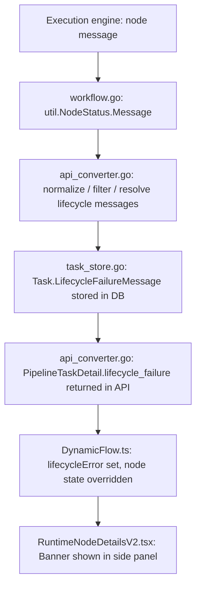

# KEP-12843: Pod Lifecycle Failure Support and Visualization

- [Summary](#summary)
- [Motivation](#motivation)
  - [Goals](#goals)
  - [Non-Goals](#non-goals)
- [Proposal](#proposal)
  - [User Stories](#user-stories)
  - [Risks and Mitigations](#risks-and-mitigations)
- [Design Details](#design-details)
  - [Where the Failure Message Lives](#where-the-failure-message-lives)
  - [Backend Changes](#backend-changes)
  - [Frontend Changes](#frontend-changes)
  - [Structured Message Classification](#structured-message-classification)
  - [Reporting Latency](#reporting-latency)
  - [Infra-Error Timeout](#infra-error-timeout)
  - [End-to-End Data Flow](#end-to-end-data-flow)
- [Test Plan](#test-plan)
- [Migration Strategy](#migration-strategy)
- [Frontend Considerations](#frontend-considerations)
- [KFP Local Considerations](#kfp-local-considerations)
- [Future Work](#future-work)
- [Implementation History](#implementation-history)
- [Drawbacks](#drawbacks)
- [Alternatives](#alternatives)

## Summary

A KFP pipeline task can fail in two ways. The first is a user-script failure, where the Python code inside the container raises an exception. The second is a pod lifecycle failure, where the Kubernetes pod backing the task never reaches a healthy running state, or is killed by the system. Common examples of the second category are `ImagePullBackOff`, `Unschedulable`, `OOMKilled`, `CrashLoopBackOff`, and `NodeLost`.

KFP handles the first case well today. The second case is currently invisible in the UI. The task node stays in a running state forever, no error is shown, and the user has no way to find out what happened without using `kubectl`. This proposal threads the pod lifecycle failure message through the execution engine abstraction, the API server, and into the run details page, so the task node reflects the failure and the reason is shown in the side panel, just like a user-script failure is shown today.

## Motivation

When a pod lifecycle failure happens, the execution engine records a human-readable message on the failed node, for example `Back-off pulling image "ghcr.io/example/does-not-exist:v1"`. KFP does not store or expose this message anywhere. The persistence agent reads the workflow, converts node statuses into the internal `util.NodeStatus` struct, and drops the message field. The `Task` row in the database has no column for it, and the v2beta1 `GetRun` API never returns it.

On the UI side, the run details page currently renders the pipeline graph from MLMD execution records. The driver pod writes the MLMD execution row in `RUNNING` state before the user container starts. If the user container then fails to start at all, the MLMD record stays at `RUNNING` forever, and the graph node renders green and spins indefinitely.

This proposal aligns with and builds on the ongoing MLMD removal effort ([KEP-12147](../12147-mlmd-removal/README.md), [#13986](https://github.com/kubeflow/pipelines/pull/13986)). As MLMD is removed, the frontend will read execution state from task APIs rather than from MLMD. The lifecycle failure information proposed here is stored on the `Task` row and exposed through the task API, so it fits naturally into the post-MLMD architecture. The UI state override described below converges with the MLMD removal: once node status comes from tasks, the override simply becomes the value.

KFP positions itself as a Kubernetes abstraction for data scientists and ML engineers. Many of its users are not Kubernetes operators. When the UI shows a task that never finishes and never fails, with no message, the only path forward is to ask someone else to run `kubectl get pods`. That breaks the abstraction the product is built on.

### Goals

1. Capture the pod lifecycle failure message from the execution engine and persist it on the KFP `Task` row. The underlying implementation uses the execution engine's node status, but the KFP API remains engine-agnostic.
2. Expose the lifecycle failure through a dedicated field on `PipelineTaskDetail` in the v2beta1 `GetRun` response, separate from the existing terminal-only `error` field (see [Backend Changes](#backend-changes) for rationale).
3. In the UI, when a lifecycle failure is present on a task, override the node visual state to reflect the failure, even if MLMD still reports `RUNNING` (or, post-MLMD removal, if the task state has not yet been updated), and show the failure reason in a banner inside the node detail side panel.
4. Avoid false positives. The execution engine emits transient messages like `PodInitializing` during normal pod startup. Healthy runs must not show a failure banner.
5. Provide a single configurable infra-error timeout so that pipeline runs stuck in a pod lifecycle failure state (such as `ImagePullBackOff`) do not run forever.

### Non-Goals

1. Per-category configurable timeouts with distinct thresholds per failure class. A single infra-error timeout is in scope; per-class granularity can be built on top of it later.
2. Any changes to the SDK, the pipeline spec, or the compiler.
3. Any changes to how user-script failures are captured. Those already work.
4. Surfacing pod logs in the UI. Out of scope.

## Proposal

The execution engine's node status already contains exactly the information the user needs. The fix is to stop dropping it. Persist it on the `Task` model behind the engine abstraction, return it in a dedicated lifecycle diagnostic field in the run response, and have the frontend render it. The work is split across six backend files and four frontend files. There are no proto changes to existing fields, no new API endpoints, and no breaking changes to existing responses.

### User Stories

#### Story 1: Bad image

I push a pipeline that references a misspelled container image. The run starts, and the affected task pod hits `ImagePullBackOff`. Within a few seconds the task node in the UI changes color to indicate a failure. I click on it and the side panel shows the failure reason. I fix the image name and re-run.

#### Story 2: Out of memory

A task pod runs out of memory and gets `OOMKilled` by the kernel. The task node indicates a failure. The side panel shows the reason. I bump the memory request on that component and re-run.

#### Story 3: Stuck run auto-terminates

I push a pipeline with a misspelled image. After the configured infra-error timeout elapses (default: 1 hour), the run is automatically terminated with the failure reason recorded. I do not need to manually cancel the run or discover via `kubectl` that it will never succeed.

### Risks and Mitigations

| Risk | Mitigation |
|---|---|
| The execution engine emits `PodInitializing` and `ContainerCreating` on healthy pods, which would create a false-positive banner on every run | Filter these known transient strings before persisting |
| The engine also emits messages on `Succeeded`, `Skipped`, and `Omitted` nodes (cache hits, conditional skips) | Suppress messages whose node state is non-failure |
| The node graph could in theory contain a cycle | Cycle-safe traversal using a recursion-stack guard |
| A pod that recovers on retry could leave a stale failure message on the row | `patchTask` always overwrites the field with the latest filtered value, with no preservation logic |
| The failure message lives on a child executor pod node, not the parent task node the UI renders | The message resolution walks the tree and bubbles the child message up to the parent task node |

## Design Details

### Where the Failure Message Lives

For a run with a bad image, the relevant slice of the workflow's node statuses looks roughly like this:

```
parent task node (rendered by the UI)
    phase: Pending
    message: ""
    children: [executor pod node]

executor pod node (one per task pod)
    phase: Pending
    message: 'Back-off pulling image "ghcr.io/example/does-not-exist:v1"'
    children: []
```

Two things matter here. First, the message lives on the child executor node, but the UI renders the parent task node, so the message has to be propagated up. Second, the parent's phase is also `Pending`, not `Failed`, until the engine gives up. That is why MLMD also reports the task as still running and why the UI cannot rely on phase alone.

The current execution engine (Argo Workflows) records these messages via its `assessNodeStatus` function, which writes onto `node.Message` on every pod sync. This covers all three failure levels: provisioning (`ImagePullBackOff`, `Unschedulable`), runtime (`OOMKilled`, `CrashLoopBackOff`), and node-level (`NodeLost`, eviction). This behavior is treated as best-effort diagnostic data rather than a stable API contract. KFP normalizes these messages into its own semantics so that the public API does not expose engine-specific message formats.

An alternative approach would be to query Kubernetes pod status or events directly. This was rejected because it would require additional RBAC grants on the persistence agent role, would duplicate work the engine already does, and would miss cases where the pod is never created at all (such as quota or admission blocks), which the engine still records.

### Backend Changes

The backend change set touches six files.

#### `backend/src/common/util/execution_status.go`

Add a `Message string` field to the internal `NodeStatus` struct. Without this field, the message is dropped during the engine-to-KFP conversion.

```go
type NodeStatus struct {
    ID         string
    Name       string
    DisplayName string
    State      string
    StartTime  int64
    CreateTime int64
    FinishTime int64
    Children   []string
    Message    string
}
```

#### `backend/src/common/util/workflow.go`

In `NodeStatuses()`, populate the new `Message` field from the engine's node message when iterating over workflow nodes. This is the only place the message enters the KFP code path.

#### `backend/src/apiserver/model/task.go`

Add a nullable `LifecycleFailureMessage` column to the `Task` model using the `LargeText` type, which maps to `LONGTEXT` on MySQL and `TEXT` on other dialects (such as PostgreSQL via pgx). No explicit `type:` GORM tag is used, allowing `LargeText` to handle dialect-specific column types through the existing cross-database abstraction in `model/common.go`.

```go
type Task struct {
    // ... existing fields ...

    LifecycleFailureMessage LargeText `gorm:"column:LifecycleFailureMessage;"`
}
```

It is stored as a dedicated field rather than embedded inside the existing payload column so that it can be queried, indexed, and updated independently.

#### `backend/src/apiserver/server/api_converter.go`

Three helpers, then one place that uses them:

1. **Normalization**: returns an empty string for transient startup messages (`PodInitializing`, `ContainerCreating`). Otherwise returns the input unchanged.
2. **Non-failure suppression**: additionally returns empty for nodes whose state is `Succeeded`, `Skipped`, or `Omitted`.
3. **Resolution**: walks the node graph starting from each task node. For a given node, the resolved message is its own filtered message if non-empty, otherwise the first non-empty resolved message from any of its descendants. Cycle detection uses a recursion-stack guard so that shared descendants (the same node reached through two different parents) are not incorrectly treated as cycles.

The resolved message is written into `task.LifecycleFailureMessage` during task model construction.

**API exposure**: The lifecycle failure message is exposed through a **new dedicated field** on `PipelineTaskDetail` rather than through the existing `error` field. The `error` field is documented in `run.proto` as "Only populated when the task is in FAILED or CANCELED state." Lifecycle failures need to surface while the task is still in a non-terminal state (the engine may still be retrying), so reusing `error` would violate the API contract and could break existing clients that use it to determine terminal state. The new field is populated whenever the lifecycle failure message is non-empty, regardless of task state, and clears when the pod recovers. This requires a proto addition to `PipelineTaskDetail`.

#### `backend/src/apiserver/storage/task_store.go`

Add `LifecycleFailureMessage` to `taskColumns`, to `scanRows`, and to the `CreateTask` and `CreateOrUpdateTasks` insert paths.

In `patchTask`, `LifecycleFailureMessage` is intentionally omitted from the preserve-if-empty loop that fills other fields from the existing DB row. This means the fresh value computed from the current workflow sync is always kept as-is, an empty string when the pod has recovered, or the failure message when it has not. Existing `patchTask` behavior for all other fields is unchanged.

### Frontend Changes

The frontend change set touches four files.

#### `frontend/src/components/graph/Constants.ts`

Add optional fields on the execution flow element data:

```ts
export type ExecutionFlowElementData = FlowElementDataBase & {
  state?: Execution.State;
  lifecycleError?: string;
};
```

#### `frontend/src/lib/v2/DynamicFlow.ts`

`updateFlowElementsState` now takes the run's `task_details` array as an extra argument. From it, build a map keyed on the **task key** (derived from `getTaskKeyFromNodeKey`), valued by the lifecycle failure message. This uses the stable task identifier that `DynamicFlow.ts` already uses for node lookups, not `display_name`, since task keys and display names can diverge when a pipeline uses custom task names, and duplicate display names could cause aliasing.

While iterating execution nodes, if the node's task key has an entry in the map, write the message onto `data.lifecycleError`. If `data.lifecycleError` is non-empty, override `data.state` to `Execution.State.FAILED`. This last step is the critical one: it makes the node render as failed even though MLMD still reports `RUNNING`.

#### `frontend/src/pages/RunDetailsV2.tsx`

Pass `run.run_details?.task_details` into `updateFlowElementsState` from the `dynamicFlowElements` `useMemo`. No other changes.

#### `frontend/src/components/tabs/RuntimeNodeDetailsV2.tsx`

Read `lifecycleError` from the typed flow element data, replacing the existing `as any` cast with `as ExecutionFlowElementData | undefined` in the same step. When set, render a `Banner` at the top of the side panel with the failure reason. Also render the banner in the Input/Output tab when no MLMD execution record exists, since that is the case where the pod failed before the driver could write any metadata.

### Structured Message Classification

Execution engine node messages are human-readable strings without a fixed schema. Most useful failure messages map to a small set of known Kubernetes failure categories:

| Category | Example messages |
|---|---|
| Image pull | `Back-off pulling image`, `ErrImagePull`, `ImagePullBackOff` |
| Resource / scheduling | `Unschedulable`, `FailedScheduling`, `Insufficient cpu` |
| Runtime / OOM | `OOMKilled`, `Error`, `CrashLoopBackOff` |
| Admission / policy | `pods "..." is forbidden` (Kyverno, PodSecurityPolicy) |
| Unknown | Anything not matching the above |

Structured classification is intentionally deferred from this proposal. The raw message already gives the user the information needed to diagnose the failure, and the engine's node message works even in cases where the pod was never created at all (for example, resource quota exceeded or an admission controller blocking pod creation). A structured category field can be added later as a separate column on the `Task` model without any breaking changes to the existing `LifecycleFailureMessage` field or the API response. For unknown or newly introduced failure patterns, the structured status would stay `Unknown` while the raw message would still provide the original diagnostic details.

### Reporting Latency

The message resolution function runs inside the persistence agent reporting path, during task model construction, which is called for each node during `ReportWorkflowResource`. The traversal is a DFS over the node graph with a memoization cache, so each node is visited at most once. The time complexity is O(n) where n is the number of nodes in the workflow.

For typical KFP pipelines this adds negligible overhead. A pipeline with 100 tasks produces roughly 200-300 nodes (one task node and one executor pod node per task). The traversal is entirely in-memory map lookups with no I/O.

For cron runs, the persistence agent reporting path is more sensitive because the run row may not yet exist in MySQL when the first workflow state update arrives. The lifecycle message processing does not add any new database reads or writes beyond the existing `patchTask` upsert. The graph traversal happens entirely in memory before the database write, so it does not affect the likelihood or window of the existing race condition on the run row.

A before-and-after performance measurement of the persistence agent reporting loop will be included in the implementation PR.

### Infra-Error Timeout

Without a timeout, a pipeline run stuck in a pod lifecycle failure such as `ImagePullBackOff` will run indefinitely, consuming cluster resources. This proposal includes a single configurable infra-error timeout that applies to all pod lifecycle failures.

The persistence agent gains a sweep worker on its own `time.Ticker`, separate from the reporting loop. It maintains a map tracking when each task first received a non-empty `LifecycleFailureMessage`. If the elapsed time exceeds the configured threshold, the run is terminated with the failure reason recorded as the termination message. The timestamp resets if the message changes or clears (recovery).

The timeout is configured via a single environment variable:

| Variable | Default | Description |
|---|---|---|
| `LIFECYCLE_FAILURE_TIMEOUT` | `1h` | Duration after which a run stuck in a pod lifecycle failure state is terminated. Set to `0` to disable. |

The sweep runs on its own ticker specifically so it cannot slow the latency-sensitive reporting loop. Per-category thresholds with distinct values per failure class are deferred to future work.

### End-to-End Data Flow


```mermaid
flowchart TD
    A["Execution engine: node message"]
    --> B["workflow.go: util.NodeStatus.Message"]
    --> C["api_converter.go: normalize / filter / resolve lifecycle messages"]
    --> D["task_store.go: Task.LifecycleFailureMessage stored in DB"]
    --> E["api_converter.go: PipelineTaskDetail.lifecycle_failure returned in API"]
    --> F["DynamicFlow.ts: lifecycleError set, node state overridden"]
    --> G["RuntimeNodeDetailsV2.tsx: Banner shown in side panel"]
```

## Test Plan

### Unit Tests

Backend, added in `backend/src/apiserver/server/api_converter_test.go`:

1. **Normalization**: real failure strings pass through unchanged, `PodInitializing` and `ContainerCreating` return empty, and empty input returns empty.
2. **Non-failure suppression**: a Failed or Pending node with a real message returns the message, and Succeeded, Skipped, and Omitted nodes return empty even when the message is non-empty.
3. **Resolution**: a direct message on a task node, propagation from a child executor node, parent precedence over a child, an empty result when no descendant has a message, a graph with a cycle, and two task nodes that share a descendant.

Backend, in `backend/src/apiserver/storage/task_store_test.go`: existing CRUD tests cover the new column once it is added to the column list. No new test files are required.

Frontend unit tests, in `frontend/src/lib/v2/DynamicFlow.test.ts`:

- A test covering a task with a non-empty `lifecycleError` confirms the node state is overridden to `Execution.State.FAILED` and `data.lifecycleError` is set.
- A test covering a task with no lifecycle error confirms the node state is unchanged and `data.lifecycleError` is undefined.
- A test where the task key and display name differ, confirming the lookup uses task key.
- Existing `RunDetailsV2.test.tsx` snapshot and behavior tests continue to pass, confirming the success path is unaffected.

Frontend component tests, in `frontend/src/components/tabs/RuntimeNodeDetailsV2.test.tsx`:

- A test confirms the `Banner` is rendered when `lifecycleError` is set on the flow element data.
- A test confirms no `Banner` is rendered when `lifecycleError` is absent.

### CI Validation

The following scenarios will be added to cover the lifecycle failure path in CI:

| Scenario | Persistence Agent captures message | API: lifecycle failure field set | Frontend: node shows failure | Frontend: banner shown |
|---|---|---|---|---|
| Bad image (`ImagePullBackOff`) | yes | yes | yes | yes |
| Runtime OOM (`OOMKilled`) | yes | yes | yes | yes |
| Pod never created (resource quota exceeded) | yes | yes | yes | yes |
| Healthy pipeline (regression check) | no message stored | no field | stays green | no banner |
| Retry: first attempt fails, retry succeeds | yes | cleared after recovery | turns green after recovery | banner clears after recovery |
| Transient startup (`PodInitializing`) | filtered, not stored | no field | stays green during startup | no banner during startup |
| Infra-error timeout | yes | yes | run terminated | reason recorded |

### Manual Verification (E2E)

These steps reproduce the behavior end to end on a local Kind cluster.

Setup:

```bash
make -C backend kind-cluster-agnostic
kubectl -n kubeflow port-forward svc/ml-pipeline-ui 8080:80
```

Failure case (`ImagePullBackOff`):

1. Compile and submit a one-component pipeline whose component uses a deliberately bad image, for example `image="ghcr.io/example/does-not-exist:v1"`.
2. Open the run in the UI. Within roughly 30 seconds the task node should indicate a failure.
3. Click the node. The side panel should display the failure reason.
4. Confirm the API matches the UI:

   ```bash
   curl -s "http://localhost:8080/apis/v2beta1/runs/<run-id>" | \
     jq '.run_details.task_details[] | {display_name, lifecycle_failure}'
   ```

Success case (clean run, regression check):

1. Submit any healthy pipeline, for example one of the samples under `samples/`.
2. Watch the run from start to finish. No task node should ever show a lifecycle failure banner during pod startup transitions.
3. The run finishes green.

Recovery case (retry after failure):

1. Submit a pipeline that fails on the first attempt and is configured with a retry policy.
2. Confirm that on the failed attempt the node shows the lifecycle banner.
3. After the engine retries and the pod succeeds, confirm the banner is cleared and the node turns green. This validates that the field is overwritten and not preserved.

## Migration Strategy

The only schema change is one new nullable column on the `tasks` table, `LifecycleFailureMessage`, stored using the `LargeText` type which maps to `LONGTEXT` on MySQL and `TEXT` on PostgreSQL. It is added on API server startup by GORM's `AutoMigrate`, which performs additive-only changes. No manual migration script is required and no downtime is needed.

Existing rows have a `null` value, which the API converter treats as "no lifecycle failure". This is indistinguishable from "no failure" by design.

Rollback is straightforward. Reverting the API server image and either dropping the column or leaving it in place unused restores the previous behavior. The column is informational only, so there is no data loss.

This migration is compatible with the MLMD removal effort. The `Task` table changes proposed in [KEP-12147](../12147-mlmd-removal/README.md) drop and recreate the table; the `LifecycleFailureMessage` column can be included in the new schema definition.

## Frontend Considerations

This proposal directly improves what users see in the run details UI. When a pod lifecycle failure occurs, the affected task node changes state to indicate a failure, and the side panel shows a banner with the failure reason. This happens even when the task has not yet been marked as failed by the execution engine, because the frontend overrides the node state based on the lifecycle failure field in the API response rather than relying solely on MLMD execution records (or, post-MLMD removal, the task state alone). Users get a clear, actionable error message without ever leaving the KFP UI or running `kubectl`.

The other relevant points:

- The lifecycle failure is exposed through a new dedicated field on `PipelineTaskDetail`, not the terminal-only `error` field.
- The frontend lookup map uses the task key (the stable identifier already used by `getTaskKeyFromNodeKey` in `DynamicFlow.ts`), not `display_name`, to avoid mismatches when task keys and display names diverge.
- The change keeps user-controlled state intact across refetches. The query refresh pattern already in `RunDetailsV2.tsx` is preserved, and only the argument list of `updateFlowElementsState` is extended.
- The state override in `DynamicFlow.ts` is computed during the existing update path. It is not a new effect and does not introduce an effect chain.
- Existing snapshot and behavior tests in `RunDetailsV2.test.tsx` continue to pass. The success path is unchanged because `lifecycleError` is undefined for healthy runs.

## KFP Local Considerations

This feature is backend and frontend only. It does not change the SDK, the compiler, or the IR. KFP local execution (`SubprocessRunner`, `DockerRunner`) does not go through the execution engine, the API server, or the database. None of the code paths added by this proposal are reached during local execution, so there is no impact on the local experience.

## Future Work

The following improvements are out of scope for this proposal but are worth keeping in mind for follow-up work.

**Structured message classification.** See the [Structured Message Classification](#structured-message-classification) section for the proposed category taxonomy. Once the raw message is stable, a structured classifier can be added as a new `LifecycleFailureCategory` column without breaking changes to the existing field or API response.

**Per-category configurable timeouts.** The single infra-error timeout in this proposal covers the common case. Distinct thresholds per failure class (for example, a shorter timeout for admission blocks than for scheduling failures) can be added later once structured classification is in place.

**Transient vs terminal failure distinction.** `OOMKilled` is a terminal failure and it may make sense to immediately transition the task to a `Failed` state. `ImagePullBackOff` and `FailedScheduling` are transient and may resolve on retry. A separate `Warning` task state could be introduced for transient conditions, but this requires additional schema changes and UI work.

**Message deduplication.** Kubernetes can alternate between `ErrImagePull` and `ImagePullBackOff` for the same root cause. If this becomes noisy in the persistence agent reporting loop, suppressing semantically equivalent message updates would reduce unnecessary database writes.

## Implementation History

- 2026-02-18: Original feature request opened by [@alyssacgoins](https://github.com/alyssacgoins) as [#12843](https://github.com/kubeflow/pipelines/issues/12843).
- 2026-06-11: Initial implementation drafted by [@khushiiagrawal](https://github.com/khushiiagrawal) as [#13516](https://github.com/kubeflow/pipelines/pull/13516) and verified end to end on a local Kind cluster against both failure and success pipelines.
- 2026-06-12: KEP submitted (this document).

## Drawbacks

1. The displayed message is the raw engine node message, normalized into KFP-owned semantics. It is human-readable but not structured, so it cannot be programmatically classified into provisioning, runtime, or node-level failures from the API alone. A structured classification could be added later without breaking this change.
2. One additional nullable column is added to the `tasks` table. For most operators this is a non-issue, but it is worth being explicit about.
3. The UI override of node state when a lifecycle error is present means the visual source of truth is no longer purely MLMD. This is intentional and necessary, and it converges with the MLMD removal effort where node status comes from task APIs.

## Alternatives

### Alternative 1: Poll Kubernetes pod status directly from the API server or persistence agent

The API server or persistence agent could query pod status directly through the Kubernetes API instead of reading from the execution engine. Rejected because the engine already records the information, querying pods directly adds RBAC requirements and another failure mode, and it bypasses the existing execution engine abstraction. It also misses cases where the pod was never created at all (quota, admission blocks), which the engine still records.

### Alternative 2: Surface the failure only as a banner above the graph

An earlier sketch only added a global banner on the run details page when any task hit a lifecycle failure. Rejected because the user still cannot tell which task failed if the pipeline has many tasks. Per-node state and per-node banners are a better fit for the existing graph-based UX.

### Alternative 3: Reuse `RuntimeStatus` or existing error fields without a new column

The `Task` model already has a `Payload` text column carrying serialized state. Stuffing the lifecycle message into the payload was considered but rejected because the payload is a serialized blob and not a queryable field, filtering or reporting on lifecycle failures across runs would require parsing the blob, and a dedicated column makes the database semantics obvious and the `patchTask` overwrite rule (fresh value wins) easy to express. The cost is one nullable column.

### Alternative 4: Reuse the existing `error` field on `PipelineTaskDetail`

The existing `error` field on `PipelineTaskDetail` is documented as "Only populated when the task is in FAILED or CANCELED state." Lifecycle failures need to surface while the task is still in a non-terminal state (the engine may still be retrying). Reusing `error` would violate the API contract and could break existing clients that use it to determine terminal state. A dedicated lifecycle diagnostic field avoids this issue.

### Alternative 5: Do this entirely in the frontend by polling pods

The frontend could call `kubectl`-equivalent endpoints to inspect pods in parallel with rendering the run. Rejected for the same reasons as Alternative 1, plus the frontend has no Kubernetes credentials in single-user mode and would need a new proxy. It is far more code for no extra value.
