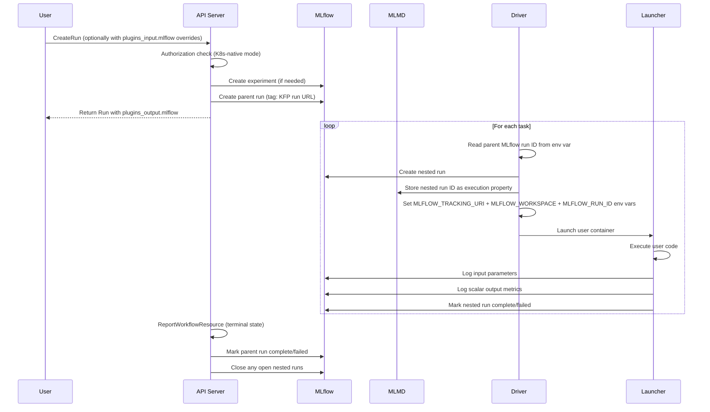

# KEP-12862: MLflow Integration for Kubeflow Pipelines

## Summary

Kubeflow Pipelines has built-in experiment tracking with run comparison in the UI, but it is limited in capability and
exists in isolation from the rest of the Kubeflow ecosystem. Users of Kubeflow Notebooks, Kubeflow Trainer, and Kubeflow
Pipelines have no unified view of experiment metrics across these components. MLflow is one option for providing that
unified experience. However, users who want MLflow tracking today must manually configure it in each pipeline component,
leading to fragmented setup, no automatic correlation between KFP pipeline runs and MLflow experiments/runs, and no
centralized view across the platform.

This proposal adds a plugin-style metadata interface to the `Run` proto (`plugins_input` / `plugins_output`) and
implements MLflow as the first built-in integration across the API server, driver, and launcher. The metadata interface
is based on the generic plugin architecture proposed in [KEP #12700](https://github.com/kubeflow/pipelines/pull/12700).
KEP #12700 will align with the interface defined here and provide the full generic plugin architecture (plugin server,
lifecycle hooks, entry points). However, KEP #12700 is blocked on MLMD removal, which is a prerequisite for it. This
proposal implements MLflow as a built-in special case so that when KEP #12700 lands, the transition to the generic
plugin architecture is seamless and clients experience no breaking changes. Long-term, the intention is to migrate this
built-in MLflow functionality to the generic plugin architecture without breaking changes.

## Motivation

KFP's built-in run comparison allows users to view metrics across pipeline runs within the KFP UI. This works for simple
cases but does not scale to workflows that span multiple Kubeflow components. A data scientist may train a model with
Kubeflow Trainer, preprocess data in a Kubeflow Notebook, and orchestrate the full workflow with Kubeflow Pipelines.
Today, metrics from each of these components are siloed in their respective UIs with no way to correlate them.

MLflow is a widely adopted experiment tracking framework. Version 3.10 introduced
[workspaces](https://mlflow.org/docs/latest/self-hosting/workspaces/) for multi-tenancy, which aligns well with KFP's
multi-user model where each user operates within a Kubernetes namespace. A Kubernetes-native deployment of MLflow can
map namespaces to MLflow workspaces and accept Kubernetes tokens for authentication, making it a natural fit for the
Kubeflow ecosystem. A broader proposal for integrating MLflow into the Kubeflow ecosystem will be pursued separately.

The primary workaround today is to add MLflow client calls directly in each pipeline component. This requires every
component author to configure `MLFLOW_TRACKING_URI`, manage credentials, create or look up experiments, and manually
correlate MLflow runs with KFP runs. The result is challenging, in particular for users not familiar with Kubernetes.
There is also no standard way to see which MLflow run corresponds to a given KFP pipeline run, or to automatically mark
an MLflow run as complete when the pipeline finishes.

Providing a built-in integration where the API server, driver, and launcher handle MLflow interactions transparently
would eliminate this manual setup and give users automatic, consistent experiment tracking across all pipeline
components. Crucially, pipelines are not required to change and will continue to work on deployments without MLflow.
When MLflow is configured, the same pipelines gain an enhanced experience with automatic experiment tracking, parameter
and metric logging, and cross-referencing between KFP and MLflow runs without any modification to the pipeline code
itself.

### Goals

1. Automatically create an MLflow parent run when a KFP pipeline run is created, and mark it as complete or failed when
   the pipeline finishes.
1. Track each task as a nested MLflow run, including individual iterations of parallel-for loops.
1. Automatically log scalar metrics and input/output parameters from each task to MLflow without requiring changes to
   pipeline components.
1. Allow the user to optionally specify an MLflow experiment name when creating a run. Default to the `Default` MLflow
   experiment when omitted.
1. Support the same MLflow configuration on recurring runs so that every triggered run is automatically tracked.
1. Expose `MLFLOW_TRACKING_URI`, `MLFLOW_WORKSPACE`, and `MLFLOW_RUN_ID` as environment variables on user containers so
   that component code can interact with MLflow directly if needed. `MLFLOW_RUN_ID` points to the task's nested run,
   allowing `mlflow.log_metric()` and similar calls to work without explicit run management.
1. Provide an MLflow [request auth provider](https://mlflow.org/docs/latest/ml/plugins/#authentication-plugins) plugin
   that automatically passes the pod's service account token when the `mlflow` Python package is available in the user's
   container image. This allows component code to call the MLflow Python API without manual authentication setup.
1. When MLflow is deployed with Kubernetes-native multi-tenancy, govern access to MLflow experiments through Kubernetes
   RBAC.
1. The plugin metadata interface should align with the future generic plugin architecture in
   [KEP #12700](https://github.com/kubeflow/pipelines/pull/12700) to ensure no breaking changes when that architecture
   is adopted.

### Non-Goals

1. Artifact synchronization between KFP and MLflow is out of scope. KFP artifacts will remain in their configured object
   storage (S3, GCS, MinIO). Only scalar metrics and parameters will be synced to MLflow.
1. Classification and structured metrics (e.g., confusion matrices, ROC curves) will not be logged to MLflow initially.
   Only scalar metrics are supported in this proposal.
1. The generic plugin architecture defined in [KEP #12700](https://github.com/kubeflow/pipelines/pull/12700) is out of
   scope. That KEP is blocked on MLMD removal. This proposal simulates the plugin interface for forward compatibility.
1. SDK and frontend changes are out of scope for the initial backend proposal. Placeholder sections are included below;
   detailed design will follow pending approval of this proposal.

## Proposal

The integration touches three backend components: the API server, the driver, and the launcher. A new `Metadata` proto
message is added to the `Run` message to carry plugin inputs and outputs. MLflow is implemented as built-in logic keyed
on the `"mlflow"` entry in the metadata maps.

### Proto Changes

Three new messages are introduced and a `Metadata` field is added to both `Run` and `RecurringRun`:

```proto
message MetadataValue {
  enum ContentType {
    UNSPECIFIED = 0;
    URL = 1;
  }
  google.protobuf.Value value = 1;
  optional ContentType content_type = 2;  // Hint for UI rendering
}

message PluginOutput {
  map<string, MetadataValue> entries = 1;
  RuntimeState state = 2;   // Reuses the existing RuntimeState enum (e.g., SUCCEEDED, FAILED)
  string state_message = 3; // Human-readable detail, especially on failure
}

```

The `plugins_input` and `plugins_output` fields are placed directly on the `Run` message (no wrapper). The
`plugins_input` map uses `google.protobuf.Struct` for each plugin key, allowing arbitrary JSON input per plugin without
schema coupling. The `plugins_output` map uses `PluginOutput` which wraps a map of `MetadataValue` entries, each with an
optional `content_type` hint for UI rendering (e.g., rendering a value as a hyperlink when `content_type` is `URL`).

A realistic example of `plugins_input` and `plugins_output` on a run:

```json
{
  "plugins_input": {
    "mlflow": {
      "experiment_name": "sentiment-classifier-tuning"
    }
  },
  "plugins_output": {
    "mlflow": {
      "entries": {
        "experiment_name": { "value": "sentiment-classifier-tuning" },
        "experiment_id": { "value": "42" },
        "run_id": { "value": "a1b2c3d4e5f6" },
        "run_url": {
          "value": "https://mlflow.example.com/experiments/42/runs/a1b2c3d4e5f6?workspace=my-namespace",
          "content_type": "URL"
        }
      }
    }
  }
}
```

### End-to-End Flow

The following diagram shows how the MLflow integration spans the pipeline run lifecycle:



### Risks and Mitigations

**MLflow API availability.** If the MLflow server is unreachable when a run is created, the `CreateRun` call could fail.
All MLflow REST API calls will use retries with exponential backoff and a configurable timeout (default 30 seconds total
per operation) to handle transient failures. If the MLflow call still fails after retries, the KFP run is still created
but `plugins_output.mlflow` is not populated. The error is logged and surfaced in the run's error field. A similar
approach applies to driver and launcher MLflow calls; failures are retried with the same policy, and if they ultimately
fail, the errors are logged but do not block task execution. If the API server successfully creates an MLflow parent run
but subsequently fails to persist the KFP run in the database, the orphan MLflow run is left as-is. Orphan runs in
MLflow are harmless (they appear as "running" indefinitely) and can be cleaned up manually or via MLflow's garbage
collection. The narrow failure window makes compensating deletes not worth the added complexity.

**Performance overhead.** Each task execution incurs additional HTTP calls to the MLflow REST API (create nested run,
log parameters, log metrics, update run status). For pipelines with hundreds of tasks, this adds latency. This is
mitigated by keeping MLflow calls in the launcher's post-execution path (non-blocking to the user's code) and by using
the MLflow REST API's batch endpoints where available.

**Configuration divergence.** The API server resolves the MLflow configuration (tracking URI, workspace, parent run ID)
at run creation time and injects these as environment variables on the Argo Workflow templates. The driver and launcher
use these environment variables rather than re-reading the `kfp-launcher` ConfigMap. This ensures that all components
in a run use the same MLflow endpoint and workspace, even if the ConfigMap is modified after the run starts. The only
ConfigMap read at task execution time is for `tokenSecretRef` (to determine which Secret to mount), which does not
affect the MLflow endpoint or workspace.

## Design Details

### Proto Changes

The `Run` message in `backend/api/v2beta1/run.proto` gains field 19:

```diff
 message Run {
   // ... existing fields 1-17 ...

   // Output. A sequence of run statuses. This field keeps a record
   // of state transitions.
   repeated RuntimeStatus state_history = 17;
+
+  // Optional input. Plugin inputs provided by the user at run creation.
+  map<string, google.protobuf.Struct> plugins_input = 19;
+
+  // Output. Plugin outputs populated by the API server and backend components.
+  map<string, PluginOutput> plugins_output = 20;
 }
```

The `RecurringRun` message in `backend/api/v2beta1/recurring_run.proto` gains field 19:

```diff
 message RecurringRun {
   // ... existing fields 1-17 ...

   // ID of the parent experiment this recurring run belongs to.
   string experiment_id = 17;
+
+  // Optional input. Plugin inputs to propagate to each triggered run.
+  // Each triggered run will inherit these values in its plugins_input field.
+  map<string, google.protobuf.Struct> plugins_input = 19;
 }
```

Field 18 is already used by `pipeline_version_reference` in both messages. The `Run` message uses fields 19 and 20 for
`plugins_input` and `plugins_output` respectively; the `RecurringRun` message uses field 19 for `plugins_input` only.
The new `PluginOutput` and `MetadataValue` messages are defined in `backend/api/v2beta1/run.proto` alongside the
existing run-related messages.

When `plugins_input` is set on a `RecurringRun`, the ScheduledWorkflow controller uses the `CreateRun` API to create
each triggered run rather than directly submitting a compiled Argo Workflow. This is the same code path already used
when a recurring run is configured to always run the latest pipeline version (i.e., `pipeline_version_id` is omitted).
The controller passes `plugins_input` from the `RecurringRun` into the `CreateRun` request, which routes through the
standard MLflow integration logic in the API server. No separate propagation mechanism is needed.

### API Server

MLflow integration requires an explicit opt-in at the API server level via a `plugins.mlflow` (JSON notation here) entry
in the API server config. In multi-user mode, the per-namespace `kfp-launcher` ConfigMap (`plugins.mlflow` key) provides
namespace-specific overrides but is only effective when the API server has MLflow enabled. If neither the API server nor
the namespace ConfigMap provides MLflow configuration, MLflow integration is disabled for that namespace.

When MLflow is enabled for a namespace (via either configuration level), it applies to **all** pipeline runs in that
namespace automatically. There is no per-run toggle to enable or disable MLflow tracking. The `plugins_input.mlflow`
field on a run is used solely for optional overrides such as `experiment_name`; omitting it does not disable MLflow.
If `plugins_input.mlflow` is absent and MLflow is configured, the run is tracked under the `"Default"` MLflow
experiment.

#### `CreateRun`

When a run is created and MLflow is enabled for the namespace:

1. If the deployment uses Kubernetes-native mode, perform the authorization check (see [Authorization](#authorization)).
1. Read `plugins_input.mlflow.experiment_name` from the request if provided. If absent or if `plugins_input.mlflow` is
   not set at all, default to `"Default"`.
1. Call the MLflow REST API to create the experiment if it does not already exist
   (`POST /api/2.0/mlflow/experiments/create`).
1. Create the MLflow parent run under the experiment (`POST /api/2.0/mlflow/runs/create`). Set tags on the MLflow run
   with the KFP pipeline run ID, pipeline run URL, and (if present) the pipeline ID and pipeline version ID for
   cross-referencing.
1. Populate `plugins_output.mlflow` with `experiment_name`, `experiment_id`, `run_id`, and `run_url`.
1. Set the parent MLflow run ID, tracking URI, and workspace as environment variables on the driver and launcher Argo
   Workflow container templates. This injection happens in the Argo compiler
   (`backend/src/apiserver/resource/resource_manager.go`) when the pipeline spec is compiled to an Argo `Workflow`
   object. These env vars serve as the resolved MLflow configuration for the entire run, ensuring that all components
   use the same MLflow endpoint and workspace regardless of any ConfigMap changes that occur after run creation.
1. Persist `plugins_input` and `plugins_output` in the database.

If the MLflow API call fails, the KFP run is still created. The error is logged and `plugins_output.mlflow.state` will
be set to `FAILED` with `state_message` describing the failure (e.g., `"MLflow server unreachable after 3 retries"`) so
that the frontend and SDK can surface the issue to the user. On success, `state` is set to `SUCCEEDED`.

#### `GetRun` / `ListRuns`

These endpoints return `plugins_input` and `plugins_output` as stored in the database. No MLflow calls are made.

#### `ReportWorkflowResource`

When a run reaches a terminal state (`SUCCEEDED`, `FAILED`, `CANCELED`):

1. Mark the MLflow parent run as complete or failed (`POST /api/2.0/mlflow/runs/update`).
1. Query MLflow for all nested runs under the parent run (`GET /api/2.0/mlflow/runs/search` filtered by
   `tags.mlflow.parentRunId`) and close any that remain in an active state. This handles cases where the launcher did
   not complete (e.g., the pod was evicted or the workflow was canceled before post-execution logic ran).
1. Update `plugins_output.mlflow.state` to `SUCCEEDED` or `FAILED` based on the outcome of the MLflow calls.

Note: `plugins_output.mlflow.state` reflects the success or failure of the MLflow operations themselves, not the
pipeline run outcome. A pipeline run can be `SUCCEEDED` while `plugins_output.mlflow.state` is `FAILED` (e.g., if the
MLflow server was unreachable during cleanup). This allows the frontend and SDK to surface MLflow-specific issues
without conflating them with the pipeline execution result.

#### `RetryRun`

When a run is retried, the existing MLflow parent run is reused. The API server reopens the parent run if it was already
marked as terminal (`POST /api/2.0/mlflow/runs/update` with status `RUNNING`). Retried tasks create new nested MLflow
runs alongside the original failed ones, preserving the history of both attempts under the same parent. This mirrors
KFP's own retry semantics where the run ID stays the same and failed tasks are re-executed.

#### Database

New `plugins_input` and `plugins_output` columns of type `LargeText` will be added to the `run_details` table,
consistent with existing JSON blob columns such as `StateHistoryString` and `PipelineRuntimeManifest` in
`backend/src/apiserver/model/run.go`. A database migration will be added following the existing migration pattern. The
GORM ORM handles schema migration automatically; existing runs will have `NULL` for these columns, which the API server
treats as empty maps.

### Driver

The driver (`backend/src/v2/driver/`) is responsible for creating nested MLflow runs and passing MLflow context to the
launcher.

#### Container Tasks (`container.go`)

Before launching a user container:

1. Read the MLflow tracking URI, workspace, and parent run ID from the environment variables injected by the Argo
   compiler at run creation time. For `tokenSecretRef` (which Secret to mount on the user container), read the
   `kfp-launcher` ConfigMap (`plugins.mlflow` key) via the existing `Config` struct in
   `backend/src/v2/config/env.go`.
1. Create a nested MLflow run under the parent run (`POST /api/2.0/mlflow/runs/create`).
1. Store the nested MLflow run ID as the `mlflow_run_id` custom property on the MLMD execution, consistent with existing
   properties like `cached_execution_id` and `pod_name` in `backend/src/v2/metadata/client.go`.
1. Add `MLFLOW_TRACKING_URI`, `MLFLOW_WORKSPACE`, and `MLFLOW_RUN_ID` (set to the nested run ID) to the user
   container's environment variables via the pod spec patch. The driver already sets environment variables on the pod
   spec in `backend/src/v2/driver/driver.go`. Setting `MLFLOW_RUN_ID` allows user code that calls the MLflow Python
   API (e.g., `mlflow.log_metric()`) to automatically log to the correct nested run without needing to call
   `mlflow.start_run()` or pass a run ID explicitly.

#### Loop Iterations (`dag.go`)

In a parallel-for loop, each iteration is executed by an iteration DAG driver followed by a container driver. Without
coordination, both would attempt to create a nested MLflow run for the same iteration. To avoid this, the loop's parent
DAG driver creates one nested MLflow run per iteration when it fans out. The iteration DAG driver skips MLflow run
creation and passes the already-created MLflow nested run ID through to the container driver, which in turn passes it to
the launcher. This ensures exactly one nested MLflow run per iteration regardless of the driver chain depth.

#### Cache Hits (`cache.go`)

When a cache hit is detected and the execution is reused, the driver will mimic the launcher's MLflow behavior: log the
cached outputs as parameters/metrics to a new nested MLflow run and immediately mark it as complete. This ensures the
MLflow experiment reflects all tasks in the pipeline, including cached ones.

### Launcher

The launcher (`backend/src/v2/component/launcher_v2.go`) handles post-execution MLflow logging.

After the user's code completes:

1. Log input parameters and scalar output metrics to the nested MLflow run in a single call using the batch endpoint
   (`POST /api/2.0/mlflow/runs/log-batch`). Only scalar metrics are supported initially; classification metrics
   (confusion matrices, ROC curves) are deferred.
1. Mark the nested MLflow run as complete or failed based on the execution status (`POST /api/2.0/mlflow/runs/update`).

Note: `MLFLOW_TRACKING_URI` and `MLFLOW_WORKSPACE` are set on the user container by the driver (not the launcher). The
launcher reads these from its own environment (set via the driver's pod spec) when making MLflow REST API calls.

#### MLflow Request Auth Provider

When the `mlflow` Python package is available in the user's container image, the KFP Python executor
(`sdk/python/kfp/dsl/executor_main.py`) registers an MLflow
[request auth provider](https://mlflow.org/docs/latest/ml/plugins/#authentication-plugins) before invoking the user's
component function. The executor already runs inside the user container as the entrypoint for component execution, so
registration happens in-process with no separate package needed. The Go launcher sets the necessary environment variables
(e.g., `KFP_MLFLOW_AUTH_MODE`, `KFP_MLFLOW_TOKEN_PATH`) on the executor's environment; the executor checks for these
and conditionally imports and registers the provider when `mlflow` is importable.

A simple `MLFLOW_TRACKING_TOKEN` environment variable is intentionally **not** used because Kubernetes projected service
account tokens rotate during the pod's lifetime. For long-running tasks, a token captured at pod startup could expire
before the task completes. The auth provider reads the token from disk on every HTTP request, ensuring it always uses
the current token.

The provider's behavior depends on the configuration mode:

- **Kubernetes-native mode**: The provider reads the pod's projected service account token from
  `/var/run/secrets/kubernetes.io/serviceaccount/token` on each request and passes it as a `Bearer` token in the
  `Authorization` header on all MLflow API requests.
- **Secret-based mode**: When `tokenSecretRef` is set in the `plugins.mlflow` configuration, the driver mounts the
  referenced Secret into the user container. The provider reads the token from the mounted path on each request and
  passes it as a `Bearer` token in the `Authorization` header on all MLflow API requests.

### Authorization

Authorization for selecting which MLflow experiment to use applies only in **Kubernetes-native mode**. In secret-based
mode, this authorization is skipped and the user is assumed to have access to create experiments and add runs to
existing ones.

A virtual resource `experiments.mlflow.kubeflow.org` is used for RBAC checks. No actual CRD instances exist; the
resource exists solely for Kubernetes RBAC authorization.

- **Standalone mode**: Optionally, a new dedicated method (e.g., `IsMLflowAuthorized`) reads the user identity from
  kube-rbac-proxy forwarded headers (e.g., `X-Remote-User` via the existing `KUBEFLOW_USERID_HEADER` config in
  `backend/src/apiserver/auth/authenticator_http_headers.go`) and performs a `SubjectAccessReview` checking `create` and
  `update` verbs on `experiments.mlflow.kubeflow.org`. A config option in the `plugins.mlflow` config (e.g.,
  `"authorizationEnabled": true`) enables this without turning on full multi-user mode. When not set, authorization is
  skipped. This path is separate from general KFP authorization, which currently skips entirely in standalone mode
  (`backend/src/apiserver/resource/resource_manager.go`, line 1877).
- **Multi-user mode**: A `SelfSubjectAccessReview` is performed using the user's own token (already available via the
  existing authenticators) checking `create` and `update` verbs on `experiments.mlflow.kubeflow.org` in the target
  namespace.

After authorization passes, the API server uses its own service account token for all MLflow REST API calls.

### MLflow REST API

All MLflow interactions use direct HTTP calls from Go. There is no Go client library for MLflow. This integration
requires **MLflow v3.10 or later**, which introduced
[workspaces](https://mlflow.org/docs/latest/self-hosting/workspaces/) for multi-tenancy. The key endpoints are:

| Endpoint                                       | Purpose                                     |
| ---------------------------------------------- | ------------------------------------------- |
| `POST /api/2.0/mlflow/experiments/create`      | Create an MLflow experiment                 |
| `POST /api/2.0/mlflow/experiments/get-by-name` | Look up an experiment by name               |
| `POST /api/2.0/mlflow/runs/create`             | Create a parent or nested MLflow run        |
| `POST /api/2.0/mlflow/runs/update`             | Mark a run as complete or failed            |
| `POST /api/2.0/mlflow/runs/log-batch`          | Log parameters and metrics in a single call |
| `POST /api/2.0/mlflow/runs/set-tag`            | Set a tag (e.g., KFP run URL) on a run      |
| `GET /api/2.0/mlflow/runs/search`              | Search for nested runs during cleanup       |

When `workspacesEnabled` is `true`, all MLflow REST API calls include an `X-MLflow-Workspace` header set to the
Kubernetes namespace. This header is how MLflow routes requests to the correct workspace. The API server, driver, and
launcher all set this header on their outbound HTTP requests using the resolved workspace value from the run's
environment variables.

### MLflow Configuration

Two modes are supported for MLflow credentials and connectivity:

- **Kubernetes-native mode**: The Kubernetes namespace maps to an MLflow workspace and the API server's service account
  token is used for authentication. This assumes MLflow is deployed with Kubernetes-native multi-tenancy. A
  Kubeflow-wide proposal to donate the MLflow plugins that make MLflow Kubernetes-native to the Kubeflow community is
  coming soon.
- **Secret-based mode**: The user provides MLflow credentials in a Kubernetes Secret in the pipeline run's namespace.
  This mode allows disabling workspaces and overriding the tracking server URI per namespace. It is intended for MLflow
  instances that are not Kubernetes-aware. In this mode, `SubjectAccessReview` authorization is skipped since there is
  no virtual CRD to check against; the user is assumed to have access to create experiments and add runs to existing
  ones. Administrators should understand that this mode delegates access control to whoever can create Secrets in the
  namespace.

Configuration is provided at two levels:

- **API server config** (required for opt-in): A `plugins` object containing a `mlflow` key. This is required in both
  standalone and multi-user modes to enable MLflow integration. When set, this provides the global default MLflow
  configuration used for all namespaces unless overridden. In standalone mode, this is the only configuration level.
- **Per-namespace `kfp-launcher` ConfigMap** (multi-user mode): A `plugins.mlflow` key with a JSON value. Allows
  per-namespace overrides of tracking URI, workspace enablement, and token secret reference. The admin may choose not to
  configure a default MLflow server at the API server level and instead require each namespace to define its own MLflow
  configuration via the `kfp-launcher` ConfigMap. If neither the API server nor the namespace ConfigMap provides MLflow
  configuration, MLflow integration is disabled for that namespace. The per-namespace ConfigMap takes precedence over
  the API server config when both are present.

The Go type for the configuration:

```go
type SecretRef struct {
	Name string `json:"name"` // K8s Secret name in the namespace
	Key  string `json:"key"`  // Key within the Secret
}

type MLflowPluginConfig struct {
	TrackingURI          string     `json:"trackingURI"`
	WorkspacesEnabled    *bool      `json:"workspacesEnabled,omitempty"`    // defaults to true
	TokenSecretRef       *SecretRef `json:"tokenSecretRef,omitempty"`       // Reference to a Secret containing an auth token
	AuthorizationEnabled *bool      `json:"authorizationEnabled,omitempty"` // defaults to false in standalone mode
}
```

Standalone API server config example:

```json
{
  "plugins": {
    "mlflow": {
      "trackingURI": "https://mlflow.example.com",
      "workspacesEnabled": true
    }
  }
}
```

Multi-user per-namespace `kfp-launcher` ConfigMap example:

```yaml
apiVersion: v1
kind: ConfigMap
metadata:
  name: kfp-launcher
  namespace: kubeflow-user-example-com
data:
  defaultPipelineRoot: "minio://mlpipeline/v2/artifacts"
  plugins.mlflow: |
    {
      "trackingURI": "https://mlflow.internal.example.com",
      "workspacesEnabled": false,
      "tokenSecretRef": {"name": "mlflow-credentials", "key": "token"}
    }
```

The ConfigMap key convention `plugins.<plugin name>` and the API server config nesting `plugins.<plugin name>` are
designed to align with the future generic plugin architecture from
[KEP #12700](https://github.com/kubeflow/pipelines/pull/12700).

### SDK Changes

TODO -- detailed design pending approval of the backend proposal.

- Add a `plugins_input` parameter to SDK client methods (`create_run_from_pipeline_func`,
  `create_run_from_pipeline_package`, `run_pipeline` in `sdk/python/kfp/client/client.py`).
- Surface `plugins_output` on run results.

### Frontend Changes

TODO -- detailed design pending approval of the backend proposal.

- Display `plugins_output` metadata on the run details page (`frontend/src/pages/RunDetailsV2.tsx`).
- Render `MetadataValue` entries: URLs as hyperlinks, plain values as text.
- Show MLflow experiment and run links in run details.

### Test Plan

TODO -- detailed test plan pending implementation.

## Drawbacks

1. This proposal increases the complexity of the API server, driver, and launcher by adding an external dependency on
   the MLflow REST API. Each component gains new code paths that must handle MLflow availability, authentication, and
   error cases.
1. If the MLflow server is unavailable, run creation and task completion may experience degraded functionality. While
   the design includes graceful degradation (KFP runs still succeed), the MLflow tracking data will be incomplete.
1. MLflow is implemented as a built-in special case rather than a generic plugin. This means MLflow-specific logic is
   spread across the API server, driver, and launcher. When
   [KEP #12700](https://github.com/kubeflow/pipelines/pull/12700) lands, this logic will need to be refactored into the
   plugin architecture. This refactor is greatly simplified by the plugin architecture since the API server, driver, and
   launcher each interact with a single plugin service rather than containing built-in logic for each integration.

## Alternatives

### Documentation-Only Approach

Rather than building backend integration, provide documentation and examples for how to use the MLflow Python client
directly in pipeline components.

**Benefits:**

- No changes to the KFP backend are required.
- Users have full control over what is logged and when.
- Works with any MLflow deployment without KFP-side configuration.
- Low effort to produce and maintain.

**Downsides:**

- Every component author must independently configure MLflow (tracking URI, credentials, experiment lookup).
- There is no automatic correlation between KFP pipeline runs and MLflow runs. Users must manually tag or name MLflow
  runs to match.
- The MLflow parent/nested run hierarchy (one parent run per pipeline, one nested run per task) cannot be achieved
  without passing MLflow run IDs between components, which adds complexity to pipeline definitions.
- Run completion status is not automatically propagated to MLflow. If a pipeline fails, the MLflow run may remain in a
  "running" state indefinitely.
- Enforcement of tracking standards across a team is not possible -- each user may configure MLflow differently or not
  at all.

This approach does not address the core problem of fragmented, manual integration and leaves no path toward a unified
tracking experience across the Kubeflow platform.

### Generic Plugin Architecture Now

Implement the full plugin architecture from [KEP #12700](https://github.com/kubeflow/pipelines/pull/12700) immediately,
then build MLflow as the first plugin.

**Benefits:**

- A single, extensible architecture that supports MLflow and any future integrations (notifications, custom validation,
  other tracking systems).
- No built-in special-casing; all integrations go through the same plugin server interface.
- Plugin authors can extend KFP without modifying core code.

**Downsides:**

- KEP #12700 depends on MLMD removal, which is a prerequisite a large prerequisite. This blocker has no firm timeline.
- The full plugin architecture introduces significant new infrastructure (plugin server deployment, entry point
  discovery, HTTP hook invocation from every backend component).
- Delivering MLflow integration is delayed until the plugin architecture is complete.

The MLMD removal blocker makes this approach impractical in the near term. The metadata interface in this proposal
(`plugins_input` / `plugins_output`) is designed to match KEP #12700's interface so that the migration is non-breaking
when the generic architecture is ready.

## Frontend Considerations

TODO -- detailed frontend considerations pending approval of the backend proposal.

## KFP Local Considerations

Local execution via `SubprocessRunner` or `DockerRunner` does not interact with the API server, driver, or launcher.
However, it is reasonable to support MLflow tracking in local mode as well. When a user sets an environment variable
(e.g., `KFP_MLFLOW_ENABLED=true`), the local runner will use the user's existing MLflow environment variables
(`MLFLOW_TRACKING_URI`, `MLFLOW_EXPERIMENT_NAME`, etc.) to create a parent MLflow run for the pipeline and nested runs
for each task, mirroring the server-side behavior. The `SubprocessRunner` and `DockerRunner` will pass these MLflow
environment variables down to the task execution environment so that component code using the MLflow Python API works
transparently. This allows users to develop and test locally with the same MLflow tracking experience they get on a
cluster. Detailed design for local mode will follow the server-side implementation.
