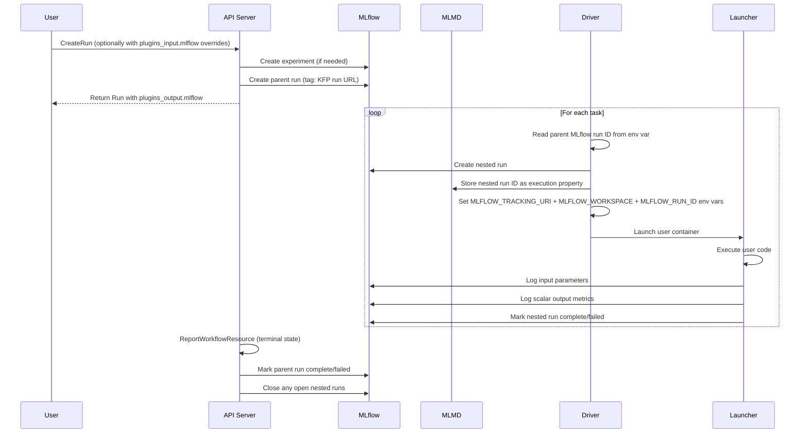

# KEP-12862: MLflow Integration for Kubeflow Pipelines

## Summary

Kubeflow Pipelines has built-in experiment tracking with run comparison in the UI, but it is limited in capability and
exists in isolation from the rest of the Kubeflow ecosystem. Users of Kubeflow Notebooks, Kubeflow Trainer, and Kubeflow
Pipelines have no unified view of experiment metrics across these components. MLflow is one option for providing that
unified experience. However, users who want MLflow tracking today must manually configure it in each pipeline component,
leading to fragmented setup, no automatic correlation between KFP pipeline runs and MLflow experiments/runs, and no
centralized view across the platform.

This proposal adds a plugin-style metadata interface to the `Run` proto (`plugins_input` / `plugins_output`) and
implements MLflow as the first built-in integration across the API server, driver, and launcher. The metadata interface
is based on the generic plugin architecture proposed in [KEP #12700](https://github.com/kubeflow/pipelines/pull/12700).
KEP #12700 will align with the interface defined here and provide the full generic plugin architecture (plugin server,
lifecycle hooks, entry points). However, KEP #12700 is blocked on MLMD removal, which is a prerequisite for it. This
proposal implements MLflow as a built-in special case so that when KEP #12700 lands, the transition to the generic
plugin architecture is seamless and clients experience no breaking changes. Long-term, the intention is to migrate this
built-in MLflow functionality to the generic plugin architecture without breaking changes.

## Motivation

KFP's built-in run comparison allows users to view metrics across pipeline runs within the KFP UI. This works for simple
cases but does not scale to workflows that span multiple Kubeflow components. A data scientist may train a model with
Kubeflow Trainer, preprocess data in a Kubeflow Notebook, and orchestrate the full workflow with Kubeflow Pipelines.
Today, metrics from each of these components are siloed in their respective UIs with no way to correlate them.

MLflow is a widely adopted experiment tracking framework. Version 3.10 introduced
[workspaces](https://mlflow.org/docs/latest/self-hosting/workspaces/) for multi-tenancy, which aligns well with KFP's
multi-user model where each user operates within a Kubernetes namespace. A Kubernetes-native deployment of MLflow can
map namespaces to MLflow workspaces and accept Kubernetes tokens for authentication, making it a natural fit for the
Kubeflow ecosystem. A broader proposal for integrating MLflow into the Kubeflow ecosystem will be pursued separately.

The primary workaround today is to add MLflow client calls directly in each pipeline component. This requires every
component author to configure `MLFLOW_TRACKING_URI`, manage credentials, create or look up experiments, and manually
correlate MLflow runs with KFP runs. The result is challenging, in particular for users not familiar with Kubernetes.
There is also no standard way to see which MLflow run corresponds to a given KFP pipeline run, or to automatically mark
an MLflow run as complete when the pipeline finishes.

Providing a built-in integration where the API server, driver, and launcher handle MLflow interactions transparently
would eliminate this manual setup and give users automatic, consistent experiment tracking across all pipeline
components. Crucially, pipelines are not required to change and will continue to work on deployments without MLflow.
When MLflow is configured, the same pipelines gain an enhanced experience with automatic experiment tracking, parameter
and metric logging, and cross-referencing between KFP and MLflow runs without any modification to the pipeline code
itself.

### Goals

1. Automatically create an MLflow parent run when a KFP pipeline run is created, and mark it as complete or failed when
   the pipeline finishes.
1. Track each task as a nested MLflow run, including individual iterations of parallel-for loops.
1. Automatically log scalar metrics and input/output parameters from each task to MLflow without requiring changes to
   pipeline components.
1. Allow the user to optionally specify an MLflow experiment name when creating a run. Default to the `"Default"` MLflow
   experiment when omitted.
1. Support the same MLflow configuration on recurring runs so that every triggered run is automatically tracked.
1. Expose `MLFLOW_TRACKING_URI`, `MLFLOW_WORKSPACE`, and `MLFLOW_RUN_ID` as environment variables on user containers so
   that component code can interact with MLflow directly if needed. `MLFLOW_RUN_ID` points to the task's nested run,
   allowing `mlflow.log_metric()` and similar calls to work without explicit run management.
1. Pre-configure MLflow authentication on user containers by setting the appropriate environment variables
   (`MLFLOW_TRACKING_AUTH`, `MLFLOW_TRACKING_TOKEN`, or `MLFLOW_TRACKING_USERNAME` / `MLFLOW_TRACKING_PASSWORD`) so that
   the MLflow Python SDK authenticates automatically without manual setup in component code.
1. The plugin metadata interface should align with the future generic plugin architecture in
   [KEP #12700](https://github.com/kubeflow/pipelines/pull/12700) to ensure no breaking changes when that architecture
   is adopted.

### Non-Goals

1. Artifact synchronization between KFP and MLflow is out of scope. KFP artifacts will remain in their configured object
   storage (S3, GCS, MinIO). Only scalar metrics and parameters will be synced to MLflow.
1. Classification and structured metrics (e.g., confusion matrices, ROC curves) will not be logged to MLflow initially.
   Only scalar metrics are supported in this proposal.
1. The generic plugin architecture defined in [KEP #12700](https://github.com/kubeflow/pipelines/pull/12700) is out of
   scope. That KEP is blocked on MLMD removal. This proposal simulates the plugin interface for forward compatibility.
1. SDK and frontend changes are out of scope for the initial backend proposal. Placeholder sections are included below;
   detailed design will follow pending approval of this proposal.
1. AWS SageMaker managed MLflow is not supported initially. SageMaker uses AWS SigV4 request signing, which requires the
   AWS SDK for Go in the driver/launcher and IAM Roles for Service Accounts (IRSA) for pod-level credentials. This can
   be added as a future `authType` (e.g., `"aws-sigv4"`) without breaking changes.

## Proposal

The integration touches three backend components: the API server, the driver, and the launcher. New `plugins_input` and
`plugins_output` fields are added to the `Run` proto along with `PluginOutput` and `MetadataValue` messages. MLflow is
implemented as built-in logic keyed on the `"mlflow"` entry in the plugin maps.

### Proto Changes

Two new messages (`PluginOutput`, `MetadataValue`) are introduced and `plugins_input` / `plugins_output` fields are
added to both `Run` and `RecurringRun`:

```proto
message MetadataValue {
  enum RenderType {
    UNSPECIFIED = 0;
    URL = 1;
  }
  google.protobuf.Value value = 1;
  optional RenderType render_type = 2;  // Hint for UI rendering
}

message PluginOutput {
  map<string, MetadataValue> entries = 1;
  RuntimeState state = 2;   // Reuses the existing RuntimeState enum (e.g., SUCCEEDED, FAILED)
  string state_message = 3; // Human-readable detail, especially on failure
}

```

The `plugins_input` and `plugins_output` fields are placed directly on the `Run` message (no wrapper). The
`plugins_input` map uses `google.protobuf.Struct` for each plugin key, allowing arbitrary JSON input per plugin without
schema coupling. The `plugins_output` map uses `PluginOutput` which wraps a map of `MetadataValue` entries, each with an
optional `render_type` hint for UI rendering (e.g., rendering a value as a hyperlink when `render_type` is `URL`).

A realistic example of `plugins_input` and `plugins_output` on a run:

```json
{
  "plugins_input": {
    "mlflow": {
      "experiment_name": "sentiment-classifier-tuning"
    }
  },
  "plugins_output": {
    "mlflow": {
      "entries": {
        "experiment_name": { "value": "sentiment-classifier-tuning" },
        "experiment_id": { "value": "42" },
        "root_run_id": { "value": "a1b2c3d4e5f6" },
        "run_url": {
          "value": "https://mlflow.example.com/experiments/42/runs/a1b2c3d4e5f6?workspace=my-namespace",
          "render_type": "URL"
        }
      }
    }
  }
}
```

### End-to-End Flow

The following diagram shows how the MLflow integration spans the pipeline run lifecycle:


```mermaid
sequenceDiagram
    participant User
    participant APIServer as API Server
    participant MLflow
    participant MLMD
    participant Driver
    participant Launcher

    User->>APIServer: CreateRun (optionally with plugins_input.mlflow overrides)
    APIServer->>MLflow: Create experiment (if needed)
    APIServer->>MLflow: Create parent run (tag: KFP run URL)
    APIServer-->>User: Return Run with plugins_output.mlflow

    loop For each task
        Driver->>Driver: Read parent MLflow run ID from env var
        Driver->>MLflow: Create nested run
        Driver->>MLMD: Store nested run ID as execution property
        Driver->>Driver: Set MLFLOW_TRACKING_URI + MLFLOW_WORKSPACE + MLFLOW_RUN_ID env vars
        Driver->>Launcher: Launch user container

        Launcher->>Launcher: Execute user code
        Launcher->>MLflow: Log input parameters
        Launcher->>MLflow: Log scalar output metrics
        Launcher->>MLflow: Mark nested run complete/failed
    end

    APIServer->>APIServer: ReportWorkflowResource (terminal state)
    APIServer->>MLflow: Mark parent run complete/failed
    APIServer->>MLflow: Close any open nested runs
```

### Risks and Mitigations

**MLflow API availability.** If the MLflow server is unreachable when a run is created, the MLflow API calls within the
KFP `CreateRun` handler could fail. All MLflow REST API calls will use retries with exponential backoff and a
configurable timeout (default 30 seconds total per operation) to handle transient failures. If the MLflow call still
fails after retries, the KFP run is still created and `plugins_output.mlflow.state` is set to `FAILED` with a
`state_message` describing the failure. A similar approach applies to driver and launcher MLflow calls; failures are
retried with the same policy, and if they ultimately fail, the errors are logged but do not block task execution. If the
API server successfully creates an MLflow parent run but subsequently fails to persist the KFP run in the database, the
orphan MLflow run is left as-is. Orphan runs in MLflow are harmless (they appear as "running" indefinitely) and can be
cleaned up manually or via MLflow's garbage collection. The narrow failure window makes compensating deletes not worth
the added complexity.

**Performance overhead.** Each task execution incurs additional HTTP calls to the MLflow REST API (create nested run,
log parameters, log metrics, update run status). For pipelines with hundreds of tasks, this adds latency. This is
mitigated by keeping MLflow calls in the launcher's post-execution path (non-blocking to the user's code) and by using
the MLflow REST API's batch endpoints where available. The per-task granularity keeps individual `log-batch` payloads
manageable. For components with very large parameter sets (e.g., training hyperparameter sweeps), the launcher chunks
parameters into multiple `log-batch` calls if they exceed 100 parameters per call.

**Configuration divergence.** The API server resolves the MLflow configuration (tracking URI, workspace, parent run ID)
at run creation time and injects these as environment variables on the Argo Workflow templates. The driver and launcher
use these environment variables rather than re-reading the `kfp-launcher` ConfigMap. This ensures that all components in
a run use the same MLflow endpoint and workspace, even if the ConfigMap is modified after the run starts. Credential env vars are also mounted via `valueFrom.secretKeyRef` on all templates at compile time, so no Secret reads
occur at task execution time.

User code may also override MLflow environment variables at runtime (e.g., calling `mlflow.set_tracking_uri()` or
setting `MLFLOW_TRACKING_URI` programmatically). This does not affect KFP's built-in MLflow logging, which is performed
by the Go launcher using its own resolved environment variables. The divergence only impacts the user's own MLflow SDK
calls (e.g., `mlflow.log_metric()`) if the user explicitly redirects them to a different MLflow instance. In this
scenario, the KFP-managed parent/nested run hierarchy remains consistent on the KFP-configured MLflow instance. Users
are recommended to rely on the pre-configured environment variables rather than hard-coding MLflow connection details.

## Design Details

### Implementation Note

All MLflow-specific logic in the API server, driver, and launcher will be encapsulated behind an internal Go interface.
The hook names and semantics align with the lifecycle hooks defined in
[KEP #12700](https://github.com/kubeflow/pipelines/pull/12700):

```go
type PluginHandler interface {
	OnRunStart(ctx context.Context, run *api.Run, config *PluginConfig) (*PluginOutput, error)
	OnRunEnd(ctx context.Context, run *api.Run, config *PluginConfig) error
	OnTaskStart(ctx context.Context, taskInfo TaskInfo, config *PluginConfig) (*TaskStartResult, error)
	OnTaskEnd(ctx context.Context, taskInfo TaskInfo, metrics map[string]float64, params map[string]string, config *PluginConfig) error
}
```

The `mlflow` package implements this interface. The core KFP code calls these methods generically so that
MLflow-specific code is isolated in a single package per component. When KEP #12700 lands, these internal interface
calls are replaced by HTTP calls to the plugin server with no change to the hook semantics.

### Proto Changes

The `Run` message in `backend/api/v2beta1/run.proto` gains fields 19 and 20:

```diff
 message Run {
   // ... existing fields 1-17 ...

   // Output. A sequence of run statuses. This field keeps a record
   // of state transitions.
   repeated RuntimeStatus state_history = 17;
+
+  // Optional input. Plugin inputs provided by the user at run creation.
+  map<string, google.protobuf.Struct> plugins_input = 19;
+
+  // Output. Plugin outputs populated by the API server and backend components.
+  map<string, PluginOutput> plugins_output = 20;
 }
```

The `RecurringRun` message in `backend/api/v2beta1/recurring_run.proto` gains field 19:

```diff
 message RecurringRun {
   // ... existing fields 1-17 ...

   // ID of the parent experiment this recurring run belongs to.
   string experiment_id = 17;
+
+  // Optional input. Plugin inputs to propagate to each triggered run.
+  // Each triggered run will inherit these values in its plugins_input field.
+  map<string, google.protobuf.Struct> plugins_input = 19;
 }
```

The `Run` message uses fields 19 and 20 for `plugins_input` and `plugins_output` respectively (field 18 is already used
by `pipeline_version_reference`); the `RecurringRun` message uses field 19 for `plugins_input` only. The new
`PluginOutput` and `MetadataValue` messages are defined in `backend/api/v2beta1/run.proto` alongside the existing
run-related messages.

### API Server

MLflow integration requires an explicit opt-in at the API server level via a `plugins.mlflow` (JSON notation here) entry
in the API server config. Existing KFP deployments that upgrade will not have MLflow enabled; an administrator must
explicitly add the `plugins.mlflow` configuration to enable it. In multi-user mode, the per-namespace `kfp-launcher`
ConfigMap (`plugins.mlflow` key) provides namespace-specific overrides but is only effective when the API server has
MLflow enabled. Alternatively, the administrator may choose not to configure a global default and instead require each
namespace to opt in by defining its own `plugins.mlflow` entry in the `kfp-launcher` ConfigMap. If neither the API
server nor the namespace ConfigMap provides MLflow configuration, MLflow integration is disabled for that namespace.

When MLflow is enabled for a namespace (via either configuration level), it applies to **all** pipeline runs in that
namespace by default. A user may opt out of MLflow tracking for a specific run by setting
`plugins_input.mlflow.disabled` to `true`. The `plugins_input.mlflow` field on a run provides optional overrides such as
`experiment_name`; omitting `plugins_input.mlflow` entirely does not disable MLflow. If `plugins_input.mlflow` is absent
and MLflow is configured, the run is tracked under the `"Default"` MLflow experiment.

#### `CreateRun`

When a run is created and MLflow is enabled for the namespace:

1. Validate `plugins_input.mlflow` against the `MLflowPluginInput` schema (see below). Reject the request with a
   descriptive error if the struct does not conform to the expected fields. If `plugins_input.mlflow.disabled` is
   `true`, skip all subsequent MLflow steps for this run.
1. Read `plugins_input.mlflow.experiment_id` or `plugins_input.mlflow.experiment_name` from the request if provided.
   `experiment_id` takes precedence if both are set. If neither is provided or `plugins_input.mlflow` is not set at all,
   default to the `"Default"` experiment.
1. Resolve MLflow credentials for outbound API calls. The API server uses its own SA token (`authType: "kubernetes"`) or
   reads the credential Secret from `credentialSecretRef`. If a per-namespace ConfigMap overrides the `endpoint`, it
   must also provide its own credentials; the API server's global credentials are never paired with a namespace-provided
   endpoint. For `"bearer"` or `"basic-auth"` modes, the Argo compiler mounts the credential Secret on the driver,
   launcher, and user container templates via `env` entries with `valueFrom.secretKeyRef`, mapping Secret keys to the
   standard MLflow env vars (`MLFLOW_TRACKING_TOKEN`, or `MLFLOW_TRACKING_USERNAME` / `MLFLOW_TRACKING_PASSWORD`). This
   ensures the driver and launcher can authenticate their own MLflow REST calls without reading the Secret at runtime,
   and no secret values appear in the Argo Workflow spec (see [MLflow Configuration](#mlflow-configuration)).
1. Call the MLflow REST API to create the experiment if it does not already exist
   (`POST /api/2.0/mlflow/experiments/create`). The experiment description is set to the value of
   `experimentDescription` from the plugin settings. If `experimentDescription` is not set, it defaults to
   `"Created by Kubeflow Pipelines"`. If set to an empty string, no description is applied.
1. Create the MLflow parent run under the experiment (`POST /api/2.0/mlflow/runs/create`). Set tags on the MLflow run
   with the KFP pipeline run ID, pipeline run URL, and (if present) the pipeline ID and pipeline version ID for
   cross-referencing.
1. Populate `plugins_output.mlflow` with `experiment_name`, `experiment_id`, `root_run_id`, and `run_url`.
1. Set the parent MLflow run ID, tracking URI, and workspace as environment variables on the driver and launcher Argo
   Workflow container templates. This injection happens in the Argo compiler
   (`backend/src/apiserver/resource/resource_manager.go`) when the pipeline spec is compiled to an Argo `Workflow`
   object. These env vars serve as the resolved MLflow configuration for the entire run, ensuring that all components
   use the same MLflow endpoint and workspace regardless of any ConfigMap changes that occur after run creation.
1. Persist `plugins_input` and `plugins_output` in the database.

If the MLflow API call fails, the KFP run is still created. The error is logged and `plugins_output.mlflow.state` will
be set to `FAILED` with `state_message` describing the failure (e.g., `"MLflow server unreachable after 3 retries"`) so
that the frontend and SDK can surface the issue to the user. On success, `state` is set to `SUCCEEDED`.

The API server validates `plugins_input` for known plugin keys at request time. For the `"mlflow"` key, the
`google.protobuf.Struct` is deserialized into the following Go type:

```go
type MLflowPluginInput struct {
	ExperimentName string `json:"experiment_name,omitempty"` // Defaults to "Default"
	ExperimentID   string `json:"experiment_id,omitempty"`   // Alternative to experiment_name; takes precedence if both are set
	Disabled       bool   `json:"disabled,omitempty"`        // Opt out of MLflow tracking for this run
}
```

Unknown fields in the struct are rejected with a validation error. This provides strict input validation for MLflow
while keeping the proto-level `plugins_input` map as `google.protobuf.Struct` for forward compatibility with the generic
plugin architecture in [KEP #12700](https://github.com/kubeflow/pipelines/pull/12700). When that architecture lands,
each plugin will declare its own input schema and the plugin framework will handle validation generically. KEP #12700
should include input parameter validation as part of its plugin contract so that all plugins benefit from the same
strict validation pattern established here.

#### `GetRun` / `ListRuns`

These endpoints return `plugins_input` and `plugins_output` as stored in the database. No MLflow calls are made.

#### `ReportWorkflowResource`

When a run reaches a terminal state (`SUCCEEDED`, `FAILED`, `CANCELED`):

1. Mark the MLflow parent run as complete or failed (`POST /api/2.0/mlflow/runs/update`).
1. Query MLflow for all nested runs under the parent run (`GET /api/2.0/mlflow/runs/search` filtered by
   `tags.mlflow.parentRunId`) and close any that remain in an active state. This handles cases where the launcher did
   not complete (e.g., the pod was evicted or the workflow was canceled before post-execution logic ran).
1. Update `plugins_output.mlflow.state` to `SUCCEEDED` or `FAILED` based on the outcome of the MLflow calls.

Note: `plugins_output.mlflow.state` reflects the success or failure of the MLflow operations themselves, not the
pipeline run outcome. A pipeline run can be `SUCCEEDED` while `plugins_output.mlflow.state` is `FAILED` (e.g., if the
MLflow server was unreachable when marking the parent run complete). This allows the frontend and SDK to surface
MLflow-specific issues without conflating them with the pipeline execution result.

#### `RetryRun`

When a run is retried, the API server reopens the MLflow parent run (`POST /api/2.0/mlflow/runs/update` with status
`RUNNING`) and reopens all failed or canceled nested runs under it. This mirrors KFP's own retry semantics where failed
nodes are reset to running rather than replaced. When the driver re-executes a retried task, it reuses the existing
reopened nested MLflow run (matched by task name tag) rather than creating a new one.

#### `CloneRun`

Cloning a run creates a new run via `CreateRun` with the same parameters as the original. The `plugins_input` from the
original run (including `experiment_name`) is copied to the new run, but a fresh MLflow parent run is created under the
same MLflow experiment. The original and cloned runs share the same MLflow experiment but are independent MLflow runs
with no parent-child relationship between them in MLflow.

#### Recurring Runs

When `plugins_input` is set on a `RecurringRun`, it must be propagated to each triggered run. The ScheduledWorkflow
controller creates runs via `submitNewWorkflowIfNotAlreadySubmitted` in
`backend/src/crd/controller/scheduledworkflow/controller.go`. To carry `plugins_input` from the API server to the
controller, a new `PluginsInput` field is added to the `ScheduledWorkflowSpec` Go struct in
`backend/src/crd/pkg/apis/scheduledworkflow/v1beta1/types.go`. The CRD manifest itself does not need to change since it
has no OpenAPI schema and Kubernetes preserves unknown fields. The API server's `CreateJob` populates this field when
creating the ScheduledWorkflow CR.

When `PluginsInput` is set on the SWF spec, the API server should not set `swf.Spec.Workflow.Spec`, ensuring the
controller uses the `CreateRun` API path. The controller passes `plugins_input` into the `CreateRun` request, which
routes through the standard MLflow integration logic in the API server so that each triggered run gets its own MLflow
parent run.

#### Database

New `plugins_input` and `plugins_output` columns of type `LargeText` will be added to the `run_details` table,
consistent with existing JSON blob columns such as `StateHistoryString` and `PipelineRuntimeManifest` in
`backend/src/apiserver/model/run.go`. The GORM ORM handles schema migration automatically; existing runs will have
`NULL` for these columns, which the API server treats as empty maps.

### Driver

The driver (`backend/src/v2/driver/`) is responsible for creating nested MLflow runs and passing MLflow context to the
launcher.

#### Container Tasks (`container.go`)

Before launching a user container:

1. Read the MLflow tracking URI, workspace, parent run ID, auth type, and credentials from the environment variables
   injected by the Argo compiler at run creation time (credentials are resolved from the Secret by kubelet at pod
   startup).
1. Create a nested MLflow run under the parent run (`POST /api/2.0/mlflow/runs/create`).
1. Store the nested MLflow run ID as `mlflow_run_id` and the parent MLflow run ID as `mlflow_parent_run_id` custom
   properties on the MLMD execution, consistent with existing properties like `cached_execution_id` and `pod_name` in
   `backend/src/v2/metadata/client.go`. Storing the parent ID enables reconstructing the MLflow run tree during future
   migration to the plugin architecture.
1. Add `MLFLOW_TRACKING_URI`, `MLFLOW_WORKSPACE`, `MLFLOW_RUN_ID` (set to the nested run ID), and `MLFLOW_TRACKING_AUTH`
   (set to `kubernetes` when `authType` is `"kubernetes"`) to the user container's environment variables via the pod
   spec patch. Credential env vars (`MLFLOW_TRACKING_TOKEN`, or `MLFLOW_TRACKING_USERNAME` / `MLFLOW_TRACKING_PASSWORD`)
   are already set on the user container by the Argo compiler via `valueFrom.secretKeyRef`. The driver already sets
   environment variables on the pod spec in `backend/src/v2/driver/driver.go`. Setting `MLFLOW_RUN_ID` allows user code
   that calls the MLflow Python API (e.g., `mlflow.log_metric()`) to automatically log to the correct nested run without
   needing to call `mlflow.start_run()` or pass a run ID explicitly.

#### Loop Iterations (`dag.go`)

In a parallel-for loop, there are three driver invocations per iteration: a loop DAG driver that fans out iterations, an
iteration DAG driver per iteration, and a container driver per iteration that launches the user container. Without
coordination, all three would create nested MLflow runs, producing a redundant hierarchy: parent run -> loop nested run
-> iteration DAG nested run -> container nested run. The iteration DAG nested run adds no value to an MLflow user. To
avoid this, the iteration DAG driver skips MLflow run creation entirely and passes the loop's nested run ID through to
the container driver. The desired MLflow hierarchy is:

- **Parent run** (pipeline)
  - **Loop nested run** (created by the loop DAG driver)
    - **Iteration nested run** (created by the container driver, one per iteration)

This gives MLflow users a clean two-level structure under the parent run without an extraneous intermediate run per
iteration.

#### Cache Hits (`cache.go`)

When a cache hit is detected and the execution is reused, the driver will mimic the launcher's MLflow behavior: log the
cached outputs as parameters/metrics to a new nested MLflow run and immediately mark it as complete. This ensures the
MLflow experiment reflects all tasks in the pipeline, including cached ones.

#### Driver-Only Tasks

Certain system tasks such as PVC creation and deletion run only in the driver without a launcher. For these tasks, the
driver creates the nested MLflow run, logs any relevant parameters, and marks it as complete or failed in a single
driver invocation. This follows the same pattern as cache hits.

### Launcher

The launcher (`backend/src/v2/component/launcher_v2.go`) handles post-execution MLflow logging.

After the user's code completes:

1. Log input parameters and scalar output metrics to the nested MLflow run in a single call using the batch endpoint
   (`POST /api/2.0/mlflow/runs/log-batch`). Only scalar metrics are supported initially; classification metrics
   (confusion matrices, ROC curves) are deferred. For components with large parameter sets, parameters are chunked into
   multiple `log-batch` calls if they exceed 100 parameters per call.
1. Mark the nested MLflow run as complete or failed based on the execution status (`POST /api/2.0/mlflow/runs/update`).

If any MLflow REST API call in the launcher fails after retries, the error is logged but the task execution result is
not affected. The task is still marked as succeeded or failed based solely on the user code's exit status. In the
current architecture, the API server does not have direct access to MLMD execution properties, so the launcher cannot
propagate MLflow errors to `plugins_output.mlflow.state` for per-task aggregation. For now, MLflow errors in the driver
and launcher are logged only. After MLMD removal, the run and task state storage will be accessible from the driver and
launcher, enabling them to update `plugins_output.mlflow.state` and `state_message` directly.

Note: `MLFLOW_TRACKING_URI` and `MLFLOW_WORKSPACE` are set on the user container by the driver (not the launcher). The
launcher reads these from its own environment (set via the driver's pod spec) when making MLflow REST API calls.

Note: KFP's built-in metric logging happens in the launcher _after_ user code completes. If user code calls
`mlflow.log_metric()` directly, those metrics are logged immediately during execution. Both approaches write to the same
nested MLflow run.

#### MLflow Authentication on User Containers

For `"bearer"` and `"basic-auth"` modes, the Argo compiler mounts the credential Secret on all container templates
(driver, launcher, user container) via `valueFrom.secretKeyRef`. The standard MLflow env vars (`MLFLOW_TRACKING_TOKEN`,
or `MLFLOW_TRACKING_USERNAME` / `MLFLOW_TRACKING_PASSWORD`) are available at pod startup, and the MLflow SDK picks them
up automatically. No additional setup is needed.

For `"kubernetes"` mode, a Kubernetes
[request auth provider](https://mlflow.org/docs/latest/ml/plugins/#authentication-plugins) is needed so the MLflow SDK
reads the pod's projected service account token on each request. The preferred approach is to contribute this provider
upstream to MLflow (targeting MLflow 3.11+). When available, the driver sets `MLFLOW_TRACKING_AUTH=kubernetes` on the
user container, and the MLflow SDK handles authentication automatically. If the MLflow SDK in the user's container is
older than the version that ships the Kubernetes auth provider, a warning is logged. A simple `MLFLOW_TRACKING_TOKEN`
environment variable is intentionally **not** used in this mode because Kubernetes projected service account tokens
rotate during the pod's lifetime. For long-running tasks, a token captured at pod startup could expire before the task
completes. The auth provider reads the token from disk on every HTTP request, ensuring it always uses the current token.

### Required Permissions by Layer

**Kubernetes-native mode.** In this mode, the Kubernetes
[workspace provider](https://github.com/opendatahub-io/mlflow/tree/master/kubernetes-workspace-provider) authorizes
MLflow API calls via `SelfSubjectAccessReview` against the `mlflow.kubeflow.org` API group. The minimum permissions
required for the KFP integration are `get`, `list`, `create`, and `update` on `experiments` in `mlflow.kubeflow.org`.
Run operations (create, update, log) are authorized under `experiments` permissions.

| Service Account                     | Kubernetes Permissions                         | `mlflow.kubeflow.org` Permissions                  |
| ----------------------------------- | ---------------------------------------------- | -------------------------------------------------- |
| `ml-pipeline` (API server)          | (no new Kubernetes permissions)                | `get`, `list`, `create`, `update` on `experiments` |
| `pipeline-runner` (driver/launcher) | `get` on `secrets` and `configmaps` (existing) | `get`, `list`, `create`, `update` on `experiments` |

If user code in a task calls the MLflow SDK directly for operations beyond experiment tracking (e.g., logging datasets,
registering models), the pipeline runner service account (or a user-specified custom SA) will need additional
permissions on the corresponding `mlflow.kubeflow.org` resources (e.g., `datasets`, `registeredmodels`). See the
[Kubernetes workspace provider RBAC documentation](https://github.com/opendatahub-io/mlflow/tree/master/kubernetes-workspace-provider#kubernetes-rbac-requirements)
for the full resource list.

**Secret-based mode.** The `ml-pipeline` API server service account will need a new RBAC rule granting `get` on
`secrets` in run namespaces to read the credential Secret at run creation time. As a best practice, administrators
should use the same Secret name (e.g., `kfp-mlflow-credentials`) across all namespaces and scope the RBAC rule with
`resourceNames` to limit the API server's access to that single Secret name. The `pipeline-runner` service account
already has `get` on `secrets` in the run's namespace. The token or credentials stored in the Secret must have
sufficient MLflow permissions to create and update experiments and runs (equivalent to `get`, `list`, `create`, `update`
on experiments in Kubernetes-native mode). If MLflow's built-in authentication is used, this means a user account with
at least editor-level access.

If a user specifies a custom service account for their pipeline run (via `kubernetes_platform`), that service account
must also have the appropriate MLflow permissions, otherwise MLflow calls from the driver and launcher will fail.

### MLflow REST API

All MLflow interactions use direct HTTP calls from Go. There is no Go client library for MLflow. The full MLflow REST
API reference is at
[https://mlflow.org/docs/latest/api_reference/rest-api.html](https://mlflow.org/docs/latest/api_reference/rest-api.html).
This integration requires **MLflow v3.10 or later**, which introduced
[workspaces](https://mlflow.org/docs/latest/self-hosting/workspaces/) for multi-tenancy. The key endpoints are:

| Endpoint                                       | Purpose                                     |
| ---------------------------------------------- | ------------------------------------------- |
| `POST /api/2.0/mlflow/experiments/create`      | Create an MLflow experiment                 |
| `POST /api/2.0/mlflow/experiments/get-by-name` | Look up an experiment by name               |
| `POST /api/2.0/mlflow/runs/create`             | Create a parent or nested MLflow run        |
| `POST /api/2.0/mlflow/runs/update`             | Mark a run as complete or failed            |
| `POST /api/2.0/mlflow/runs/log-batch`          | Log parameters and metrics in a single call |
| `POST /api/2.0/mlflow/runs/set-tag`            | Set a tag (e.g., KFP run URL) on a run      |
| `GET /api/2.0/mlflow/runs/search`              | Search for nested runs during cleanup       |

When `workspacesEnabled` is `true`, all MLflow REST API calls include an `X-MLflow-Workspace` header set to the
Kubernetes namespace. This header is how MLflow routes requests to the correct workspace. The API server, driver, and
launcher all set this header on their outbound HTTP requests using the resolved workspace value from the run's
environment variables.

### Environment Variables

The following environment variables are injected by the Argo compiler at run creation time and consumed by the driver,
launcher, and user container:

| Env Var                    | Set By                                   | Set On                           | Purpose                                          |
| -------------------------- | ---------------------------------------- | -------------------------------- | ------------------------------------------------ |
| `KFP_MLFLOW_TRACKING_URI`  | Argo compiler                            | Driver, Launcher                 | MLflow endpoint for Go REST calls                |
| `KFP_MLFLOW_WORKSPACE`     | Argo compiler                            | Driver, Launcher                 | MLflow workspace (namespace) for Go REST calls   |
| `KFP_MLFLOW_PARENT_RUN_ID` | Argo compiler                            | Driver, Launcher                 | Parent MLflow run ID                             |
| `KFP_MLFLOW_AUTH_TYPE`     | Argo compiler                            | Driver                           | Auth mode (`kubernetes`, `bearer`, `basic-auth`) |
| `MLFLOW_TRACKING_TOKEN`    | Argo compiler (`valueFrom.secretKeyRef`) | Driver, Launcher, User container | Bearer token (secret-based bearer mode)          |
| `MLFLOW_TRACKING_USERNAME` | Argo compiler (`valueFrom.secretKeyRef`) | Driver, Launcher, User container | Username (secret-based basic-auth mode)          |
| `MLFLOW_TRACKING_PASSWORD` | Argo compiler (`valueFrom.secretKeyRef`) | Driver, Launcher, User container | Password (secret-based basic-auth mode)          |
| `MLFLOW_TRACKING_URI`      | Driver                                   | User container                   | Standard MLflow SDK env var                      |
| `MLFLOW_WORKSPACE`         | Driver                                   | User container                   | Standard MLflow SDK env var (3.10+)              |
| `MLFLOW_RUN_ID`            | Driver                                   | User container                   | Active nested run for MLflow SDK (3.10+)         |
| `MLFLOW_TRACKING_AUTH`     | Driver                                   | User container                   | Auth provider (`kubernetes`, when available)     |

The `KFP_MLFLOW_*` prefix distinguishes KFP-internal variables from standard `MLFLOW_*` variables. Credential env vars
(`MLFLOW_TRACKING_TOKEN`, `MLFLOW_TRACKING_USERNAME`, `MLFLOW_TRACKING_PASSWORD`) use `valueFrom.secretKeyRef` so that
secret values are never stored in the Argo Workflow spec -- Kubernetes resolves them at pod startup. The driver,
launcher, and user container all receive the same credential env vars, enabling each to authenticate its own MLflow REST
calls.

### MLflow Configuration

Three `authType` values are supported:

- **`"kubernetes"`** (default): The API server's service account token is used for MLflow API calls. Workspaces default
  to enabled, mapping Kubernetes namespaces to MLflow workspaces. This assumes MLflow
  is deployed with Kubernetes-native multi-tenancy. A Kubeflow-wide proposal to donate the MLflow plugins that make
  MLflow Kubernetes-native to the Kubeflow community is coming soon.
- **`"bearer"`**: The user provides an API token in a Kubernetes Secret in the pipeline run's namespace. This supports
  MLflow deployments using token-based authentication (including Databricks managed MLflow via personal access tokens)
  or a reverse proxy that accepts bearer tokens.
- **`"basic-auth"`**: The user provides username and password in a Kubernetes Secret in the pipeline run's namespace.
  This is the default authentication mechanism for self-hosted MLflow using its
  [built-in authentication](https://mlflow.org/docs/latest/ml/auth/).

For `"bearer"` and `"basic-auth"`, `credentialSecretRef` is required. Workspaces default to disabled but can be enabled.
Administrators should understand that these modes delegate access control to whoever can create Secrets in the
namespace.

Configuration is provided at two levels:

- **API server config** (required for opt-in): A `plugins` object containing a `mlflow` key. This is required in both
  standalone and multi-user modes to enable MLflow integration. When set, this provides the global default MLflow
  configuration used for all namespaces unless overridden. In standalone mode, this is the only configuration level.
- **Per-namespace `kfp-launcher` ConfigMap** (multi-user mode): A `plugins.mlflow` key with a JSON value. Allows
  per-namespace MLflow configuration. Fields set in the per-namespace config override the corresponding global defaults;
  unset fields are inherited from the global config. If the namespace overrides the `endpoint`, it must also provide its
  own credentials -- the API server's global credentials are never used with a namespace-provided endpoint. A namespace
  may override only credentials while inheriting the global endpoint, for example to use a namespace-scoped Secret
  instead of the API server's service account token. The admin may choose not to configure a default MLflow server at the API server level
  and instead require each namespace to define its own MLflow configuration via the `kfp-launcher` ConfigMap. If neither
  the API server nor the namespace ConfigMap provides MLflow configuration, MLflow integration is disabled for that
  namespace.

The Go types for the configuration use a generic `PluginConfig` wrapper with plugin-specific settings in a
`json.RawMessage` field. This structure aligns with [KEP #12700](https://github.com/kubeflow/pipelines/pull/12700)'s
plugin server config pattern and keeps the KFP core code decoupled from plugin-specific fields:

```go
type TLSConfig struct {
	InsecureSkipVerify bool   `json:"insecureSkipVerify,omitempty"` // Skip TLS certificate verification
	CABundlePath       string `json:"caBundlePath,omitempty"`       // Path to a custom CA bundle
}

type PluginConfig struct {
	Endpoint string          `json:"endpoint"`
	Timeout  string          `json:"timeout,omitempty"` // e.g. "30s"; defaults to "30s"
	TLS      *TLSConfig      `json:"tls,omitempty"`
	Settings json.RawMessage `json:"settings,omitempty"`
}
```

The MLflow module parses `Settings` into:

```go
type CredentialSecretRef struct {
	Name        string `json:"name"`                  // Required. K8s Secret name in the run's namespace.
	TokenKey    string `json:"tokenKey,omitempty"`     // Key for MLFLOW_TRACKING_TOKEN (when authType is "bearer")
	UsernameKey string `json:"usernameKey,omitempty"`  // Key for MLFLOW_TRACKING_USERNAME (when authType is "basic-auth")
	PasswordKey string `json:"passwordKey,omitempty"`  // Key for MLFLOW_TRACKING_PASSWORD (when authType is "basic-auth")
}

type MLflowPluginSettings struct {
	WorkspacesEnabled     *bool                `json:"workspacesEnabled,omitempty"`     // defaults to true when authType is "kubernetes", false otherwise
	AuthType              string               `json:"authType,omitempty"`              // "kubernetes" (default), "bearer", or "basic-auth"
	CredentialSecretRef   *CredentialSecretRef `json:"credentialSecretRef,omitempty"`   // Required when authType is "bearer" or "basic-auth"
	ExperimentDescription *string              `json:"experimentDescription,omitempty"` // nil = "Created by Kubeflow Pipelines"; "" = none
}
```

Standalone API server config example (Kubernetes-native mode):

```json
{
  "plugins": {
    "mlflow": {
      "endpoint": "https://mlflow.example.com",
      "settings": {
        "workspacesEnabled": true
      }
    }
  }
}
```

Multi-user per-namespace `kfp-launcher` ConfigMap example (basic-auth mode):

```yaml
apiVersion: v1
kind: ConfigMap
metadata:
  name: kfp-launcher
  namespace: kubeflow-user-example-com
data:
  defaultPipelineRoot: "minio://mlpipeline/v2/artifacts"
  plugins.mlflow: |
    {
      "endpoint": "https://mlflow.internal.example.com",
      "settings": {
        "workspacesEnabled": false,
        "authType": "basic-auth",
        "credentialSecretRef": {
          "name": "kfp-mlflow-credentials",
          "usernameKey": "username",
          "passwordKey": "password"
        }
      }
    }
```

The ConfigMap key convention `plugins.<plugin name>` and the API server config nesting `plugins.<plugin name>` are
designed to align with the future generic plugin architecture from
[KEP #12700](https://github.com/kubeflow/pipelines/pull/12700).

### SDK Changes

TODO -- detailed design pending approval of the backend proposal.

- Add a `plugins_input` parameter to SDK client methods (`create_run_from_pipeline_func`,
  `create_run_from_pipeline_package`, `run_pipeline` in `sdk/python/kfp/client/client.py`).
- Surface `plugins_output` on run results.

### Frontend Changes

TODO -- detailed design pending approval of the backend proposal.

- Display `plugins_output` metadata on the run details page (`frontend/src/pages/RunDetailsV2.tsx`).
- Render `MetadataValue` entries: URLs as hyperlinks, plain values as text.
- Show MLflow experiment and run links in run details.

### Test Plan

TODO -- detailed test plan pending implementation.

## Drawbacks

1. This proposal increases the complexity of the API server, driver, and launcher by adding an external dependency on
   the MLflow REST API. Each component gains new code paths that must handle MLflow availability, authentication, and
   error cases.
1. If the MLflow server is unavailable, run creation and task completion may experience degraded functionality. While
   the design includes graceful degradation (KFP runs still succeed), the MLflow tracking data will be incomplete.
1. MLflow is implemented as a built-in special case rather than a generic plugin. This means MLflow-specific logic is
   spread across the API server, driver, and launcher. When
   [KEP #12700](https://github.com/kubeflow/pipelines/pull/12700) lands, this logic will need to be refactored into the
   plugin architecture. This refactor is greatly simplified by the plugin architecture since the API server, driver, and
   launcher each interact with a single plugin service rather than containing built-in logic for each integration.

## Alternatives

### Documentation-Only Approach

Rather than building backend integration, provide documentation and examples for how to use the MLflow Python client
directly in pipeline components.

**Benefits:**

- No changes to the KFP backend are required.
- Users have full control over what is logged and when.
- Works with any MLflow deployment without KFP-side configuration.
- Low effort to produce and maintain.

**Downsides:**

- Every component author must independently configure MLflow (tracking URI, credentials, experiment lookup).
- There is no automatic correlation between KFP pipeline runs and MLflow runs. Users must manually tag or name MLflow
  runs to match.
- The MLflow parent/nested run hierarchy (one parent run per pipeline, one nested run per task) cannot be achieved
  without passing MLflow run IDs between components, which adds complexity to pipeline definitions.
- Run completion status is not automatically propagated to MLflow. If a pipeline fails, the MLflow run may remain in a
  "running" state indefinitely.
- Enforcement of tracking standards across a team is not possible -- each user may configure MLflow differently or not
  at all.

This approach does not address the core problem of fragmented, manual integration and leaves no path toward a unified
tracking experience across the Kubeflow platform.

### Generic Plugin Architecture Now

Implement the full plugin architecture from [KEP #12700](https://github.com/kubeflow/pipelines/pull/12700) immediately,
then build MLflow as the first plugin.

**Benefits:**

- A single, extensible architecture that supports MLflow and any future integrations (notifications, custom validation,
  other tracking systems).
- No built-in special-casing; all integrations go through the same plugin server interface.
- Plugin authors can extend KFP without modifying core code.

**Downsides:**

- KEP #12700 depends on MLMD removal, which is a large prerequisite. This blocker has no firm timeline.
- The full plugin architecture introduces significant new infrastructure (plugin server deployment, entry point
  discovery, HTTP hook invocation from every backend component).
- Delivering MLflow integration is delayed until the plugin architecture is complete.

The MLMD removal blocker makes this approach impractical in the near term. The metadata interface in this proposal
(`plugins_input` / `plugins_output`) is designed to match KEP #12700's interface so that the migration is non-breaking
when the generic architecture is ready.

## Frontend Considerations

TODO -- detailed frontend considerations pending approval of the backend proposal.

## KFP Local Considerations

Local execution via `SubprocessRunner` or `DockerRunner` does not interact with the API server, driver, or launcher.
However, it is reasonable to support MLflow tracking in local mode as well. When a user sets an environment variable
(e.g., `KFP_MLFLOW_ENABLED=true`), the local runner will use the user's existing MLflow environment variables
(`MLFLOW_TRACKING_URI`, `MLFLOW_EXPERIMENT_NAME`, etc.) to create a parent MLflow run for the pipeline and nested runs
for each task, mirroring the server-side behavior. The `SubprocessRunner` and `DockerRunner` will pass these MLflow
environment variables down to the task execution environment so that component code using the MLflow Python API works
transparently. This allows users to develop and test locally with the same MLflow tracking experience they get on a
cluster. Detailed design for local mode will follow the server-side implementation.
