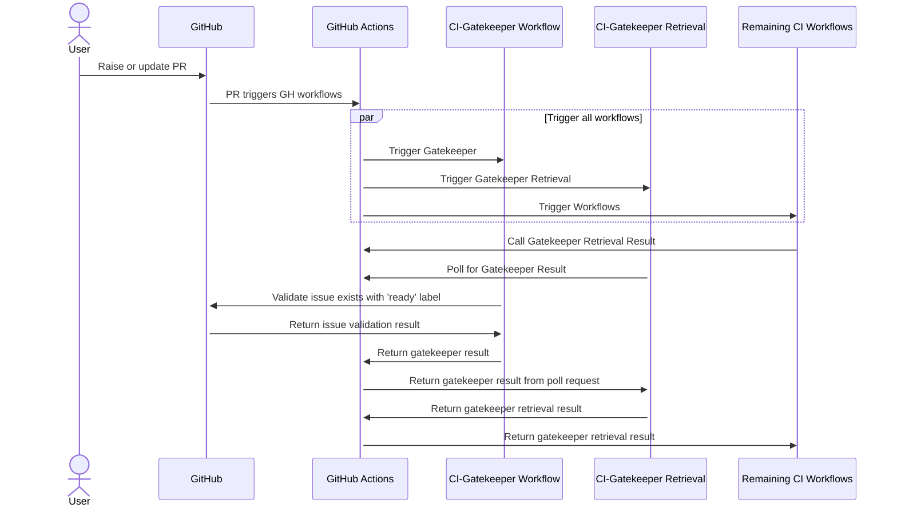

# KEP-13293: Gatekeep CI Workflows for Approved Issues

## Summary
With the mainstream introduction of coding agents within the last year, KFP (like many other open-source projects) has seen a large increase in AI-generated drive-by PRs. 
A drive-by PR is a pull request opened by a new contributor that generally does not resolve a relevant raised issue and is often never followed up on. 
The consequence of these PRs are overburdened maintainers, an overloaded CI and more limited community resources for new contributors with a genuine interest. 
This KEP proposes a two-part approach to PR validation: a workflow for marking issues ready to be addressed, and a workflow gatekeeping CI execution on a valid linked issue.


## Motivation
The three primary consequences of (predominantly) AI-generated drive-by PRs are maintainer fatigue, CI overload and a resulting lack of support for genuine new contributors. 
These consequences threaten the health and longevity of KFP and drive the following four goals. 

### Goals
1. Reduce KFP maintainer burden by blocking unfocused PRs that take away focus from both work prioritized by the community and also supporting genuine new contributors.
2. Introduce an additional layer of complexity to the PR process (linking a valid issue) that discourages drive-by contributors who don't intend to follow up on thier work.
3. Reduce the burden on CI by preventing CI workflows from executing for unfocused PRs.
4. The above three goals allow the community to focus on both relevant, agreed-upon work and also support genuine new contributors.

### Non-Goals
1. This proposal does not enhance support for the PR review process. It aims to reduce new PRs to project-focused work.
2. This proposal does not support for triaging existing issues and PRs – it intends to address the issues and PRs raised after this workflow is implemented. Existing issues and PRs will not be affected.


## Proposal
This KEP proposes a two-part approach: a GitHub Action workflow that tags relevant owners/approvers to mark issues ready, and GitHub Action workflows that require a linked ready issue to execute.
Note: This section references [ci-gatekeeper.yml](ci-gatekeeper.yml), [retrieve-gatekeeper-result.yml](retrieve-gatekeeper-result.yml) and [issue-triage.yml](issue-triage.yml). Please note that these workflows are currently under development and are meant to be used as a general outline.

### I. Introduce a 'Ready' label for approved issues
A new GitHub Action workflow [issue-triage.yml](issue-triage.yml) triggers when a new KFP issue is raised and executes the following steps:
1. Adds label `request ai review` to the new issue. 
2. Executes a script that parses issue title and identifies the relevant subdirectory for the issue (for example, title "" directs to the subdirectory `pipelines/sdk/python`). If a directory is not identified, root approvers/owners are returned.
3. Pings the owners/approvers identified in step (2) to assess the Copilot AI triage review and add `ready` label if appropriate.

Implementation notes:
- A KFP maintainer will need to enable the [Copilot Issue Triage tool](https://docs.github.com/en/issues/tracking-your-work-with-issues/administering-issues/triaging-an-issue-with-ai) for the KFP repository.
- A KFP maintainer will need to create the following two labels: `request ai review` and `ready`.
  - Note that while the `request ai review` label can remain unrestricted, `ready` must be restricted to only the KFP maintainer/approver team (including the approvers for each subdirectory).

### II. PR must link a 'Ready' issue to execute CI workflows
A new GitHub Action workflow [ci-gatekeeper.yml](ci-gatekeeper.yml) triggers when a new KFP PR is raised and executes the following steps:
1. Parses the PR body for a linked issue.
2. Verifies the linked issue is both an existing KFP issue and also contains `ready` label.
3. If the linked issue does not meet the above criteria, the PR is auto-closed with the following message:
```aiignore
Closing this PR automatically. Link an issue with 'ready' label in the PR body and then reopen. See CONTRIBUTING.md for more details.
```
A third GitHub Action workflow [retrieve-gatekeeper-result.yml](retrieve-gatekeeper-result.yml) is used to retrieve the `ci-gatekeeper` action result with the following steps.
This allows the gatekeeper to execute only once, instead of executing on every single CI workflow.
1. Continuously polls for the result of `ci-gatekeeper.yml`.
2. Once the result is available, return the result.
3. If the result is not available after a timeout limit, return failure.

All other GitHub Actions workflows are modified to depend on `retrieve-gatekeeper-result.yml`, as shown below.
```diff
jobs:
+  gatekeeper:
+    uses: ./.github/workflows/retrieve-gatekeeper-result.yml

  build:
+    needs: gatekeeper
     uses: ./.github/workflows/image-builds.yml
```
If `retrieve-gatekeeper-result.yml` returns a failure, each workflow's remaining jobs will be canceled. Thus, `ci-gatekeeper` failure blocks CI workflow execution.




**NOTE:** If a PR was raised before this feature is merged, or if a PR references an issue created before this feature is merged, the gatekeeper will automatically pass.
This prevents the gatekeeper from blocking PRs that were raised before, or that reference issues raised before this feature is merged.

### III. Documentation
Documentation must be added to [CONTRIBUTING.md](https://github.com/kubeflow/pipelines/blob/master/CONTRIBUTING.md) to explain both how issues are marked `ready` and also the gatekeeper workflow.

### Risks and Mitigations
#### Large CI Change
This KEP design introduces a large CI change. 
All existing workflows are modified to depend on the gatekeeper workflow. 
Although this change can be tested on singular PRs, it will not be possible to performance-test this CI change over any length of time before merging changes into master. 
This risk is mitigated by the test cases below, tested on my fork.

#### Discouraging New Contributors
Although one of the goals of this KEP is to free up KFP community resources to be able to support genuine new contributors, one potential unintended consequence is discouraging new contributors with a more lengthy contribution process.
This risk is mitigated by the process documentation added to CONTRIBUTING.md, which is also linked in the event an issue is auto-closed.

#### Slowdown on addressing chores/bugs
Chores and bugs are two common issue types created and addressed in KFP. 
With the addition of the gatekeeper workflow, these issues will require additional steps to be marked as ready for review, which may slow down their resolution.


## Drawbacks
While the overall goal of this KEP is to reduce maintainer/reviewer fatigue, the design does require more maintainer/reviewer involvement at the issue level, given that issues need to be marked with the `ready` label.


## Alternatives
### Remove Copilot AI triage
If the KFP community does not want to use Copilot AI triage, this step can be easily removed. 
Maintainers and approvers tagged on issues will be responsible for determining on their own if an issue should be labeled `ready`.

### Completely Automated Triage
Alternatively, if the KFP community prefers an entirely automated triage process, GitHub Copilot can use AI triage results to handle issue as `ready` labels.


## Adapting this proposal to other projects
This design is easily adaptable to other repositories and projects. 
The issue triage workflow can be modified to rely either more or less heavily on Copilot AI triage. 
The gatekeeper workflow can be easily modified to include more or less stringent requirements.


## Implementation History
Kubeflow Pipelines has not introduced a workflow in its history thus far to limit PRs to approved issues.
This idea was proposed in the KFP Community Meeting on 2026-04-10.