# KEP-14572: Modernize the Kubeflow Pipelines UI

- **Status:** Provisional
- **Author:** Jeff Spahr (@jeffspahr)
- **Area:** `frontend/`
- **Created:** 2026-09-26
- **Tracking issue:** [kubeflow/pipelines#14572](https://github.com/kubeflow/pipelines/issues/14572)

## Summary

Replace the frontend's MUI/Emotion/typestyle presentation layer with shadcn/ui
components using Base UI primitives and Tailwind v4. Deliver a consistent visual
language, system/light/dark themes, a collapsible navigation rail, a command
palette, a task inspector alongside the run graph, a single-page run and schedule
form, and a clearer comparison view.

The migration has one coordinated release cutover. Implementation proceeds through
verified stages on a development branch; the existing UI remains the released UI
until the replacement meets the compatibility and test criteria below. Preserve
backend APIs, data and graph semantics, deployment integration, and existing user
capabilities throughout the change.

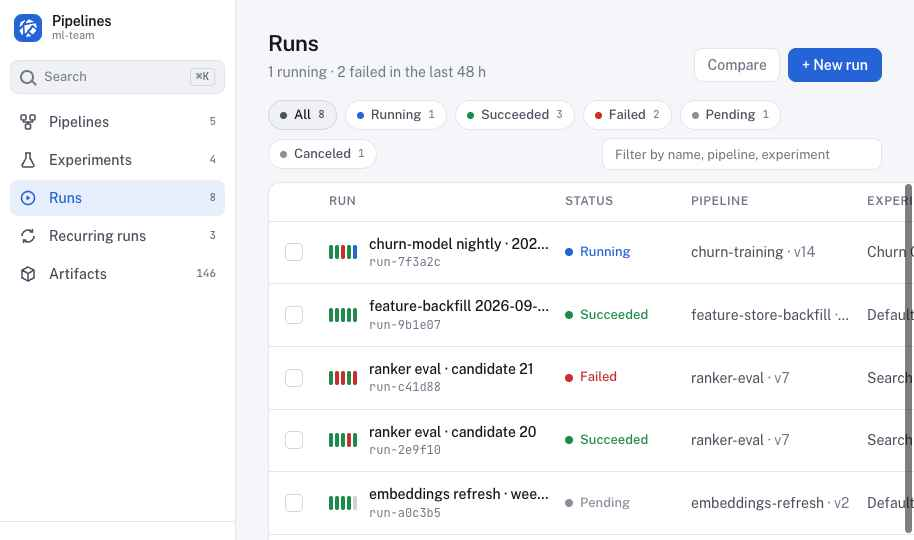

## Motivation

The current frontend combines MUI/Emotion, typestyle, and Tailwind. Its navigation,
tables, forms, and toolbars use inconsistent spacing and interaction patterns.
Creating a run crosses multiple dialogs, and inspecting a failed task separates
information that users need together. The supplied design consolidates these
workflows and provides a shared foundation for subsequent frontend work.

### Goals

- One token-driven component system with consistent density and light/dark themes.
- Shorten the runs → run → failed task → logs workflow.
- Simplify run creation and comparison without losing existing functionality.
- Maintain complete route, action, and deployment parity.
- Preserve accessible keyboard interaction and improve explicit loading/error states.
- Remove obsolete `@mui/*`, `@emotion/*`, typestyle, and associated style helpers
  after their consumers have migrated.

### Non-goals

- Backend, API schema, authentication, authorization, or database changes.
- Replacing React, Vite, TanStack Query, React Router, or React Flow.
- Changing graph construction/layout, run execution, scheduling, or validation semantics.
- Adding Python `kfp.local` visualization or changing local execution.
- Maintaining two production UI implementations after cutover.

## Proposal

### Component and styling foundation

| Layer | Current | Proposed |
| --- | --- | --- |
| Components | MUI v5 + Emotion | shadcn/ui using Base UI primitives, source owned in `src/components/ui` |
| Styling | Emotion + typestyle + Tailwind 3 | Tailwind v4 and semantic CSS variables |
| Icons | MUI icons + custom SVG | Lucide stroke icons; retain the Kubeflow mark |
| Graph | React Flow (`@xyflow/react`) | Retain graph behavior/layout; restyle nodes, edges, and controls |
| Data | TanStack Query and generated v2beta1 clients | Retain hooks, query keys, API contracts, and generated clients |

Owning the component source lets KFP adapt accessible primitives to its workflows
and tokens without retaining the Material theme layer. Use the Base UI component
variants consistently and review additional component dependencies individually.
A new table, form, or state-management library is not a prerequisite for this KEP.
Pin implementation dependencies in the lockfile and keep the existing Node/npm
version policy. See the [shadcn Tailwind v4 guide](https://ui.shadcn.com/docs/tailwind-v4).

### Design reference and defaults

The [design handoff](design/README.md), [tokens](design/tokens.css),
[prototype source](design/prototype/KFP%20Modern.dc.html), and screenshots specify
the visual direction and principal workflows. The prototype uses illustrative
in-memory data and is a reference, not application code or proof of API coverage.
This KEP governs behavior, compatibility, and delivery where the reference omits
or simplifies a case.

- Default to the system theme, with explicit system/light/dark choices persisted locally.
- Keep archived runs and experiments as distinct, discoverable views and preserve
  their existing URLs.
- Retain existing behavior for secondary routes and actions not fully illustrated
  in the prototype; apply the shared components and tokens to those surfaces.
- Keep artifact details, previews, and lineage accessible alongside a link to the
  producing run/task.
- Use locally bundled Public Sans and JetBrains Mono with their license notices;
  production operation must not require external font or component CDNs.
- Match the design while meeting contrast, focus, keyboard, and reduced-motion
  requirements. Status must remain understandable without color or animation.

### User experience

**Navigation and discovery.** A collapsible text-and-icon rail provides the main
sections. A keyboard-accessible command palette searches runs, pipelines, and
experiments in the active namespace and exposes common navigation actions.
Search is debounced, bounded, cancellable, and uses existing list/filter APIs.
Namespace changes invalidate pending results and prevent stale results appearing
under the new namespace.

**Run inspection.** Keep the graph visible beside a task panel with Info, Logs,
and Events. Failed runs expose a direct action to the failing task's logs.
Preserve nested graph navigation, task deep links, polling and terminal-state
behavior, and virtualized log viewing.

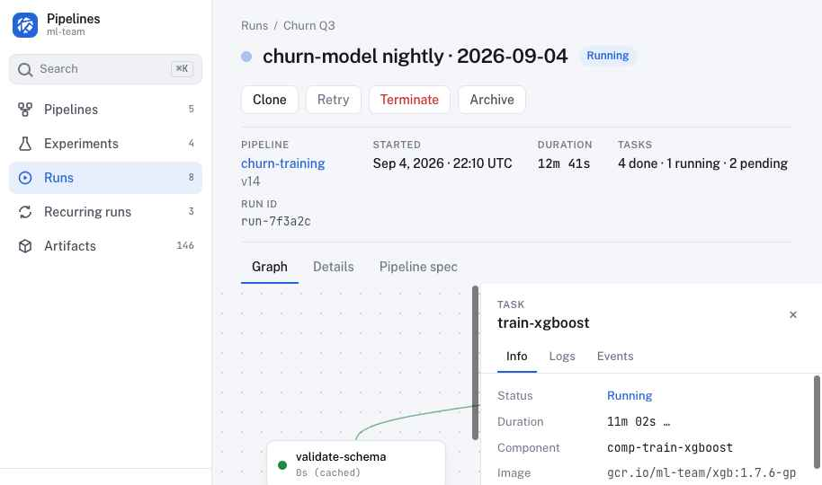
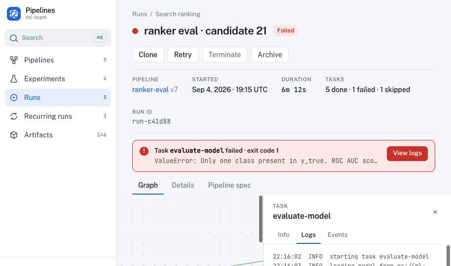

**Comparison.** Show runs as columns with parameters and metrics as rows, highlight
differences, and retain existing scalar and rich metric visualizations. Missing
values are distinct from zero. Preserve selected-run URLs and access to each run.

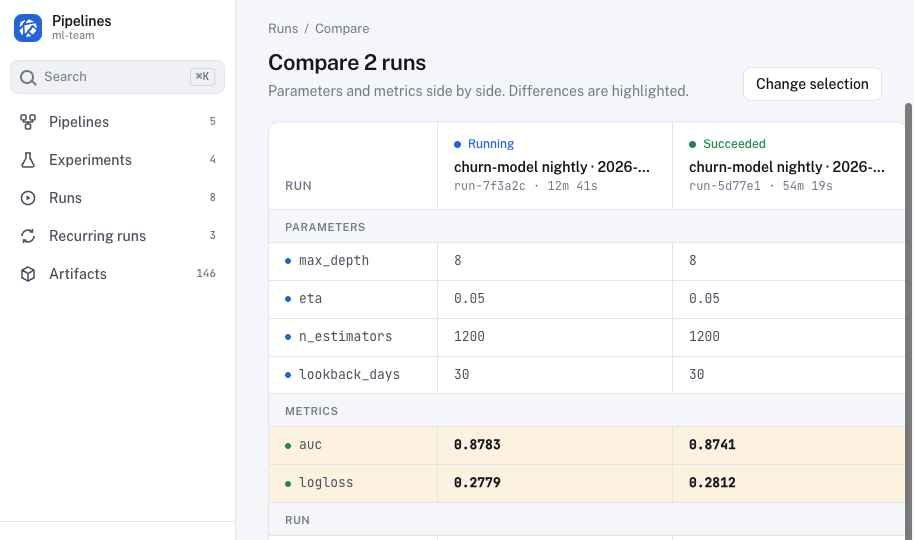

**Resource pages.** Restyle pipeline cards and details, experiments and their runs,
recurring schedules, and artifacts. Preserve uploads/version creation, pagination,
sorting, filtering, bulk actions, archive/restore/delete, confirmations, and
permission-sensitive actions. Inline schedule toggles show pending/error states
and reflect confirmed server state.

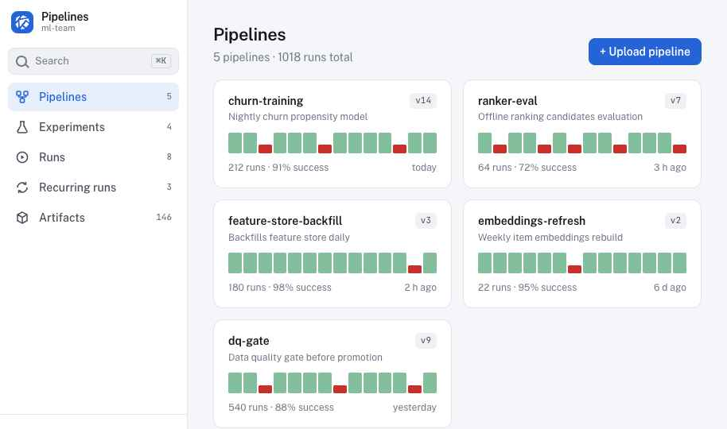
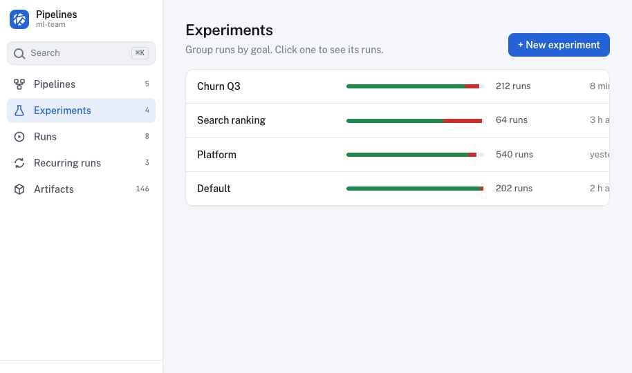
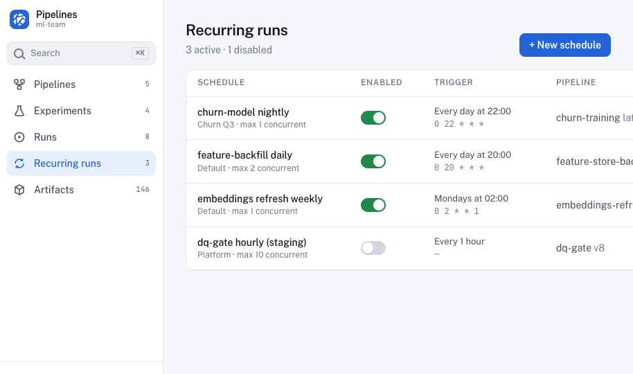
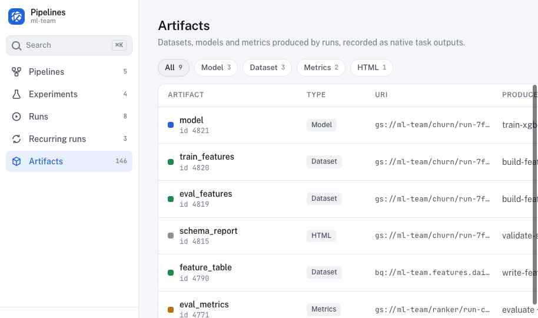

**Run and schedule creation.** Use a single page for pipeline/version selection,
run details, once/recurring scheduling, parameters, and a summary. Preserve clone
inputs, experiment context, service account, pipeline root, parameter types and
validation, latest-version behavior, cron/periodic settings, catch-up, concurrency,
and all other currently supported form options. Prevent duplicate submissions;
failed submissions retain entered values and give actionable feedback. For standard
creation without an explicit return destination, return to Runs or Recurring runs
and show a success notification linking to the created resource. This intentionally
changes the current immediate-detail navigation; preserve explicit `returnTo`
contracts and test both paths.

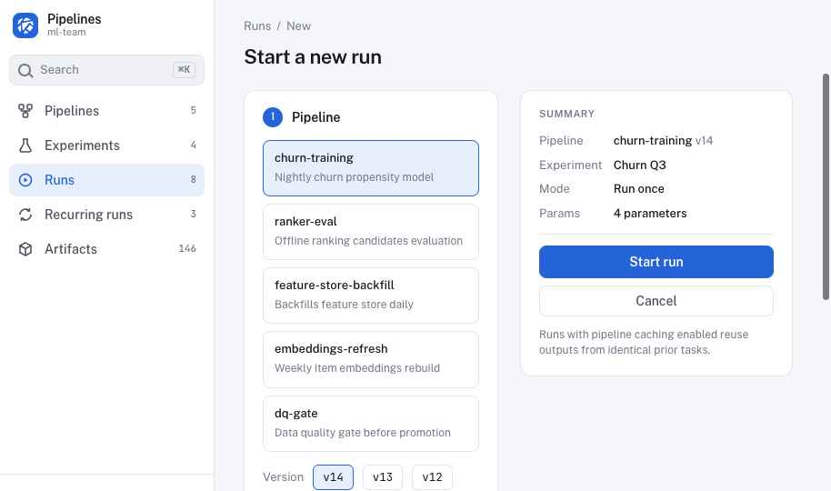
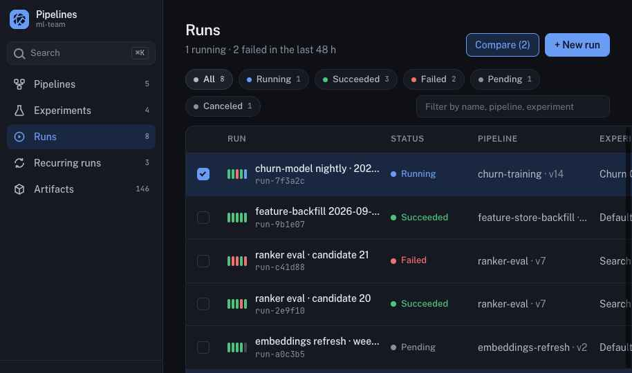
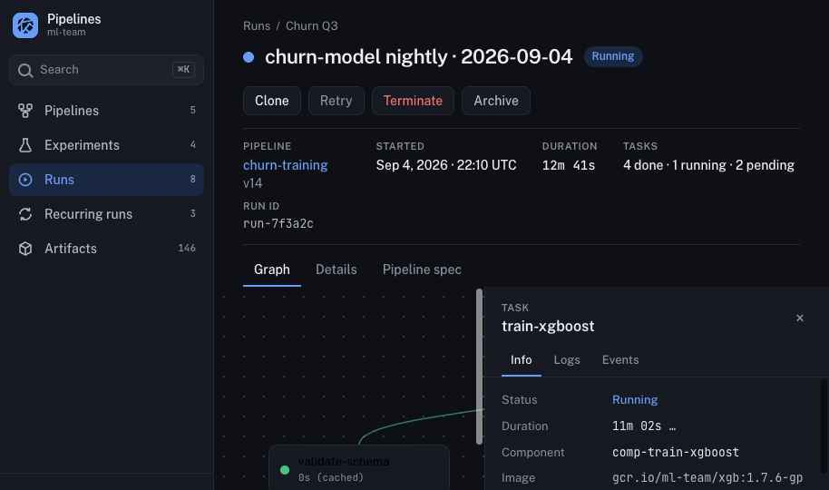
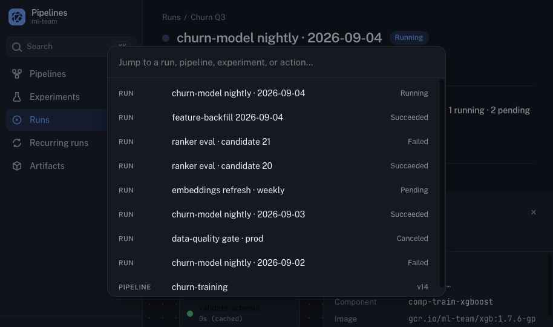

### Statistics and API boundary

Before implementing nav counts, status/type chips, recent-failure summaries,
per-pipeline histories, health bars, or experiment success rates, document each
metric's namespace, filters, time window, denominator, source, and request bound.
A page of results must not be presented as a complete total or global success rate.
Use existing aggregate data or bounded explicitly labeled samples where meaningful;
omit a statistic or show it as unavailable when its scope cannot be represented
accurately. Do not scan every run, add a request per row, or introduce a new backend
API to reproduce fixture values. Any required backend enhancement is separate work.

Implementation and qualification evidence are tracked in [PR #14584](https://github.com/kubeflow/pipelines/pull/14584).
The Runs status selector has a compatibility dependency: generic `state` filtering
uses stored `State` before the API normalizes the displayed state or falls back to
historical `Conditions`. It can therefore omit historical runs whose displayed
status matches a selection. The legacy `status` predicate is not equivalent: it
collapses Paused into Pending and Canceled into Failed. Prove effective-state list
filtering parity before exposing that selector; any necessary backend enhancement
remains separate work under the API boundary above. This implementation reference
does not establish release qualification or change the completion criteria.

## Design Details

### Frontend Considerations and compatibility criteria

Create a checked route/action/state inventory from
[`Router.tsx`](../../frontend/src/components/Router.tsx) and existing page tests.
The implementation PR must attach evidence for every row, including:

| Area | Required compatibility |
| --- | --- |
| Routing | Preserve hash routes, encoded IDs, `task`, `view`, `runlist`, clone/create inputs, `returnTo`, browser back/forward, refresh, and legacy execution redirects. Any added query aliases must not replace existing meanings. |
| Secondary pages | Include upload/new-version, new/archive experiments, resource details, shared pipelines, Getting Started, frontend feature settings, and deployment-conditional routes. |
| Data and mutations | Preserve request payloads, server-side filtering/pagination/sorting, query/cache isolation, validation, action eligibility, confirmations, retries, and refresh recovery. |
| Graphs and artifacts | Preserve nested/loop graphs, task selection, logs/events, artifact details, previews/lineage, scalar/rich metrics, and TensorBoard access. |
| Deployment | Preserve `BASEPATH`, relative assets, proxy/auth behavior, `DEPLOYMENT`, `HIDE_SIDENAV`, embedded Central Dashboard integration, and namespace switching. Validate standalone and embedded multi-user deployments. |
| Preferences | Preserve existing navigation, table-page-size, and frontend feature preferences; add theme storage without destructive migration. Missing, invalid, or unavailable storage must fall back safely. Old UI must still start with preferences written by the new UI. |
| Async states | Cover first-use empty, filtered empty, loading, refresh, partial data, 401/403, not found, failed request, retry, and recovery. Keep user-controlled filters, selections, and form inputs through unrelated refetches. |

Retain behavior covered by existing hooks, `lib/`, generated clients, and graph
logic. Small presentation adapters are allowed; do not fold unrelated data-layer
refactors into the migration. Side effects must not duplicate mutations,
navigation, or notifications on remount/refetch.

**Browser compatibility.** Tailwind v4 introduces a CSS compatibility constraint:
its documented baseline is Chrome 111, Safari 16.4, and Firefox 128. The current
`supports es6-module` browserslist/ES2015 JavaScript target alone does not establish
this support. The proposed browser floor is at least those versions; confirm and
document the selected package versions' requirements before implementation and
align browser configuration and release notes. If the supported KFP browser
policy requires older versions, revise the styling approach before cutover rather
than silently dropping support. Exercise Chromium, Firefox, and WebKit/Safari;
check the declared minimum versions as well as current browser releases. See
[Tailwind browser support](https://tailwindcss.com/docs/compatibility#browser-support).

### KFP Local Considerations

This proposal does not change Python `kfp.local`, its Docker/subprocess runners,
compilation, pipeline/component execution, returned outputs, or local artifact
directories. It introduces no local UI service and requires no local SDK migration.
Existing local-execution tests remain applicable without changed expectations.

Developing the frontend against the mock backend or a standalone Kind deployment
is distinct from KFP Local execution. Those development paths remain supported.
Viewing or importing `kfp.local` executions in this UI would require a separate
proposal and is outside this scope.

### Migration strategy

Deliver one coordinated production cutover with verifiable development stages:

1. **Inventory and baseline.** Record the exact pre-migration commit and compatible
   UI image digest. Complete the route/action/state checklist, record browser and
   deployment support, capture test/coverage and visual baselines, and measure
   bundle sizes and representative large-list/graph/log interactions.
2. **Foundation.** Add tokens, fonts, theme handling, Base UI components, and the
   Tailwind v4 build integration. Cover primitive states and keyboard behavior in
   component tests and Storybook. Adapt build/test scripts as required by the new
   CSS pipeline; preserve their documented entry points.
3. **Workflows.** Migrate shell/navigation, runs and task inspection, comparison,
   resource pages, and creation forms in reviewable commits on the development
   branch. Verify each completed workflow before proceeding. Existing production
   releases keep the old UI during this work.
4. **Parity and cleanup.** Complete the compatibility matrix and live-deployment
   tests. Remove old components/helpers and direct dependencies only after their
   consumers and behavioral coverage have migrated. Review the lockfile and
   production bundle for residual obsolete presentation packages.
5. **Release qualification.** Complete the functional, visual, accessibility,
   performance, and upgrade/rollback checks below. Record evidence and accepted
   design differences in the implementation PR; release notes explain the new
   navigation, browser floor, and impact on downstream component customizations.
6. **Cutover.** Release the complete new frontend image through the normal KFP
   release process. No API, database, or pipeline-data migration accompanies it.

A mixed presentation stack may exist temporarily on the development branch, but
is not the intended released state. There is no permanent legacy-theme feature
flag; rollback uses the known-good frontend image. The KEP issue stays open until
implementation and qualification are complete.

### Rollback strategy and acceptance criteria

The frontend container includes both the browser bundle and Express server.
Keep server behavior and deployment configuration compatible, and record a
pre-cutover image **digest** verified against the backend being deployed. A
previous release tag alone is not evidence of compatibility.

Before release, rehearse upgrade → exercise new UI → rollback against the same
seeded backend in standalone and embedded multi-user configurations:

1. Preserve the current UI image reference and deployment configuration. Create
   representative runs, schedules, artifacts, and existing browser preferences.
2. Deploy the candidate; exercise creation/inspection and theme/navigation
   preferences, then restore the known-good `ml-pipeline-ui` image/pod template
   through the deployment's normal configuration mechanism.
3. Preserve backend workloads/data, service accounts, ConfigMaps, authorization
   settings, and the shared TensorBoard proxy signing Secret. Do not roll back
   backend schemas or delete resources as part of the UI rollback.
4. Confirm health/readiness, direct links and refresh, namespace selection,
   listing/creating runs, logs, artifacts/TensorBoard, and resources created with
   the candidate. Verify the old UI starts with the candidate's stored preferences.
5. Verify a browser reload obtains a consistent old asset bundle and document any
   operator cache/reload instructions and the observed interruption. The current
   UI Deployment uses `Recreate`; do not assume zero downtime.

A release-blocking loss of core functionality, inaccessible critical workflow,
namespace/auth regression, or incompatible deployment behavior triggers restoration
of that image while a fix is prepared. Rollback is accepted only when the above
checks pass without data repair or backend changes.

### Test Plan

Existing tests are the behavioral regression contract. The commands below are
implementation qualification requirements, not claims of tests already run for
this documentation proposal. Use the Node version in `frontend/.nvmrc`, the npm
version in `frontend/package.json`, and the documented server test prerequisites.

#### Prerequisite testing updates

- Inventory the existing page/router/hook tests before replacing components. Replace
  MUI-specific snapshots/selectors with role/text or stable semantic selectors
  while retaining assertions about actions, requests, navigation, and recovery.
- Extend deterministic mock fixtures and the visual route manifest for populated
  detail pages, task panels, comparison, creation, themes, and empty/error/loading
  states. The current mock primarily supports list pages; it is not evidence for
  live authentication, native artifacts, or pod logs.
- Give screenshot routes content-ready selectors and inspect capture manifests.
  A loaded `#root` alone does not prove the intended page rendered.
- Add Storybook states for the shared primitives and automated accessibility checks
  for critical pages/overlays. Keep manual keyboard and screen-reader checks.

#### Unit and integration tests

From `frontend/`:

```sh
npm ci
npm run test:ci
npm run build
npm run build:storybook
```

`test:ci` covers formatting, lint, application/mock-backend types, React peers, and
UI/server coverage. Retain the server integration and TLS coverage used by CI.
Capture `npm run coverage:baseline` on the recorded base and run
`npm run coverage:compare` after migration using the preserved baseline. These
commands run UI coverage; they do not use mock-backend screenshots. Investigate
any decrease: the comparison must pass against the preserved baseline, or an
explicitly reviewed baseline adjustment must account for removed presentation-only
code and be recorded with the original report. Do not silently reset a failing
baseline. No lost behavioral case is justified by unchanged aggregate coverage.

Add focused regression cases for duplicate submission, refetch/remount behavior,
failed mutation recovery, stale namespace search results, keyboard focus return,
local preferences, direct links, and the row/action interactions in the parity
inventory. Preserve existing graph and parameter-validation tests.

#### Functional browser and deployment tests

Retain and adapt the WebdriverIO flows under
[`test/frontend-integration-test`](../../test/frontend-integration-test) and the
existing [frontend E2E workflow](../../.github/workflows/e2e-test-frontend.yml).
The hello-world, literal-input, and TensorBoard cases cover upload/run creation,
parameter validation, task inspection/logs, and artifact access. Extend coverage:

| Workflow | Required assertions |
| --- | --- |
| Run creation and clone | Existing inputs/options survive; submitted payload and destination are correct; invalid inputs block submission; errors preserve values; one user action makes one mutation. |
| Inspection and control | Task deep links, nested graphs, logs/events, retry/terminate eligibility, confirmation/cancel, terminal polling, and failed-task navigation behave correctly. |
| Lists and comparison | Filter/sort/page, select across supported interactions, archive/restore/delete, comparison URLs, differing/missing values, and rich metrics remain correct. |
| Recurring runs | Once/recurring mode, cron/periodic fields, latest-version policy, enable/disable success/failure, and concurrency/catch-up semantics match existing behavior. |
| Artifact access | Details/preview/lineage and producing-task navigation remain available; permission failures remain visible; TensorBoard authorization still works. |
| Shell and deployment | Theme persistence/system changes, rail state, command palette, browser history, prefixed paths, embedded navigation, namespace changes, and forbidden/not-found responses work. |

Run the critical flows in both standalone and embedded multi-user deployments.
Include a namespace change during in-flight reads and permitted/denied access to
resources across namespaces. Use real clusters for logs, native artifacts,
authentication, and deployment-specific behavior; mocks supplement these checks.

#### Visual and accessibility review

Run mock API and dev servers in separate terminals, capture the recorded base
before changes and the candidate afterward with identical fixture/viewport settings:

```sh
npm run mock:api
npm start
# In the capture terminal, once both servers are ready:
npx playwright install chromium
npm run visual:baseline -- --base-url http://localhost:3000
# After switching the served UI to the candidate:
npm run visual:current -- --base-url http://localhost:3000
npm run visual:diff
```

Capture light/dark themes, expanded/collapsed rail, desktop and narrow layouts,
including either side of the 1024px rail and 900px task-panel breakpoints, and
loading/empty/error/permission states. Compare candidate captures with the supplied
design, and old/new captures for completeness. Intentional redesign differences
must be reviewed; they are not made safe by raising a pixel-diff threshold.
Establish approved new baselines after review.

Use the [UI smoke tooling](../../frontend/scripts/ui-smoke-test/README.md) for
additional live-cluster comparisons against the recorded base. It needs its own
dependencies, browser setup, Docker/Kind/kubectl, and a disposable development
cluster; it can create resources and temporarily change UI replicas. Its screenshot
comparison supplements functional E2E and is expected to differ during a redesign.

Critical flows must be operable by keyboard with visible focus, correct focus
trapping/restoration, accessible names and validation, and usable zoom/reflow.
Check contrast in both themes, screen-reader announcements, and reduced motion.
Require no unresolved serious/critical automated accessibility findings on covered
flows and no blocking manual keyboard/screen-reader defects. Primitive-library
accessibility does not establish accessibility of the assembled application.

#### Performance and release evidence

Run `npm run analyze-bundle` on base and candidate. Record production JS/CSS/font
sizes and representative list, graph, logs, and command-palette measurements with
the same data, browser, and hardware. Record the largest-painted element and
matched content-readiness endpoints as well as Web Vitals: a redesign can change
which element qualifies as LCP without delaying the requested data. Repeat
representative large-graph and populated-comparison workloads in fresh browser
contexts, retain individual samples and asset/fixture identities, and separate
automation readiness timings from field INP. Agree measured budgets before
qualification; explain increases and resolve unaccepted regressions. Retain
virtualization and bounded requests; reject per-row fetch growth and unbounded
history scans.

The implementation PR must include the completed parity matrix, exact tested
commits/images, passing checks, functional deployment results, visual review,
accessibility results, performance comparisons, and rollback rehearsal results.

### Completion Criteria

The redesign is ready for release when the compatibility matrix and required test
flows pass; design differences and performance results are reviewed; old direct
presentation dependencies/helpers are removed; browser/deployment requirements
and downstream migration notes are documented; and rollback passes against the
same backend without data repair. Merging this KEP alone does not meet those criteria.

## Risks and Mitigations

- **Broad presentation change:** stage implementation with a route/action/state
  inventory and retained behavioral tests, then perform one complete cutover.
- **Hidden functionality lost in the prototype:** existing routes, tests, and
  deployment contracts define parity beyond the pictured screens.
- **Browser/CSS regressions:** explicitly resolve the Tailwind v4 support floor
  and test both themes and declared browser versions.
- **Accessibility regressions:** test composed workflows and focus behavior,
  supplementing automated checks with manual checks.
- **Expensive or misleading summaries:** document scope and query bounds, and omit
  unsupported statistics rather than scan all records or mislabel a page sample.
- **Downstream forks:** document replaced component/style extension points;
  maintainers of forks customizing MUI components must adapt those customizations.
- **Rollback mismatch:** qualify the prior frontend image, including its Express
  server, against the same backend/configuration and preserve signing credentials.

## Drawbacks

Owning copied component source increases KFP's maintenance responsibility. The
migration touches many presentation tests and downstream customizations, and a
coordinated cutover concentrates release qualification work. Tailwind v4 also
requires an explicit browser compatibility decision.

## Alternatives

- **Retheme/upgrade MUI:** less component churn, but retains the Material/Emotion
  foundation and does not consolidate the chosen presentation stack.
- **Mantine:** an alternative component system if the proposed stack proves
  unsuitable; it requires its own component migration and styling integration.
- **Release page by page:** reduces each cutover's size, but extends the period of
  mixed styling and interaction patterns. This proposal instead stages development
  and verification before one complete release cutover.
- **Cosmetic changes only:** lower immediate cost, but do not simplify the target
  workflows or replace the competing styling systems.

## Implementation History

- 2026-09-26: Initial KEP and design reference; implementation tracked in #14572.
- 2026-09-28: Implementation PR #14584 records legacy presentation retirement,
  [repeated performance qualification](https://github.com/jeffspahr/jeffspahr-pipelines/blob/codex/ui-modernization-foundation/frontend/docs/ui-modernization/performance-qualification.md)
  and [browser/accessibility qualification](https://github.com/jeffspahr/jeffspahr-pipelines/blob/codex/ui-modernization-foundation/frontend/docs/ui-modernization/browser-accessibility-qualification.md).
  Reports retain exact source/asset identities and separate automated checks from
  minimum-version, actual-device and assistive-technology acceptance. Actual
  Firefox 128 exposed and now covers a native input activation compatibility fix;
  other declared minimum browsers remain open. Measured budgets, deployment
  authorization and the compatible same-backend rollback rehearsal still require
  acceptance. These implementation results do not complete the coordinated
  release or introduce a KFP Local migration.

## References

- [Design handoff and prototype instructions](design/README.md)
- [KFP proposal requirements](../README.md)
- [Frontend development and verification](../../frontend/README.md)
- [Kubeflow KEP process](https://github.com/kubeflow/community/blob/master/proposals/README.md)
