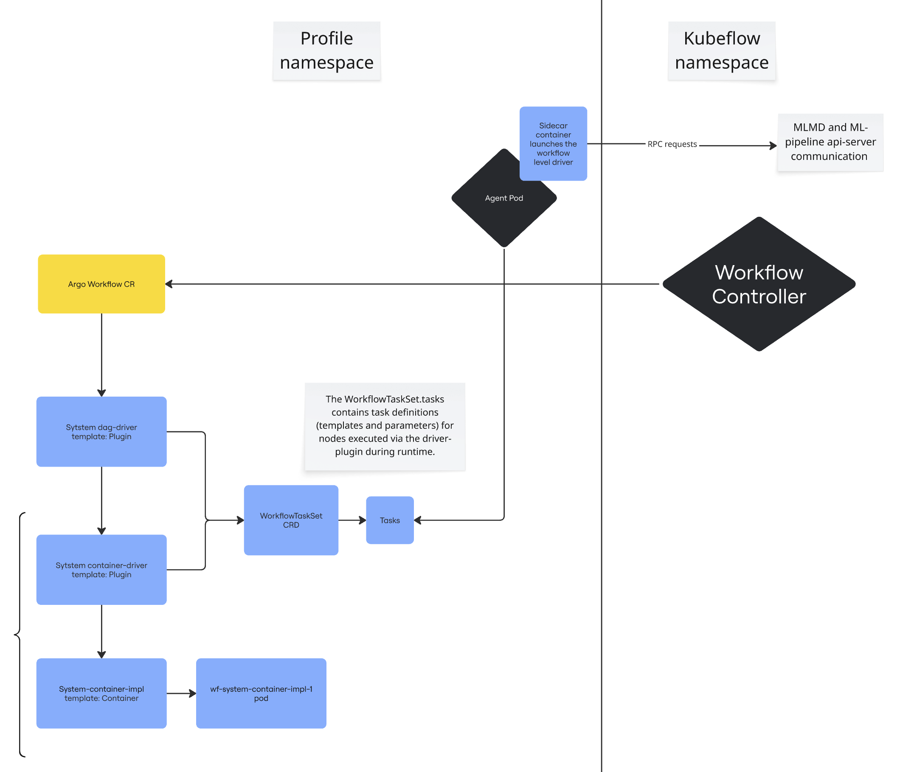

# Standalone driver 

## Summary
In [Kubeflow Pipelines](https://www.kubeflow.org/docs/components/pipelines/interfaces/), each node in the pipeline graph is non-atomic and, at the Kubernetes level, consists of two components: a driver and an executor. Each of these runs in a separate Kubernetes pod. Additionally, every pipeline run spawns a root DAG driver pod.

Here’s a simple diagram of the pods created during a KFP (Kubeflow Pipelines) run:

*(User-defined pipeline with 2 tasks: Task 1 and Task 2)*


This proposal explores approaches to replacing both the root DAG driver and all container drivers with a single standalone service, using Argo Workflows as the orchestration framework.


## Motivation
While using a separate pod for the executor makes sense - since it often handles heavy workloads and benefits from isolation and flexibility - the driver is a lightweight component. It typically performs just a few API calls: checking for cached results and creating an MLMD Execution.

However, running the driver in a separate pod causes several issues:

High overhead: Launching a Kubernetes pod merely to execute a few API calls introduces significant latency. Often, the pod scheduling and startup time outweighs the driver's actual processing time.

Resource availability problems: There's no guarantee the Kubernetes cluster has sufficient resources to schedule the driver pod. If scheduling fails, the pipeline gets stuck. The UI currently doesn't show driver pod scheduling failures, which makes it hard to debug and understand what's going on.

## Current state details

Let's take a look at the copy of [hello_world.yaml](hello_world.yaml)  generated by the argo compiler tests.

**Execution Order:**

1. **entrypoint**  
   *Type:* DAG  
   The root DAG represents the entire pipeline run.

2. **root-driver** *(template: system-dag-driver)*  
   *Type:* Container  
   *Purpose:* Initializes the root DAG. Creates an MLMD execution for the DAG.  
   **Outputs:**
    - `execution-id` – ID of the DAG execution (created during root-driver execution)

   **Tasks inside:**

    - **hello-world-driver** *(template: system-container-driver)*  
      *Purpose:* Check for the existence of an execution in the cache. If it does not exist, prepare the MLMD execution of the hello-world container task, and generate the appropriate pod-spec-patch.  
      **Outputs:**
        - `pod-spec-patch` – patch for the system-container-executor pod; inserts the correct image and command for the main container
        - `cached-decision` – if true, the next step will be skipped

    - **hello-world** *(template: system-container-executor)*  
      *Depends on:* `hello-world-driver.Succeeded`  
      *Purpose:* Executes the hello-world component  
      **Inputs:**
        - `pod-spec-patch` — patch for the pod generated in the previous step
        - `cached-decision` — used as a skip condition

      The `system-container-executor` template defines the main container that runs the user-defined code.


Overview of the Argo workflow node structure for the container-driver
```yaml
  templates:
    - name: system-container-driver
      container:
        args:
        ...
        command:
        - driver
      image: ghcr.io/kubeflow/kfp-driver
      outputs:
        parameters:
          - name: pod-spec-patch
            valueFrom:
              path: /tmp/outputs/pod-spec-patch
          - name: cached-decision
            valueFrom:
              path: /tmp/outputs/cached-decision
```
It creates a pod that launches the driver container using the kfp-driver image.

## Proposal

Instead of launching a new driver's pod using a container template, configure the system to send requests to an already running server.
Something like this (showing both types of drivers):
```yaml
  templates:
  - name: system-container-driver
    request:
      args:
        ...
      outputs:
        parameters:
          - name: pod-spec-patch
            jsonPath: $.pod_spec_patch
          - name: cached-decision
            jsonPath: $.cached_decision
```
```yaml
    - name: system-dag-driver
      request:
        args:
         ...
      outputs:
        parameters:
          - name: execution-id
            valueFrom:
              jsonPath: $.execution-id
          - name: iteration-count
            valueFrom:
              default: "0"
              jsonPath: $.iteration-count
          - name: condition
            valueFrom:
              default: "true"
              jsonPath: $.condition
```


### Requirements:
- Execute a remote call with parameters
- Read the response
- Extract parameters from the response 
- Use the response in the next steps

*Extract parameters from the response — this is important to use in the Argo workflow itself, specifically cached-decision and pod-spec-patch. These parameters are used in when conditions and to patch the pod specification.*

### Argo workflow Features
Two similar features in Argo Workflow can be considered to meet these requirements:
- [Http Template](https://argo-workflows.readthedocs.io/en/latest/http-template)
- [Executor Plugin](https://argo-workflows.readthedocs.io/en/latest/executor_plugins/)

Comparison:

| Feature          | Supports Remote Call | Read the Response | Can Extract Parameters | Notes                        |
|------------------|----------------------|-------------------|------------------------|------------------------------|
| HTTP Template    | ✅                   | ✅                | ❌                     |                              |
| Executor Plugin  | ✅                   | ✅                | ✅                     | Requires plugin installation |

The HTTP template [is not able](https://github.com/argoproj/argo-workflows/issues/13955) to extract parameters from the response and can only use the full response as-is. As a result, it cannot be used in podSpecPatch: '{{inputs.parameters.pod-spec-patch}}' or when: '{{inputs.parameters.cached-decision}} != true'

There’s a trade-off between running a standalone driver service pod globally or single per workflow. This is a balance between better performance and avoiding a single point of failure.
Currently, Argo [supports](https://github.com/argoproj/argo-workflows/issues/7891) only one driver pod per workflow option. Both options are based on the Agent pod, which is currently started per workflow — this is a limitation of the current [implementation](https://github.com/argoproj/argo-workflows/issues/7891).

### Implementation Based on the Executor Plugin

Instead of creating a driver pod for each task, we can reuse a single agent pod via a plugin template:
[Agent pod](https://github.com/argoproj/argo-workflows/issues/5544) is a unit designed for extension. 
It can be extended by any server that implements the protocol.
This server(plugin in Executor plugin terminology) runs as a sidecar alongside the agent pod.

Below is a scheme where, instead of creating a pod for the driver's task, we reuse the Argo Workflow Agent via a plugin



To move from the container template to the Executor Plugin template:
- patch the [Argo compiler](https://github.com/kubeflow/pipelines/tree/a870b1a325dae0c82c8b6f57941468ee1aea960b/backend/src/v2/compiler/argocompiler) to generate a plugin template instead of a container template. Sample: hello-world [adapted](kfp-plugin-flow.png) (see name: system-container-driver)
- Namely, replace the templates used in the [container-driver](https://github.com/kubeflow/pipelines/blob/a870b1a325dae0c82c8b6f57941468ee1aea960b/backend/src/v2/compiler/argocompiler/container.go#L148) and [dag-driver](https://github.com/kubeflow/pipelines/blob/a870b1a325dae0c82c8b6f57941468ee1aea960b/backend/src/v2/compiler/argocompiler/dag.go#L156) section of the compiler
- Extract the [driver](https://github.com/kubeflow/pipelines/tree/a870b1a325dae0c82c8b6f57941468ee1aea960b/backend/src/v2/driver) component into a standalone server.
- Implement the [plugin](plugin.md)

The sample of the Argo Workflow system-container-driver template based on plugin.
```yaml
    - name: system-container-driver
      inputs:
        parameters:
          - name: component
          - name: task
          - name: container
          - name: parent-dag-id
          - default: "-1"
            name: iteration-index
          - default: ""
            name: kubernetes-config
      metadata: {}
      # this is the key change that specifies use of the executor plugin
      plugin:
        driver-plugin:
          args:
            cached_decision_path: '{{outputs.parameters.cached-decision.path}}'
            component: '{{inputs.parameters.component}}'
            condition_path: '{{outputs.parameters.condition.path}}'
            container: '{{inputs.parameters.container}}'
            dag_execution_id: '{{inputs.parameters.parent-dag-id}}'
            iteration_index: '{{inputs.parameters.iteration-index}}'
            kubernetes_config: '{{inputs.parameters.kubernetes-config}}'
            pipeline_name: namespace/n1/pipeline/hello-world
            pod_spec_patch_path: '{{outputs.parameters.pod-spec-patch.path}}'
            run_id: '{{workflow.uid}}'
            task: '{{inputs.parameters.task}}'
            type: CONTAINER
      outputs:
        parameters:
          - name: pod-spec-patch
            valueFrom:
              default: ""
              jsonPath: $.pod-spec-patch
          - default: "false"
            name: cached-decision
            valueFrom:
              default: "false"
              jsonPath: $.cached-decision
          - name: condition
            valueFrom:
              default: "true"
              jsonPath: $.condition
```

## Test Plan
[x] I/we understand the owners of the involved components may require updates to existing tests to make this code solid enough prior to committing the changes necessary to implement this enhancement.

Unit Tests
Unit tests will primarily validate the compilation from KFP pipelines to Argo Workflow specs, while most other logic will be covered by integration tests.

Integration tests
Add an additional E2E test to verify the behavior of the global driver server.

Additionally, it is nice to have end-to-end (E2E) tests to verify basic functionality. Existing tests should be reused if available. The E2E tests should cover at least the following scenarios:
- A simple pipeline with a single component, waiting for successful completion of the run.
- A pipeline with a chain of components passing inputs and outputs between them, waiting for successful completion of the run.
- A pipeline designed to fail, waiting for the run to end with an error.
- A pipeline which fails but has retries enabled(pipeline/ and component level), waiting for the run to complete successfully.

## Conclusion
This proposal introduces an optimization for Kubeflow Pipelines (KFP) that replaces per-task driver pods with a lightweight standalone service based on Argo Workflows’ Executor Plugin mechanism. It significantly reduces pipeline task startup time by eliminating the overhead of scheduling a separate driver pod for each task — particularly beneficial for large pipelines with multiple steps and caching enabled.
Instead of launching a new driver pod per task, the driver logic is offloaded to a shared agent pod that is scheduled per workflow, and completes once the workflow ends. This reduces latency in cache lookups and metadata initialization.
However, this approach does not fully eliminate pod scheduling issues: the standalone driver is not a global service, but is instantiated per workflow. Thus, a pod still needs to be scheduled for each workflow run.

## Disadvantages:
A key limitation of this implementation is that it currently supports only the Argo Workflows backend. The Executor plugin also adds some extra complexity to maintenance and deployment.

## Open Questions:
- Do we need a fallback mechanism to the per-task driver pods in case the Executor Plugin is not available in some installations? Should KFP continue supporting both execution flows (plugin-based and pod-based drivers) for compatibility?

## Follow-ups
- Implement a global agent pod. The community is [open](https://github.com/argoproj/argo-workflows/issues/7891) to it.