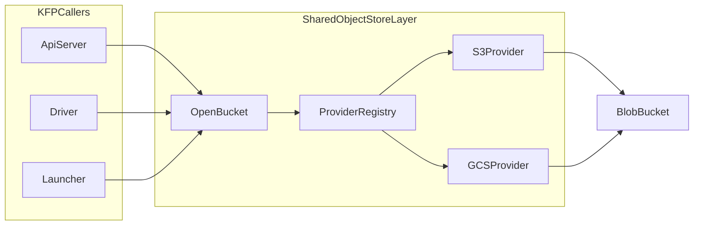

# KEP: Extensible Multi-Backend Object Storage with Unified Storage Layer

## Summary

Kubeflow Pipelines needs to support additional storage backends (notably Azure Blob)
without introducing repeated refactors across API server, driver, and launcher.

Today, storage-opening logic exists in two separate paths:

1. API server object store initialization in `backend/src/apiserver/client_manager/client_manager.go` (S3-compatible centric).
2. Driver/launcher artifact store opening in `backend/src/v2/objectstore/object_store.go` (S3/MinIO/GCS aware).

This proposal defines an extensible provider model where adding a backend (for example `azblob://`) is provider work,
not cross-stack rewiring. To make that practical and safe, both existing call paths are unified behind a shared provider
abstraction in `backend/src/common/objectstore`.

Phase 1 keeps existing behavior intact for `s3://`, `minio://`, and `gs://` while laying the extension foundation.

The key outcomes are:

- no intended runtime regression for current providers;
- unchanged secret handling semantics;
- a clear path to add Azure Blob (`azblob://`) without broad refactors.
- an extensible registry model that future backends can plug into.

## Motivation

Primary motivation: Kubernetes is cloud agnostic, so should KFP especially when dealing with object storage and in order to do that, we need to support more storage backends (starting with Azure Blob) in a maintainable way.

Current duplication in provider/credential logic across API server and runtime makes backend expansion expensive and
risky:

- same provider implemented in two places with slightly different defaults and fallbacks;
- secret/auth code path divergence risk;
- higher change surface when adding new providers.

Unifying the opening layer is therefore not the end goal by itself; it is the enabling mechanism for safe backend
expansion while preserving current `*blob.Bucket` behavior and upload/download code paths.

## External Validation (Feasibility Check)

This proposal is validated against upstream behavior:

1. **Azure Blob fit**: Go CDK blob supports Azure via `azblob://` through `gocloud.dev/blob/azureblob` with `blob.OpenBucket`.
2. **Provider portability fit**: Go CDK URL mux model is provider-pluggable by scheme.

## Goals

1. Enable future backend support (starting with Azure Blob) without requiring another cross-stack refactor.
2. Introduce a shared provider abstraction used by both API server and v2 runtime as the enabling architecture.
3. Preserve behavior for `s3://`, `minio://`, and `gs://`.
4. Preserve existing secret/credential semantics and fallback order.
5. Keep rollout incremental and low risk (no broad refactor of artifact upload/download logic).
6. Make provider onboarding additive via registry-based provider implementations.

## Non-Goals

1. Enabling Azure Blob runtime support in Phase 1.
2. Redesigning artifact read/write/list algorithms.
3. Changing user-facing artifact URI formats in Phase 1.
4. Changing frontend behavior in Phase 1.

## Requirements and Constraints

### Hard Requirements

1. No regression for existing paths and current install defaults.
2. Secrets handled with the same semantics as current implementation.
3. Keep solution simple and reuse existing code.
4. Make extension to new providers straightforward.

### Technical Constraints

1. API server still consumes `OBJECTSTORECONFIG_*` env vars.
2. Runtime still consumes `kfp-launcher` provider/session config and secret refs.
3. `BlobObjectStore` API in API server must remain stable.
4. Existing runtime artifact path semantics (`Prefix`, `KeyFromURI`, path traversal protections) must be unchanged.

## Current State (Before Change)

### API Server Path

- `initBlobObjectStore()` reads `OBJECTSTORECONFIG_*` env vars.
- `ensureBucketExists()` is best-effort.
- `openBucketWithRetry()` creates an S3 client and opens bucket.
- Object operations use `storage.BlobObjectStore`.

### Runtime Path (Driver/Launcher)

- `OpenBucket()` in `backend/src/v2/objectstore/object_store.go`:
  - switches provider (`minio/s3/gs`);
  - loads secrets for S3/GCS as needed;
  - opens prefixed bucket.
- Upload/download operations are implemented on top of `*blob.Bucket` and must remain intact.

## Proposal

Introduce `backend/src/common/objectstore` with:

- `Provider` interface and `Registry`.
- Shared request/config/session types.
- Capability metadata.
- Provider implementations:
  - `S3Provider` for `s3` + `minio`
  - `GCSProvider` for `gs`

Migrate both callers to shared open path:

- `backend/src/v2/objectstore/OpenBucket()` delegates opening.
- `backend/src/apiserver/client_manager/openBucketWithRetry()` delegates opening.

Keep existing transfer code and storage APIs unchanged.

## Design Details

### Core Provider Contract

```go
type Provider interface {
    Name() string
    Capabilities() CapabilityMetadata
    OpenBucket(ctx context.Context, request *OpenRequest) (*blob.Bucket, error)
}
```

### Shared Open Request/Config

```go
type OpenRequest struct {
    Namespace string
    K8sClient kubernetes.Interface
    Config    *Config
}

type Config struct {
    Scheme      string
    BucketName  string
    Prefix      string
    QueryString string
    SessionInfo *SessionInfo
}
```

`SessionInfo.Params` keeps existing key conventions:

- S3 family: `fromEnv`, `secretName`, `accessKeyKey`, `secretKeyKey`, `region`, `endpoint`, `disableSSL`,
  `forcePathStyle`, `maxRetries`.
- GCS: `fromEnv`, `secretName`, `tokenKey`.
- API server compatibility: inline `accessKey` / `secretAccessKey` mapping.

### Registry and Dispatch

```go
registry := NewDefaultRegistry()
registry.Register(&S3Provider{}, "s3", "minio")
registry.Register(&GCSProvider{}, "gs", "gcs")
```

Dispatch logic:

1. If `SessionInfo == nil`: fallback to URL open (`blob.OpenBucket`) with current query behavior.
2. Else: resolve provider by `SessionInfo.Provider`, call provider-specific opener.

### Phase 1 Provider Behavior

#### S3Provider

- Supports three auth modes:
  1. env/default credential chain;
  2. K8s secret-backed keys;
  3. inline static keys (API server compatibility path).
- Uses AWS SDK v2 + `s3blob.OpenBucketV2` in provider-session mode.
- Preserves path-style and endpoint behavior for S3-compatible backends.

#### GCSProvider

- Supports env/default creds or secret-backed token JSON.
- Uses `gcsblob.OpenBucket` and prefixed buckets.

### Caller Integration Snippets

#### Runtime integration

```go
commonConfig := &commonobjectstore.Config{
    Scheme:      config.Scheme,
    BucketName:  config.BucketName,
    Prefix:      config.Prefix,
    QueryString: config.QueryString,
}
openedBucket, err := commonobjectstore.OpenBucket(ctx, &commonobjectstore.OpenRequest{
    Namespace: namespace,
    K8sClient: k8sClient,
    Config:    commonConfig,
})
```

#### API server integration

```go
sharedConfig := toSharedObjectStoreConfig(config)
bucket, err = commonobjectstore.OpenBucket(ctx, &commonobjectstore.OpenRequest{
    Config: sharedConfig,
})
```

### Data Flow



## Phase-by-Phase Plan

## Phase 0: Baseline and Safety Lock

### Scope

- Validate current behavior before abstraction changes.

### Required Checks

- `go test ./backend/src/apiserver/client_manager`
- `go test ./backend/src/v2/objectstore`

### Exit Criteria

- Existing tests pass and become baseline regression guardrail.

## Phase 1: Shared Layer Introduction

### Scope

- Add shared package and providers (`s3/minio`, `gs`).
- Add registry and request/config model.

### Files

- `backend/src/common/objectstore/types.go`
- `backend/src/common/objectstore/registry.go`
- `backend/src/common/objectstore/open_bucket.go`
- `backend/src/common/objectstore/s3_provider.go`
- `backend/src/common/objectstore/gcs_provider.go`

### Constraints

- Keep behavior of existing session params.
- Keep URL fallback behavior for configs that rely on query params.

### Exit Criteria

- Shared package tests pass.

## Phase 2: Runtime Migration (Driver/Launcher Open Path)

### Scope

- Replace provider-switch opening in `backend/src/v2/objectstore/OpenBucket()` with shared dispatch.
- Leave upload/download implementations untouched.

### Files

- `backend/src/v2/objectstore/object_store.go`

### Constraints

- No changes to:
  - `UploadBlob`;
  - `DownloadBlob`;
  - path traversal protections;
  - `KeyFromURI` and prefix semantics.

### Exit Criteria

- `go test ./backend/src/v2/objectstore` passes unchanged behavior.

## Phase 3: API Server Migration

### Scope

- Route API server bucket open through shared layer.
- Preserve `OBJECTSTORECONFIG_*` compatibility via mapper.

### Files

- `backend/src/apiserver/client_manager/client_manager.go`
- `backend/src/apiserver/client_manager/client_manager_test.go`

### Constraints

- Keep:
  - `ensureBucketExists` best-effort behavior;
  - retry behavior around opening;
  - `BlobObjectStore` API and object key layout.

### Exit Criteria

- `go test ./backend/src/apiserver/client_manager` passes.

## Phase 4: Extensibility Proof (Design + Scaffold)

### Scope

- Add provider conformance test strategy.
- Document Azure enablement model and constraints.

### Constraints

- No production enablement of `azblob://` in Phase 1.

### Exit Criteria

- Proposal and test plan fully describe extension contract.

## Impact Analysis

### Backend Impact

1. **API server**: opening logic is delegated, but startup and object operations remain unchanged.
2. **driver/launcher**: opening logic is delegated, artifact transfer behavior remains unchanged.
3. **shared common package**: new reusable abstraction and provider implementations.

### Operational Impact

1. No required config migration in Phase 1.
2. Existing providers and default deployment assumptions remain valid.
3. Future provider onboarding complexity moves from cross-cutting edits to provider-specific implementation.

### Performance Impact

- No expected material regression in steady-state artifact transfer; only bucket opening path is centralized.

## Test Plan

### Unit Tests (Required)

1. Shared layer:
   - registry alias resolution;
   - request validation;
   - unsupported provider behavior;
   - URL fallback behavior.
2. API server:
   - env vs inline credentials mapping into shared config.
3. Existing packages:
   - `backend/src/apiserver/client_manager`;
   - `backend/src/v2/objectstore`.

### Command Set

- `go test ./backend/src/common/objectstore`
- `go test ./backend/src/v2/objectstore`
- `go test ./backend/src/apiserver/client_manager`

### Future Conformance Tests

Add a provider contract suite for:

- open semantics for env-backed auth;
- secret-backed auth error behavior;
- prefix handling and unsupported-provider behavior.

### E2E Tests

#### S3/MinIO (Phase 1)

The existing e2e test suite (`.github/workflows/e2e-test.yml`) already validates the full artifact lifecycle against
SeaweedFS (`chrislusf/seaweedfs:4.15`), which serves as the S3-compatible object store in CI. Since Phase 1 only
centralizes the bucket-opening path without changing transfer logic, the existing e2e coverage is sufficient to validate
S3/MinIO behavior. No new e2e tests are required for Phase 1.

#### Azure Blob (Future Phase)

When `azblob://` provider support is implemented, e2e tests must validate the full artifact lifecycle against an Azure
Blob-compatible backend. [Azurite](https://github.com/Azure/Azurite) is the official Azure Storage emulator and will
replace SeaweedFS in CI when the object store type is configured for Azure.

##### Azurite Overview

Azurite emulates the Azure Blob Storage REST API in a lightweight container. Key properties for CI use:

- **Image**: `mcr.microsoft.com/azure-storage/azurite`
- **Blob service port**: `10000`
- **Well-known credentials** (hardcoded, not secret):
  - Account: `devstoreaccount1`
  - Key: `Eby8vdM02xNOcqFlqUwJPLlmEtlCDXJ1OUzFT50uSRZ6IFsuFq2UVErCz4I6tq/K1SZFPTOtr/KBHBeksoGMGw==`
- **In-memory mode**: `--inMemoryPersistence` eliminates PVC requirements for CI.
- **Go CDK compatibility**: `gocloud.dev/blob/azureblob` connects to Azurite natively via URL params or env vars.

##### Deployment Plan for CI

Deploy Azurite as a Kubernetes Deployment and Service in the `kubeflow` namespace, mirroring the existing SeaweedFS
pattern. The e2e workflow will select the object store backend based on a configuration flag.

**Azurite Kubernetes manifests** (new, under `manifests/kustomize/third-party/azurite/base/`):

```yaml
# azurite-deployment.yaml
apiVersion: apps/v1
kind: Deployment
metadata:
  name: azurite
  namespace: kubeflow
spec:
  replicas: 1
  strategy:
    type: Recreate
  selector:
    matchLabels:
      app: azurite
  template:
    metadata:
      labels:
        app: azurite
    spec:
      containers:
      - name: azurite
        image: mcr.microsoft.com/azure-storage/azurite:3.35.0
        command: ["azurite"]
        args:
        - "--blobHost"
        - "0.0.0.0"
        - "--inMemoryPersistence"
        - "--loose"
        ports:
        - containerPort: 10000
          name: blob
        readinessProbe:
          httpGet:
            port: 10000
          initialDelaySeconds: 5
          periodSeconds: 5
---
# azurite-service.yaml
apiVersion: v1
kind: Service
metadata:
  name: azurite
  namespace: kubeflow
spec:
  selector:
    app: azurite
  ports:
  - name: blob
    port: 10000
    targetPort: 10000
```

**Credential secret** (new, mirrors `mlpipeline-minio-artifact` pattern):

```yaml
# azurite-storage-secret.yaml
apiVersion: v1
kind: Secret
metadata:
  name: mlpipeline-azure-artifact
  namespace: kubeflow
stringData:
  accountName: devstoreaccount1
  accountKey: "Eby8vdM02xNOcqFlqUwJPLlmEtlCDXJ1OUzFT50uSRZ6IFsuFq2UVErCz4I6tq/K1SZFPTOtr/KBHBeksoGMGw=="
```

##### Workflow Integration

The e2e workflow (`.github/workflows/e2e-test.yml`) will add a matrix parameter for object store type. When
`object-store: azure` is selected, the deploy script will:

1. Apply Azurite manifests instead of SeaweedFS manifests.
2. Override API server environment variables:

   ```yaml
   OBJECTSTORECONFIG_PROVIDER: "azure"
   OBJECTSTORECONFIG_HOST: "azurite.kubeflow"
   OBJECTSTORECONFIG_PORT: "10000"
   OBJECTSTORECONFIG_SECURE: "false"
   OBJECTSTORECONFIG_ACCESSKEY:
     secretKeyRef: mlpipeline-azure-artifact -> accountName
   OBJECTSTORECONFIG_SECRETACCESSKEY:
     secretKeyRef: mlpipeline-azure-artifact -> accountKey
   ```

3. Configure the runtime session for Azure:

   ```yaml
   provider: "azblob"
   params:
     endpoint: "azurite.kubeflow:10000"
     protocol: "http"
     localEmulator: "true"
     storageAccount: "devstoreaccount1"
     secretName: "mlpipeline-azure-artifact"
     accountNameKey: "accountName"
     accountKeyKey: "accountKey"
   ```

4. Create the `mlpipeline` container in Azurite at startup (via a PostStart hook or init container using
   `az storage container create` or a curl-based REST call).

##### Go CDK Connection

The `AzureBlobProvider` will connect to Azurite using Go CDK's `azureblob` package:

```go
// URL-based open (used when localEmulator=true)
bucket, err := blob.OpenBucket(ctx, "azblob://mlpipeline?protocol=http&domain=azurite.kubeflow:10000&localemu=true&storage_account=devstoreaccount1")
```

Alternatively, via environment variables:

```bash
AZURE_STORAGE_ACCOUNT=devstoreaccount1
AZURE_STORAGE_KEY=<well-known-key>
AZURE_STORAGE_PROTOCOL=http
AZURE_STORAGE_DOMAIN=azurite.kubeflow:10000
AZURE_STORAGE_IS_LOCAL_EMULATOR=true
```

##### Kustomize Overlay Structure

```
manifests/kustomize/third-party/
├── seaweedfs/          # existing S3-compatible store
│   └── base/
└── azurite/            # new Azure-compatible store
    └── base/
        ├── kustomization.yaml
        ├── azurite-deployment.yaml
        ├── azurite-service.yaml
        └── azurite-storage-secret.yaml
```

The deploy script (`deploy-kfp.sh`) will select the object store overlay based on a `OBJECT_STORE_TYPE` environment
variable (default: `seaweedfs` for backward compatibility).

## Migration Strategy

No user migration required in Phase 1:

- `s3://`, `minio://`, `gs://` remain supported;
- API server `OBJECTSTORECONFIG_*` remains supported;
- runtime provider/session config conventions remain supported.

Future `azblob://` addition is additive.

## Frontend Considerations

No frontend contract changes in Phase 1. Artifact URL handling and API responses remain unchanged.

## Risks and Mitigations

1. **Credential handling drift**
   - Mitigation: centralize provider auth logic and add mapping tests.
2. **Behavior drift in existing providers**
   - Mitigation: keep transfer code unchanged and run existing package tests.
3. **Endpoint/SSL/path-style compatibility regressions on S3-compatible stores**
   - Mitigation: preserve existing params (`endpoint`, `disableSSL`, `forcePathStyle`, `maxRetries`) and add focused tests.

## Open Issues and Follow-Ups

1. Define whether `azblob` auth in KFP should be env-first only or support secret-ref parity with current providers.
2. Decide whether to add a provider capability gate at compile-time vs runtime config.

## Alternatives Considered

1. Keep per-service provider logic.
   - Rejected: duplicated behavior and long-term drift risk.
2. Full storage rewrite in a single phase.
   - Rejected: unnecessary risk vs no-regression requirement.
3. Migrate only one side (API server or runtime).
   - Rejected: does not achieve full-stack consistency.
