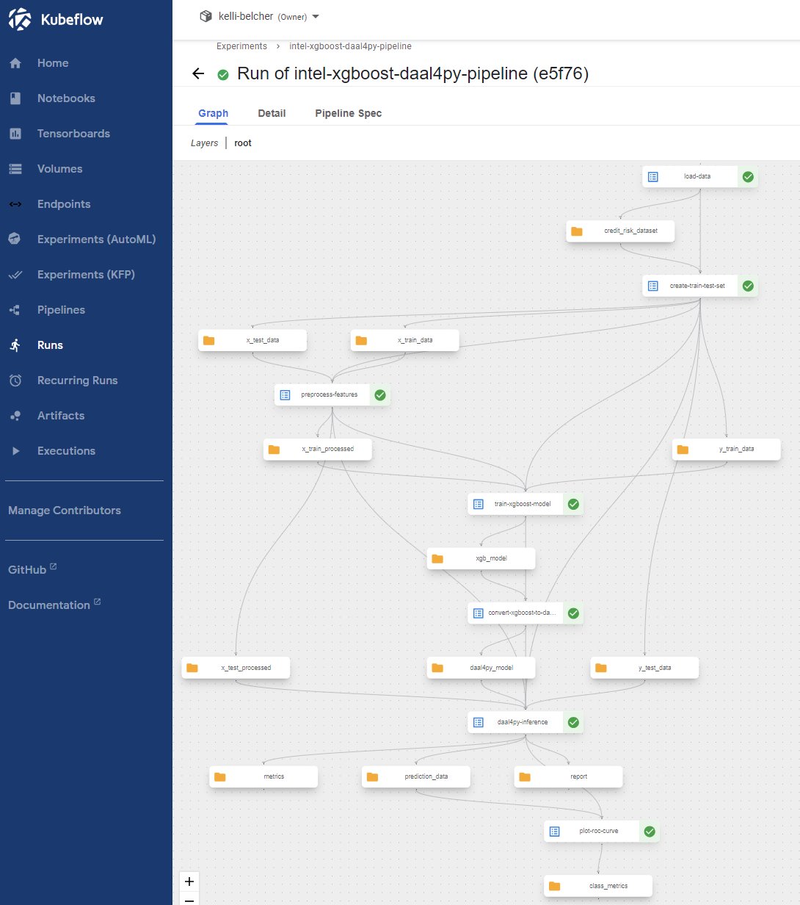
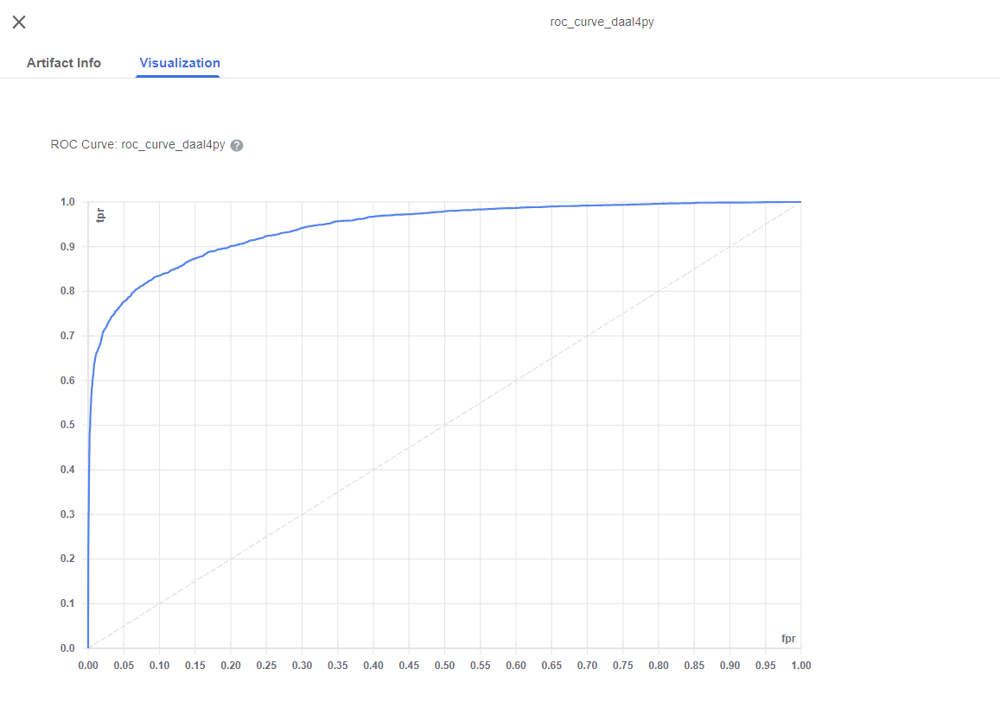

<p align="center">
  
</p>

# Intel® Optimized XGBoost daal4py Kubeflow Pipeline 

This example demonstrates how to optimize an XGBoost Kubeflow Pipeline using a sample 
dataset to predict the probability of loan default. 
The reference solution enables the use of the
[Intel® Optimization for XGBoost*](https://www.intel.com/content/www/us/en/developer/tools/oneapi/optimization-for-xgboost.html), 
[Intel® oneAPI Data Analytics Library (Intel® oneDAL)](https://www.intel.com/content/www/us/en/developer/tools/oneapi/onedal.html), 
and [Intel® Extension for Scikit-Learn*](https://www.intel.com/content/www/us/en/developer/tools/oneapi/scikit-learn.html) 
to accelerate an end-to-end training and inference XGBoost pipeline.

## Table of Contents
- [System Requirements](#system-requirements)
- [Overview](#pipeline-overview)
- [Pipeline Optimizations](#pipeline-optimizations)
- [Pipeline Parameters](#pipeline-parameters)
- [Pipeline Results](#pipeline-results)

## System Requirements

- Before running the code for the pipeline, please ensure you have downloaded and installed 
[Kubeflow Pipelines SDK](https://v1-5-branch.kubeflow.org/docs/components/pipelines/sdk-v2/)
v2.0.1 or above.  
- To attain the most performance benefits from the Intel software optimizations, deploy the 
pipeline on a 3rd or 4th Generation [Intel® Xeon® Processor](https://www.intel.com/content/www/us/en/products/details/processors/xeon.html).

## Pipeline Overview

This pipeline is derived from the 
[Loan Default Risk Prediction AI Reference Kit](https://github.com/oneapi-src/loan-default-risk-prediction). 
The code has been enhanced through refactoring to achieve better modularity and suitability for 
Kubeflow Pipelines. The credit risk data set used in the pipeline is obtained from 
[Kaggle](https://www.kaggle.com/datasets/laotse/credit-risk-dataset)* 
and synthetically augmented for testing and benchmarking purposes. Below is a graph of the full 
XGBoost daal4py Kubeflow Pipeline.

<p align="center">
  
</p>

The pipeline consists of the following seven components:  
- **Load data**: This component loads the dataset (`credit_risk_dataset.csv`) from the URL specified 
in the pipeline run parameters and performs synthetic data augmentation.   
- **Create training and test sets**: This component splits the data into training and test sets of an 
approximately 75:25 split for model evaluation.  
- **Preprocess features**: This component transforms the categorical features of the training and 
test sets by using one-hot encoding, imputes missing values, and power-transforms numerical features.  
- **Train XGBoost model**: This component trains an XGBoost model using the accelerations provided by 
the Intel Optimizations for XGBoost.  
- **Convert XGBoost model to daal4py**: This component converts the XGBoost model to an 
inference-optimized daal4py classifier.  
- **daal4py Inference**: This component computes predictions using the inference-optimized daal4py 
classifier and evaluates model performance. It returns a summary of the precision, recall, and F1 
score for each class, as well as the area under the curve (AUC) and accuracy score of the model.   
- **Plot ROC Curve**: This component performs model validation on the test data and generates a 
graph of the receiver operating characteristic (ROC) curve.  

[Back to Table of Contents](#table-of-contents)

## Pipeline Optimizations

#### Enable the Intel Optimization for XGBoost 

The [XGBoost optimizations](https://www.intel.com/content/www/us/en/developer/tools/oneapi/optimization-for-xgboost.html) 
for training and inference on CPUs are upstreamed into the open source XGBoost framework. 
Ensure you are using the latest version of XGBoost to access the most Intel optimizations. 
The following code sample is implemented in the `train_xgboost_model` component. 

```
dtrain = xgb.DMatrix(X_train.values, y_train.values)
    
# define model parameters
params = {
    "objective": "binary:logistic",
    "eval_metric": "logloss",
    "nthread": 4,  # num_cpu
    "tree_method": "hist",
    "learning_rate": 0.02,
    "max_depth": 10,
    "min_child_weight": 6,
    "n_jobs": 4,  # num_cpu,
    "verbosity": 1}

# train XGBoost model
clf = xgb.train(params = params, 
                dtrain = dtrain, 
                num_boost_round = 500)
```

#### Convert the Trained XGBoost Model to daal4py 

[daal4py](https://www.intel.com/content/www/us/en/developer/articles/guide/a-daal4py-introduction-and-getting-started-guide.html) 
is the Python API of the oneAPI Data Analytics Library, oneDAL. daal4py helps to further 
optimize model prediction, or inference, on CPUs. The following code demonstrates how to 
convert a trained XGBoost model into daal4py format and calculate the predicted 
classification results, implemented in the `convert_xgboost_to_daal4py` and `daal4py_inference` 
components. 

```
# convert XGBoost model to daal4py
daal_model = d4p.get_gbt_model_from_xgboost(clf)


# compute class labels and probabilities
daal_prediction = d4p.gbt_classification_prediction(
     nClasses = 2, 
     resultsToEvaluate = "computeClassLabels|computeClassProbabilities"
).compute(X_test, daal_model)
```

#### Enable the Intel Extension for Scikit-Learn
The [Intel Extension for Scikit-Learn](https://www.intel.com/content/www/us/en/developer/tools/oneapi/scikit-learn.html) 
provides CPU accelerations for many scikit-learn libraries. Below is an example 
using the scikit-learn extension to accelerate the computation of the ROC curve. 
The following code is implemented in the `plot_roc_curve` component.

```
# call patch_sklearn() before importing scikit-learn libraries
from sklearnex import patch_sklearn
patch_sklearn()
from sklearn.metrics import roc_curve


# calculate the ROC curve using the CPU-accelerated version
fpr, tpr, thresholds = roc_curve(
     y_true = prediction_data['y_test'], 
     y_score = prediction_data['y_prob'], 
     pos_label = 1)
```

[Back to Table of Contents](#table-of-contents)

## Pipeline Parameters

The XGBoost daal4py Kubeflow Pipeline consists of the following two parameters:
- `data_url`: The sample dataset can be downloaded from 
[Kaggle](https://www.kaggle.com/datasets/laotse/credit-risk-dataset)
and hosted on a public URL of your choice. 
- `data_size`: The recommended data size for the pipeline is 1 million.

## Pipeline Results

When the Pipeline tasks `daal4py-inference` and `plot-roc-curve` are finished running, 
click on the Visualization tab of the  `metrics` and `roc_curve_daal4py` artifacts to 
view the model performance results. You should see a similar graph of the receiver 
operating characteristic (ROC) curve as the one below.

<p align="center">
  
</p>

[Back to Table of Contents](#table-of-contents)

## Next Steps

Thanks for checking out this tutorial! If you would like to implement this reference solution 
on a cloud service provider like AWS, Azure, or GCP, you can view the full deployment steps, 
as well as additional Intel® Optimized Cloud Modules 
[here](https://www.intel.com/content/www/us/en/developer/topic-technology/cloud-optimization.html).

[Back to Table of Contents](#table-of-contents)