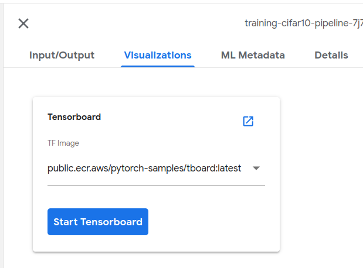

# Running From Kubeflow Jupyter Notebook

This covers instructions on building the Bert and Cifar10 building and running a pipeline from the Jupyter notebook in Kubeflow Notebook server.

## Prerequisites

[Kubeflow Jupyter Notebook Server](https://www.kubeflow.org/docs/components/notebooks/setup/)

### Steps to Run the example pipelines from Kubeflow Jupyter Notebook

  1. Clone the repository into the Jupyter notebook from terminal

      ```git clone https://github.com/kubeflow/pipelines```

  2. Run the example notebooks

      Cifar 10 - [Pipeline-Cifar10.ipynb](Pipeline-Cifar10.ipynb)

      Bert - [Pipeline-Bert.ipynb](Pipeline-Bert.ipynb)

  Once the deployment is done, run the prediction and explanations.

**Notes**

  1. For GPU Training
      1. Make sure to set `node selectors`, `gpus`, `accelerator` variables under the train task
      2. Use `isvc_gpu_yaml` for GPU inference.
  
  2. Tensorboard Image Update

      A custom tensorboard image is used for viewing pytorch profiler statistics. Update tensorboard image name in the notebook (variable_name: `TENSORBOARD_IMAGE`) for using any other custom tensorboard image.

### Captum Insights Visualization

Run the following command to port forward kubeflow dashboard

```
kubectl port-forward svc/istio-ingressgateway -n istio-system 8080:80
```

To view the captum insights UI in the local environment, run the following port forwarding command

```
kubectl port-forward <notebook-server-pod-name> -n kubeflow-user-example-com <port>:6080
```

For example:

```
kubectl port-forward pod/root-0 -n kubeflow-user-example-com 8999:6080
```

The captum insights UI can be accessed via

```
http://localhost:8999
```

### For Code changes and new examples 

1. Build and push the docker image

CPU Build
```bash
docker build -t image_name:tag .
```

GPU Build
```bash
docker build --build-arg BASE_IMAGE=pytorch/pytorch:1.8.1-cuda10.2-cudnn7-runtime -t image_name:tag .
```

Push the docker image

```bash
docker tag image_name:tag username/image_name:tag
docker push username/image_name
```

2. Update the component yamls of the example with the new image

```yaml
image: public.ecr.aws/pytorch-samples/kfp_samples:latest
```

Steps for generating/updating component.yamls are given in the following readme file

[generate component.yaml from templates](utils/template-generation.md)

3. Run the examples notebook

4. Click on the visualization tab, select the custom tensorboard image from the dropdown (examples screenshot shown below) and click `Start Tensorboard`. Tensoboard UI will be loaded with the run details.



